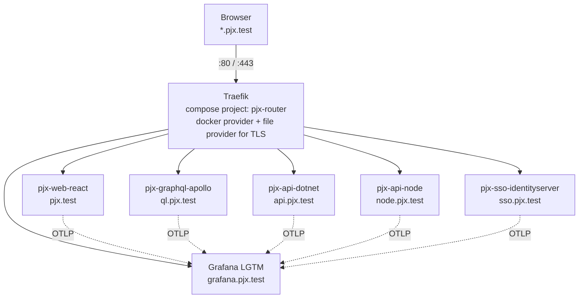

# pjx-root Architecture Upgrade

Plan to bring pjx-root's development environment up to the architecture used by
`CloudDevEnvironment`: a Traefik reverse proxy with real hostnames and TLS, a
Grafana/OpenTelemetry observability stack, a scripted developer workflow, and a
devcontainer image carrying the Kubernetes/Helm toolchain.

## Progress

| Phase | Status |
|---|---|
| 0 — Foundation | ✅ **Done** (merged, PR #15). Nine defects; see [Step 3b](phase-0-foundation.md#step-3b--nine-defects-found-during-execution) |
| 1 — Script layer | 🔨 in progress |
| 2–11, 8 | not started |

Phase 0 absorbed part of Phase 6 out of necessity — the `universal:2-linux` base
image had to be replaced before Docker could work inside the container at all.
Phase 6 is correspondingly smaller; see the note at the top of its doc.

## How this plan is meant to be used

Each phase is a separate document with explicit commands, a verification step,
and a rollback. Phases are ordered so that every one of them leaves the repo in
a working state — you can stop after any phase and still have a usable
environment.

You execute the steps. This document is the instruction set, not a changelog.

## Background reading

- [**How a request reaches a pjx container**](../reference/request-flow.md) —
  name resolution (including the `.localhost` trap), TLS/SNI, Traefik routing,
  and the container network, with diagrams. Worth reading before Phase 2.

## Reference environment

`/home/mike/projects/CloudDevEnvironment` is the architecture we're copying
from. It is **read-only reference** — we read patterns out of it and never write
to it. File paths quoted in these phase docs are relative to that repo when
prefixed `CDE:`, and relative to pjx-root otherwise.

Note that CloudDevEnvironment is *not* uniformly ahead of pjx-root. It has no
Helm charts at all — only the toolchain in its devcontainer image. pjx-root
already has `helm-pjx/` and `kubernetes/`. So "bring over k8s and Helm" means
adopting the *tooling and CI/CD promotion pattern*, not copying charts.

## Current-state findings

Discovered while surveying the repo. The first two are bugs that would derail
Phase 1 onward if not fixed first, which is why Phase 0 exists.

| # | Finding | Location | Impact |
|---|---|---|---|
| 1 | Devcontainer setup script has never run. The compose mount puts the repo at `/workspaces/pjx-root/pjx-root`, but the script probes `/workspaces/pjx-root/projects/…`. Every `if [ -d ]` guard fails silently and it still prints "Setup complete!" | `.devcontainer/setup.sh:16-38` | No `npm install`, no `dotnet restore`, ever |
| 2 | The mount is `..:/workspaces/pjx-root` — the *parent* of pjx-root, which also contains `CloudDevEnvironment` | `docker-compose.devcontainer.yml:7` | Read-only reference repo is mounted into the pjx container |
| 3 | IdentityServer publishes host port `443` | `docker-compose.yml:65` | Direct collision with any Traefik on 443 |
| 4 | `projects/` is tracked in git (388 files), but README says it is gitignored | `README.md:104` | Docs contradict reality; affects the submodule decision |
| 5 | All 8 `.csproj` target `netcoreapp3.1` (out of support since Dec 2022) | `projects/pjx-api-dotnet/`, `projects/pjx-sso-identityserver/` | Blocks OpenTelemetry on .NET services |
| 6 | SSO server and .NET API both depend on `IdentityServer4` 4.0.x (archived Nov 2022) | `IdentityServerAspNetIdentity.csproj:13`, `pjx-api-dotnet.csproj:23` | No .NET 8 path without replacing the auth stack |
| 7 | No CI/CD. One stray `Jenkinsfile` in `pjx-api-node` | — | Phase 7 is greenfield |
| 8 | Compose sets `REACT_APP_GRAPHQL_URI` / `_API_URI` / `_SSO_URI`, but the app reads `REACT_APP_GRAPHQL_ENDPOINT` / `_API_DOTNET_URL` / `_SSO_ISSUER_URL` from a gitignored `.env` | `docker-compose.devcontainer.yml:81-83` vs `src/utils/authConst.tsx` | Three dead env vars; real config is untracked with no `.env.example` |
| 9 | `kubernetes/` and `helm-pjx/templates/` are the same 10-file set — one templated, one not | both dirs | Duplicate manifests that will drift |
| 10 | All 6 Helm templates hardcode image tags; `values.yaml` has no image keys. Every service is both `NodePort` **and** behind an Ingress, whose ports 82/83 do not exist | `helm-pjx/` | Shipping a version means editing templates; two conflicting routing paths |

## Target architecture

### Deliberate divergence from CloudDevEnvironment

CloudDevEnvironment runs a **two-tier** proxy: a `central-router` using
Traefik's *file* provider forwards to three per-stack Traefik instances on host
ports 81/82/83, each using the *docker* provider. That tier exists because it
has three independent submodule stacks that start and stop separately.

pjx-root is **one stack**, so the second tier would be pure overhead. We use a
**single Traefik** with the docker provider for routing and the file provider
for the TLS store. The directory layout stays `local/central-router/` so it
remains recognisable against the reference, and a second tier can be added
later if pjx ever splits into multiple stacks.

### Port collision warning

pjx's Traefik will claim host ports 80, 443, and 9090 — exactly what
CloudDevEnvironment's `central-router` claims. **The two environments cannot run
at the same time.** Stop one before starting the other. This is called out again
in Phase 2.

## Decisions to lock before Phase 1

Phase 0 is safe to run regardless. These three change the shape of later work.

### D1 — When to do the .NET 3.1 → 8 upgrade

It is the long pole: it gates OpenTelemetry on the two .NET services and it is
what lets us drop the `universal:2-linux` base image.

**Recommendation: after Phase 3.** You get Traefik and a running Grafana stack
early and visibly, then take on the upgrade knowing the surrounding
infrastructure already works. The cost is that Grafana shows Node/React
telemetry only until Phase 5 completes.

### D2 — What replaces IdentityServer4 — **DECIDED: defer to Phase 8**

**Resolved.** The SSO server stays on `netcoreapp3.1` with IdentityServer4
(bumped to its final release, 4.1.2). Replacement moves to
[Phase 8](phase-8-duende.md) — optional, gated on production deployment.

Rationale: IS4 is a self-hosted, in-process library with no external service
dependency, and its clients are declared in `Config.cs` under version control.
For local and demo use that is easier to maintain and automate than any
alternative. The seam is clean — `pjx-sso-identityserver` is a standalone
solution with **zero project references in or out**, so it can sit on a lower
framework with no mixed-TFM friction. The API talks to it over HTTP via the OIDC
discovery document, which is a protocol boundary, not a library one.

This removed a risk item rather than adding one: Phase 4 is now a single
migration (seven projects, no auth work) instead of two intertwined ones.

**What deferring costs**, in order of how much it actually matters:

1. **No SSO telemetry.** Current OpenTelemetry packages target `net6.0`+, so the
   auth hop stays dark in Grafana. Older OTel versions did support
   `netcoreapp3.1`, but pinning to them is worse than the gap.
2. **Frozen base image.** `mcr.microsoft.com/dotnet/aspnet:3.1` left support in
   December 2022, on Debian 10 (past LTS). Fine on localhost; not fine published.
   Phase 7's CI scanning will flag it on every run.
3. **Toolchain check.** The .NET 8 SDK should build `netcoreapp3.1` with warning
   NETSDK1138. Phase 4 step 1 verifies this; if it fails, SSO builds via Docker
   only and is excluded from `validate.sh`.

When Phase 8 becomes non-optional, and the options compared, are both documented
in [phase-8-duende.md](phase-8-duende.md). Short version: **Duende**, not
OpenIddict — it is IS4's direct continuation and preserves the
`Config.cs`-in-git property that makes the current setup worth keeping.

### D3 — `projects/` as submodules, or stay vendored

CloudDevEnvironment's whole script layer assumes submodules — the `docker()`
bash wrapper rewrites `HOST_PROJECT_PATH` per submodule, and `dev-up.sh` fans
out to each one. pjx-root has the same five projects vendored and tracked.

**Recommendation: stay vendored.** Converting means rewriting git history for
388 tracked files and gains you nothing at this scale — pjx has one compose
stack, so there is no fan-out to coordinate. Instead, fix the README to say
`projects/` is tracked, and write the scripts against a single stack. If you
later want independent release cycles per project, revisit.

### D5 — Azure deployment target — **DECIDED**

Added after the plan was first drafted: the end state is an AKS demo, eventually
production. Locked choices, implemented by Phases 9–11:

| Concern | Choice | Why |
|---|---|---|
| Registry | **ACR** (GHCR → ACR promotion) | Follows CloudDevEnvironment; `--attach-acr` means no imagePullSecret in the cluster |
| Database | **Azure Database for PostgreSQL** Flexible Server, Burstable | Matches AwareServices; replaces SQLite, which cannot work in k8s |
| Access | **IP-restricted** first demo | One `loadBalancerSourceRanges` line, versus doing Phase 8 before deploying at all |
| TLS | cert-manager + Let's Encrypt **DNS-01** via Azure DNS | HTTP-01 cannot validate against an IP-restricted load balancer — Let's Encrypt publishes no stable source IPs |
| Domain | One `.com`/`.dev`, ~$12/yr + ~$0.50/mo Azure DNS zone | Needed for real certificates |
| Observability | **Grafana Cloud free tier**, with a dormant App Insights exporter | Keeps Grafana's UI and query languages at $0 and zero cluster footprint; App Insights is a values-file change away |

Self-hosting the LGTM stack in-cluster was rejected: `grafana/otel-lgtm` is a
local-development image, and running Grafana + Mimir + Loki + Tempo needs
2–4GB plus persistent disks, forcing a larger node pool for ~$30–70/month. The
local container from [Phase 3](phase-3-observability.md) stays for offline dev.

### D4 — Platform portal: in or out

CloudDevEnvironment's `Platform/` is a Node + Angular service on port 8086 that
discovers containers via `dev-portal.*` Docker labels.

**Recommendation: out of scope.** It is the largest chunk of net-new code in the
whole reference architecture and delivers the least. `status.sh` from Phase 1
covers the same need. Revisit only if you miss it.

## Phases

| Phase | Goal | Risk | Reversible | Depends on |
|---|---|---|---|---|
| [0](phase-0-foundation.md) | Fix the devcontainer bugs; get a container that actually provisions | Low | Yes | — |
| [1](phase-1-script-layer.md) | `local/scripts/` on `$PATH`; lifecycle hooks | Low | Yes | 0 |
| [2](phase-2-traefik.md) | Traefik, mkcert TLS, `*.pjx.test` hostnames | **Medium** | Yes | 1 |
| [3](phase-3-observability.md) | Grafana LGTM stack running and routed | Low | Yes | 2 |
| [4](phase-4-dotnet8.md) | .NET 3.1 → 8 for the seven API-side projects; drop IS4 from the API | Medium | Branch only | D1 |
| [5](phase-5-otel.md) | OpenTelemetry instrumentation (all but SSO) | Medium | Yes | 3, 4 |
| [6](phase-6-devcontainer-image.md) | Custom devcontainer Dockerfile with k8s/Helm toolchain | Low | Yes | 4 |
| [7](phase-7-cicd.md) | Tag-driven CI/CD; clean up Helm charts | Medium | Yes | 6 |
| [9](phase-9-azure-foundation.md) | Azure: ACR, AKS, PostgreSQL, Key Vault, DNS, Traefik, cert-manager | Low (but **costs money**) | Yes | 7 |
| [10](phase-10-deployable.md) | SQLite→Postgres, real secrets, probes, React runtime config | **High** | Branch only | 9 |
| [11](phase-11-deploy.md) | AKS deploy + CD via Actions OIDC federation | Medium | Yes | 10 |
| [8](phase-8-duende.md) | **Optional** — SSO to Duende + `net8.0`; then drop the IP restriction | Medium-high | Branch only | 11 |

**Execution order is 0 → 7, then 9 → 11, then 8.** Phase 8 keeps its number
(it was reviewed under it) but runs last: the demo is IP-restricted, so the
unpatched `netcoreapp3.1` SSO container is not internet-facing and the auth
migration is not a prerequisite for deploying. Making the demo public is the
final step of Phase 8.

Phases 0–3 are the low-risk, high-visibility half. Phases 4 and 10 are the two
largest pieces of application work. Phase 9 is the first that incurs Azure cost —
roughly $60–70/month running, ~$25 with the cluster stopped between demos.

### Framework end-state after Phase 4

| Project | Target | Auth | Telemetry |
|---|---|---|---|
| `pjx-api-dotnet` (7 projects) | `net8.0` | stock JWT bearer, IS4 removed | Full |
| `pjx-sso-identityserver` | `netcoreapp3.1` | IdentityServer4 4.1.2 | None until Phase 8 |

## Where to run commands

pjx uses **docker-outside-of-docker**: the devcontainer holds only the Docker
CLI, and every container is a sibling on the host daemon. That makes "which shell
am I in?" a load-bearing question — most of the defects found while executing
Phases 0–2 came from getting it wrong.

| Run in the **devcontainer** | Run on the **host** |
|---|---|
| `dev-up.sh`, `stop.sh`, `status.sh`, `validate.sh`, `obs-up.sh` | anything hitting a **published port**: `localhost:9090`, `localhost:4318` |
| `docker compose …` (needs `HOST_PROJECT_PATH`) | your **browser** |
| `dotnet`, `npm`, `mkcert`, `git` once `safe.directory` is set | `sudo` for `/etc/hosts`, killing host processes, system trust store |
| service-to-service HTTP: `http://pjx-web-react:3000` | `az`, `kubectl`, `helm` against Azure |

Three rules behind that table:

1. **Bind-mount sources are resolved by the host daemon.** Compose files must emit
   host paths — `${HOST_PROJECT_PATH:-.}` — even when run from inside the
   container. A relative path silently mounts an empty auto-created directory.
2. **`localhost` means something different in every shell.** Inside a container it
   is that container's own loopback. Reach other services by compose service name
   and **container** port (`http://pjx-api-dotnet:80`), not the published port.
3. **Trust stores are per-machine.** `mkcert -install` in the devcontainer does
   not make your host browser, or any app container, trust the CA. Each needs its
   own import.

The prompt tells you where you are: `vscode ➜ …` is the devcontainer,
`mike@…` is the host.

> ⚠️ **Never run a recursive delete on a path that exists in both namespaces.**
> `/workspaces` is Docker's junk on the host and *your repo's bind mount* inside
> the container. `sudo rm -rf /workspaces` in the devcontainer destroyed the
> working tree once during Phase 1. `ls` the path first, and prefer `chown` over
> `rm` when fixing ownership.

## Working conventions

- **One branch per phase**, off `master`, merged via PR before the next phase
  starts. Any descriptive name works — Phase 0 shipped as `dev_fix_devcontainer`.
  Do not commit directly to `master`.
- **Commit after every numbered step, and push the branch early.** Phase 1's work
  lived only in the working tree and was destroyed by a `sudo rm -rf` aimed at the
  wrong namespace; it was recoverable only via VS Code's local file history.
  `git push -u origin <branch>` costs nothing.
- **Verify before merging.** Every phase doc ends with a `## Verify` section.
  If it does not pass, do not proceed to the next phase.
- **Rollback** is documented per phase. Phases 0–3 and 5–7 are revertible with
  `git revert`; Phase 4 should live on its branch until it fully works.
- **Commit granularity**: one commit per numbered step where practical, so a
  single bad step can be dropped without unwinding the phase.

## Out of scope

- The Platform portal (D4)
- Infrastructure-as-code. Phase 9 provisions Azure with imperative `az` CLI
  scripts, which is the right weight for a demo. Port to Bicep or Terraform if
  pjx becomes long-lived
- Migrating off Create React App. Flagged as a constraint in Phases 6 and 10,
  not addressed
- Bruno API tests, CSharpier, Angular tooling — CloudDevEnvironment-specific
