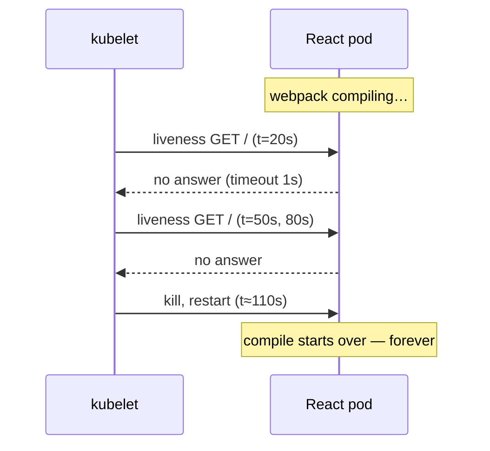

# Phase 7b — Local Kubernetes with k3d

**Goal:** run the whole stack on a real Kubernetes cluster on your machine, and
pass the same browser test you pass under Docker Compose — before spending
anything on Azure.

**Risk:** Medium. No cloud cost, fully disposable (`k3d cluster delete pjx`), but
it is the first time the Helm charts actually run rather than merely render.

**Depends on:** [Phase 6](phase-6-devcontainer-image.md) (kubectl, helm, k9s,
k3d), [Phase 7](phase-7-cicd.md) (charts parameterised — the pre-cleanup chart
cannot deploy), and [Phase 5](phase-5-otel.md) (health endpoints, so probes have
something to hit).

**Read first:** [k3d networking, from the browser to the pod](../reference/k3d-networking.md)
— diagrams of the three address spaces and three DNS resolvers involved. The
kubeconfig k3d writes does **not** work from the devcontainer, and that document
explains why and what to run instead.

```bash
git checkout -b feature/arch-phase-7b-local-k8s
```

---

## Why before CI/CD

[Phase 7c](phase-7c-cicd.md) automates building images and publishing charts. If
the chart has never run, CI just automates publishing a broken chart. Deploying
locally first means that by the time you write the pipeline you *know* the
artifacts work.

It is also free and fast to iterate on, where the alternative — learning
Kubernetes for the first time against a paid AKS cluster — is neither.

**No registry needed.** `k3d image import` pushes your locally-built Compose
images straight into the cluster, so CI is genuinely not a prerequisite.

---

## ⚠️ The Compose stack and the k3d cluster cannot run at the same time

Both want host ports **80** and **443**. This is the third instance of this exact
conflict in the project — after CloudDevEnvironment's `central-router` and its
leftover `simpleproxy` — and it fails the same misleading way: the cluster's load
balancer silently has no ports, or `k3d cluster create` errors on a port bind.

**Always stop one before starting the other:**

```bash
# switching to k3d
stop.sh                                              # the five app containers
docker compose -f local/docker-compose.yml down      # the Compose Traefik
ss -tln | grep -E ':(80|443) ' || echo "80/443 free"
```

```bash
# switching back to Compose
k3d cluster stop pjx        # or: k3d cluster delete pjx
dev-up.sh -d
docker compose -f local/docker-compose.yml up -d
```

### Why not just map k3d to 8080/8443 and run both?

Tempting, and it breaks the React app. Its production image bakes `REACT_APP_*`
values at **build** time, so the bundle contains `https://pjx.test` with port 443
implied. Served on `:8443`, the SPA loads but every API call goes to the wrong
port — and you would be debugging
[Deployable's runtime-config problem](phase-deployable.md#step-3--react-runtime-configuration)
before reaching Deployable.

With k3d on 80/443, your existing `/etc/hosts` entries and mkcert certificate
work unchanged and the app behaves exactly as it does under Compose. The cost is
that the two stacks are mutually exclusive, which is the right trade here.

Once Deployable lands runtime configuration, running both on different ports
becomes viable — revisit then if you want side-by-side comparison.

---

## Step 1 — Install k3d

If [Phase 6](phase-6-devcontainer-image.md) added it to the devcontainer image,
skip this. Otherwise, pinned:

```dockerfile
ARG K3D_VERSION=v5.7.4
RUN curl -fsSL https://raw.githubusercontent.com/k3d-io/k3d/main/install.sh \
    | TAG=${K3D_VERSION} bash
```

```bash
k3d version
```

> k3d creates its cluster nodes as containers on the **host** daemon, which works
> from the devcontainer because of the mounted socket. Same
> docker-outside-of-docker arrangement as everything else.

---

## Step 2 — Create the cluster

```bash
k3d cluster create pjx \
  --port "80:80@loadbalancer" \
  --port "443:443@loadbalancer" \
  --agents 1
```

```bash
kubectl cluster-info
kubectl get nodes
```

`k3d` writes a context into your kubeconfig and switches to it. Confirm you are
pointed at the right cluster before every `kubectl` command that matters:

```bash
kubectl config current-context      # → k3d-pjx
```

> ### 🛑 The kubeconfig k3d writes does not work from the devcontainer
>
> `kubectl cluster-info` will fail with:
>
> ```
> The connection to the server 0.0.0.0:38493 was refused
> ```
>
> k3d talks to the **host's** Docker daemon through the mounted socket, so it
> creates host-level containers and writes a host-level address —
> `https://0.0.0.0:<random port>`. On the host that means "this machine". Inside
> the devcontainer it means *the devcontainer*, where nothing is listening.
>
> **Do not reach for the host gateway.** `172.17.0.1:38493` connects at the TCP
> level and still fails, because the API server certificate does not list it:
>
> ```
> DNS: k3d-pjx-server-0, k3d-pjx-serverlb, kubernetes, localhost
> IP:  0.0.0.0, 10.43.0.1, 127.0.0.1, 172.18.0.2, ::1
> ```
>
> `k3d-pjx-serverlb` **is** a SAN. Join the devcontainer to k3d's network and use
> that name — TLS verification stays intact:
>
> ```bash
> docker network connect k3d-pjx pjx-root-workspace-1
> kubectl config set-cluster k3d-pjx --server=https://k3d-pjx-serverlb:6443
> kubectl get nodes
> ```
>
> | Event | Redo |
> |---|---|
> | `k3d cluster stop` / `start` | nothing |
> | Devcontainer rebuild | `docker network connect` |
> | `k3d cluster delete` + recreate | **both** — new network, new random API port |
>
> Pinning the API port at creation removes the random-port half, so the kubeconfig
> stops changing every time the cluster is recreated:
>
> ```bash
> k3d cluster create pjx \
>   --port "80:80@loadbalancer" --port "443:443@loadbalancer" \
>   --api-port 6443 --agents 1
> ```
>
> `--api-port` takes `[HOST:]PORT`, and any HOST given must already resolve —
> naming the load balancer container fails, because it does not exist until the
> cluster is created:
>
> ```
> FATA Failed to lookup host 'k3d-pjx-serverlb' specified for Port Exposure
> ```
>
> A bare port is what you want. It does not change the certificate, so the
> `set-cluster` fix above is still needed — `k3d-pjx-serverlb` is a SAN by
> default.
>
> Full explanation, with diagrams:
> [k3d networking](../reference/k3d-networking.md#why-kubectl-failed-and-why-the-obvious-fix-also-fails).
>
> One more trap while debugging: `docker exec` without `-u vscode` runs as
> **root**, with a different `HOME` and an empty `~/.kube/config`. A `kubectl`
> reporting `localhost:8080` is that — 8080 is the hardcoded default when no
> kubeconfig exists — not a broken cluster.

> **k3s bundles Traefik as its default ingress controller.** That is a real
> convenience: your `className: traefik` and existing ingress annotations carry
> over unchanged, so you are testing the routing model you already understand
> rather than learning NGINX. It is a different Traefik instance from the Compose
> one — same software, separate deployment.

---

## Step 3 — Import the locally-built images

k3s has its own containerd and cannot see the host daemon's images. Without this
step every pod sits in `ImagePullBackOff` trying to reach a registry.

```bash
for svc in pjx-web-react pjx-graphql-apollo pjx-api-node pjx-api-dotnet pjx-sso-identityserver; do
  k3d image import "pjx-root-${svc}:latest" -c pjx
done
```

```bash
docker exec k3d-pjx-server-0 crictl images | grep pjx-root
```

Those are the image names Compose produces (`<project>-<service>`). Verify with
`docker images | grep pjx-root` if they differ.

> Imported images must be referenced with `imagePullPolicy: Never` or
> `IfNotPresent` — with `Always`, Kubernetes ignores the local copy and tries the
> registry. Set it in `environments/local.yaml` below.

---

## Step 4 — TLS from the existing mkcert certificate

No new CA, no browser re-import:

```bash
cd local/central-router/config/cert
CERT=$(ls *.pem | grep -v -- '-key' | head -1)
kubectl create namespace pjx
kubectl -n pjx create secret tls pjx-tls --cert="${CERT}" --key="${CERT%.pem}-key.pem"
kubectl -n pjx get secret pjx-tls
```

The certificate already covers `*.pjx.test` and `pjx.test`, so every hostname
works.

---

## Step 5 — A local values file

`helm-pjx/environments/local.yaml`:

```yaml
global:
  # Empty registry → pjx.image emits a bare name, not a leading slash.
  imageRegistry: ""
  imageTag: latest
  # Never, not IfNotPresent: a repository typo then fails immediately with
  # ErrImageNeverPull, instead of spending 30s trying Docker Hub and reporting
  # ImagePullBackOff — which reads as a network problem.
  imagePullPolicy: Never

# Docker Compose prefixes built images with its PROJECT NAME, so the images in
# your daemon are pjx-root-pjx-web-react, not pjx-web-react. Override the
# repository here rather than in values.yaml — the prefix is an artifact of local
# Compose builds and would be wrong for GHCR and ACR.
#
# SQLite is ephemeral and single-writer, so one replica each until Deployable
# replaces it with PostgreSQL. values.yaml sets web.replicas to 2, so that
# override is load-bearing.
web:       { replicas: 1, image: { repository: pjx-root-pjx-web-react } }
apollo:    { replicas: 1, image: { repository: pjx-root-pjx-graphql-apollo } }
nodeApi:   { replicas: 1, image: { repository: pjx-root-pjx-api-node } }
dotnetApi: { replicas: 1, image: { repository: pjx-root-pjx-api-dotnet } }
sso:       { replicas: 1, image: { repository: pjx-root-pjx-sso-identityserver } }

ingress:
  enabled: true
  className: traefik
  host: pjx.test
  tls:
    enabled: true
    secretName: pjx-tls      # created in step 4, not cert-manager

# The .NET API reaches SSO over in-cluster Service DNS.
ssoUrl: http://pjx-sso-service:80
```

> ### The image names are not what `values.yaml` says
>
> `values.yaml` declares `repository: pjx-web-react` — correct for GHCR and ACR.
> But Compose names its builds `<project>-<service>`, so what is actually in your
> daemon is `pjx-root-pjx-web-react`. Without the overrides above, the chart asks
> for `pjx-web-react:latest`, Kubernetes finds nothing, and tries Docker Hub.
>
> Confirm the two lists correspond **before** creating the cluster — `helm
> template` cannot check this for you, and it is the most likely thing to go
> wrong in this phase:
>
> ```bash
> helm template pjx helm-pjx/ -f helm-pjx/environments/local.yaml \
>   | grep -oE 'image: [^ ]+' | sed 's/image: //' | sort
> docker images --format '{{.Repository}}:{{.Tag}}' | grep '^pjx-root-pjx' | sort
> ```
>
> If you `diff` those two lists, strip carriage returns first — the chart
> templates are CRLF (see `.gitattributes`: the repo was authored on Windows), so
> rendered output carries `\r` and every line reads as different:
> `diff <(tr -d '\r' < a) <(tr -d '\r' < b)`.

> `global.imageRegistry: ""` relies on the `pjx.image` helper from
> [Phase 7 Step 1](phase-7-cicd.md#step-1--parameterise-images) omitting the
> registry when empty. A naive `printf "%s/%s:%s"` renders
> `/pjx-root-pjx-web-react:latest` — a leading slash is not a valid reference.

---

## Step 6 — Add the probes to the templates

The endpoints exist from
[Phase 5 Step 5d](phase-5-otel.md#step-5d--health-checks). Declare them per
service, using each one's own path and container port:

```yaml
        readinessProbe:
          httpGet: { path: /health/ready, port: 80 }
          initialDelaySeconds: 10
          periodSeconds: 10
        livenessProbe:
          httpGet: { path: /health/live, port: 80 }
          initialDelaySeconds: 30
          periodSeconds: 20
          failureThreshold: 3
```

| Service | Readiness path | Container port |
|---|---|---|
| `pjx-api-dotnet` | `/health/ready` | 80 |
| `pjx-sso-identityserver` | `/health/ready` | 80 |
| `pjx-api-node` | `/healthcheck` | 8081 |
| `pjx-graphql-apollo` | `/.well-known/apollo/server-health` | 4000 |
| `pjx-web-react` | `/` | 3000 |

> **`pjx-api-dotnet`'s readiness does not check the database.** Its
> `AddDbContextCheck` had to be removed —
> [EF Core is still 3.1.7 there](phase-4-dotnet8.md#it-is-now-blocking-not-merely-stale)
> and the health-check EF package drags in EF Core 8, which breaks the Sqlite
> provider outright.
>
> Consequence for this phase: the pod reports `Ready` as soon as Kestrel answers,
> so a `CrashLoopBackOff` caused by an unwritable SQLite path (failure mode 2
> below) will *not* be caught by the probe — it surfaces as 500s from the
> ingress instead. Check `kubectl logs` rather than trusting `READY 1/1`.
>
> `pjx-sso-identityserver` keeps its database check, so its probe is the more
> meaningful of the two. [Deployable Step 0](phase-deployable.md#step-2--sqlite--postgresql)
> restores the API's.

---

## Step 7 — Deploy

Render and read it first:

```bash
helm template pjx helm-pjx/ -f helm-pjx/environments/local.yaml > /tmp/local.yaml
less /tmp/local.yaml
```

```bash
helm upgrade --install pjx helm-pjx/ \
  --namespace pjx --create-namespace \
  -f helm-pjx/environments/local.yaml \
  --atomic --timeout 5m
```

```bash
kubectl -n pjx get pods,svc,ingress -w
```

`--atomic` rolls back a failed release instead of leaving the namespace
half-updated.

### When a pod will not start

```bash
kubectl -n pjx describe pod <name>          # scheduling, image pull, probe failures
kubectl -n pjx logs <name> --previous       # the crash before the current attempt
kubectl -n pjx get events --sort-by=.lastTimestamp | tail -30
k9s -n pjx                                  # interactive, faster for browsing
```

Most likely first failures:

1. **`ImagePullBackOff`** — image not imported, or `imagePullPolicy: Always`
2. **`CrashLoopBackOff` on the .NET services** — the connection string points
   somewhere that does not exist, or `pjx_calendar` has no tables (see
   [migrations](#the-net-api-does-not-migrate-itself) below)
3. **Probe failures during startup** — a dev image compiling at pod start
   exceeds the liveness budget; add a `startupProbe`, do not raise
   `initialDelaySeconds` (see [how it actually went](#how-it-actually-went-2026-09-26))
4. **`OOMKilled`** — `kubectl top pod` shows the container pinned at its memory
   limit; the limit was sized for a different image
5. **Ingress 404** — `className` not matching k3s's Traefik, or the host not
   matching `/etc/hosts`

---

## Verify

> Run these in the devcontainer unless a command is marked HOST. See
> [Where to run commands](README.md#where-to-run-commands) — `localhost` means
> something different in each shell.

```bash
# 1. Everything running and ready
kubectl -n pjx get pods
#    → all 5 Running, READY 1/1

# 2. Probes are actually declared, not just written
kubectl -n pjx get deploy -o json | grep -c readinessProbe    # → 5

# 3. Images came from the local import, not a registry
kubectl -n pjx get pods -o jsonpath='{range .items[*]}{.spec.containers[0].image}{"\n"}{end}'

# 4. Ingress has an address
kubectl -n pjx get ingress
```

**HOST:**

```bash
# 5. TLS terminates with the mkcert certificate
echo | openssl s_client -connect pjx.test:443 -servername pjx.test 2>&1 | grep -E 'Verify return code|issuer='

# 6. Every hostname answers
for h in pjx ql.pjx api.pjx node.pjx sso.pjx; do
  printf '  %-18s %s\n' "$h.test" "$(curl -s -o /dev/null -w '%{http_code}' -k --max-time 5 https://$h.test/)"
done
```

**Then the browser pass** at <https://pjx.test> — register, activate (activation
code from `kubectl -n pjx logs -l app=pjx-sso --tail=50`), log in,
`/country/all`, `/cities`, sign out.

That full pass is the point of this phase. Passing it locally means AKS Deploy's
AKS deploy is "the same thing, elsewhere" rather than a first attempt.

### Expect these, do not debug them

- ~~**Data vanishes on pod restart.** SQLite in an ephemeral container.~~
  Superseded 2026-09-13: Deployable Step 5b put PostgreSQL in the chart, on a
  2Gi PVC that survives pod restarts and `k3d cluster stop`.
- **The signing certificate is the committed one.** Insecure, local only —
  Deployable Step 1a/1b, after Azure Foundation.
- **No telemetry reaches Grafana** unless you point
  `OTEL_EXPORTER_OTLP_ENDPOINT` at something reachable from the cluster. The
  Compose Grafana is on `pjx-network`, which k3s pods are not.

---

## How it actually went (2026-09-26)

Verify passed: six pods Ready, the mkcert certificate served by k3s's Traefik,
every hostname answering, and the full browser pass — register, activate, log
in, create an event — against the cluster's PostgreSQL. Three things were not in
the plan.

### The release is named `pjx`

The chart was first installed as `helm install pjx` on 2026-09-13, but this
document said `pjx-release`. `helm upgrade --install` with an unknown name is a
fresh install, and it refused because every object already carries
`meta.helm.sh/release-name: pjx`:

```
Secret "pjx-postgres" in namespace "pjx" exists and cannot be imported into the
current release: invalid ownership metadata; ... key "meta.helm.sh/release-name"
must equal "pjx-release": current value is "pjx"
```

Nothing changes when this happens — helm aborts before touching the cluster.
`helm -n pjx list` is the source of truth for the name, and the commands above
now use it.

### The React dev image needs a `startupProbe`, and four times the memory

The React pod had been crash-looping since 2026-09-13 — two ReplicaSets, 59 and
68 restarts, the rollout never completing because the new pod never went Ready.
Two causes, one after the other, both the same mistake: `values.yaml` describes
the **nginx** production image serving static files, and `local.yaml` swaps in
the **dev** image, which runs `react-scripts start` and webpack-compiles at pod
start.



1. **Liveness killed the compile.** `initialDelaySeconds: 20`, `periodSeconds:
   30`, `failureThreshold: 3` gives about 110 seconds; the compile takes longer
   under a 500m CPU limit. Each kill restarted the compile from zero. The
   symptom in `describe pod` was `Liveness probe failed: ... context deadline
   exceeded` — the default `timeoutSeconds` is 1 second. Fix in
   `templates/pjx-web-react.yaml`: a `startupProbe` with `failureThreshold: 60`
   × `periodSeconds: 10`, which suspends liveness and readiness until the server
   first answers, plus `timeoutSeconds: 5` on all three probes. Raising
   `initialDelaySeconds` instead would have been a guess that fails again on a
   slower machine.
2. **Then memory.** With the probe fixed the pod lived long enough to be
   `OOMKilled` at the 512Mi limit, with CPU pinned at 500m. At steady state,
   after the compile, `kubectl top pod` shows the dev image at **644Mi** — it
   was never going to fit. Fix in `environments/local.yaml`: `web.resources`
   overridden to 2Gi / 2 CPU. With the CPU unthrottled the compile took 40
   seconds and the pod was Ready on the first attempt. The production image
   keeps the small numbers in `values.yaml`.

Helm merges maps, so overriding `resources` requires giving both `requests` and
`limits`, or the untouched half keeps the production values.

### The .NET API does not migrate itself

*(It does now — this records why it changed.)*

SSO calls `Database.Migrate()` at startup (`Program.cs:53`), so `pjx_identity`
had its 8 tables the first time the pod ran. The .NET API did not, so
`pjx_calendar` was empty while `/health/ready` reported healthy, and every
calendar call would have failed. The first browser pass got through only after
a by-hand `dotnet ef database update` over `kubectl port-forward` — a deploy
that needs a human with `kubectl` is not continuous delivery, and Copilot's
review of PR #30 flagged it twice.

Fix, same day: the API's `Program.cs` builds the host, opens a scope, resolves
`CalendarDbContext` and calls `Database.Migrate()` before `host.Run()` — the
SSO shape. Proven the honest way:

```bash
kubectl -n pjx exec deploy/pjx-postgres-deployment -- psql -U pjx -d postgres \
  -c 'DROP DATABASE pjx_calendar;' -c 'CREATE DATABASE pjx_calendar OWNER pjx;'
docker compose -f docker-compose.devcontainer.yml build pjx-api-dotnet
k3d image import pjx-root-pjx-api-dotnet:latest -c pjx
kubectl -n pjx rollout restart deploy/pjx-dotnet-deployment
```

The new pod logged `Applying pending migrations...`, and `__EFMigrationsHistory`
listed `InitialPostgres` with zero rows in `CalendarEvents`. Two consequences
worth knowing:

- **A pod that cannot reach the database now crashes at startup** instead of
  coming up healthy with no tables. In Kubernetes that is a restart loop until
  Postgres answers, which is the right behaviour. On Compose it is why
  `docker-compose.devcontainer.yml` gained a `pg_isready` healthcheck and
  `depends_on: condition: service_healthy` on both .NET services.
- **`Migrate()` is not safe for two replicas starting at once.** Fine at
  `replicas: 1` and for the demo; the production shape is an init container or
  a Job that runs once per deploy.

`kubectl logs deploy/<name>` picks *a* pod, and during a rollout that is often
the old one — `Found 2 pods, using pod/...` in the output means look again with
the new pod's name.

---

## Rollback

```bash
helm -n pjx uninstall pjx              # remove the app, keep the cluster
k3d cluster stop pjx                   # keep it for later, frees the ports
k3d cluster delete pjx                 # remove entirely
```

Then return to Compose:

```bash
dev-up.sh -d
docker compose -f local/docker-compose.yml up -d
status.sh
```

Nothing in this phase touches the Compose stack, so the switch back is clean.
