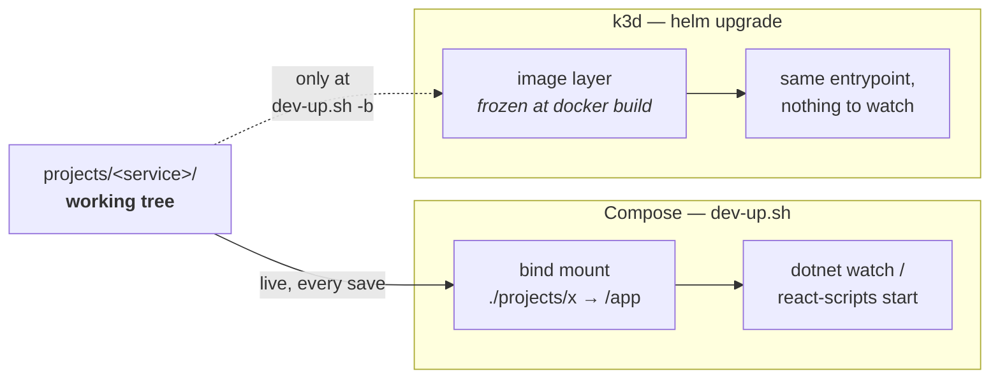
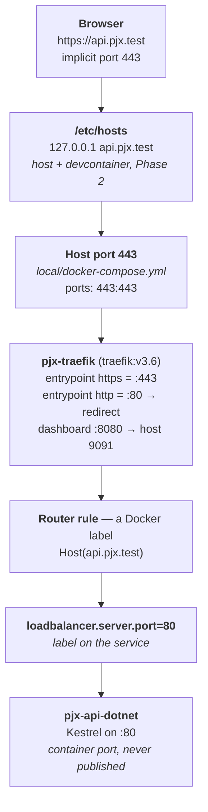
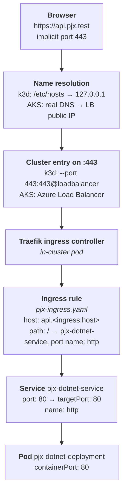

# Deployable phase — Make the application deployable

> **Executes 11th of 14** — after [7c](phase-7c-cicd.md), before
> [Azure Foundation](phase-azure-foundation.md). This phase is named rather than
> numbered; see the [README](README.md#progress).

**Goal:** close the gaps between "runs in Docker Compose on localhost" and "runs
in Kubernetes" — PostgreSQL, real secrets, health probes, resource limits, and
runtime configuration for the React app.

**Risk: High.** This is application code, not infrastructure — the largest phase
after Phase 4.

**Reversible:** yes, but the database migration is one-way in practice.

**Depends on:** [Phase 7b](phase-7b-local-k8s.md) (a local cluster to prove the
changes against). **Not Azure Foundation** — most of this phase is local work.

> **Ordering — corrected.** This line previously read *"Depends on: Azure Foundation
> (Azure resources must exist)"*, which would have you provisioning ~$60–70/month
> of Azure and then leaving it idle for weeks of application work. Only two tails
> of this phase actually touch Azure:
>
> | Step | Needs Azure? |
> |---|---|
> | 1 — signing certificate | **only the tail** — `openssl` generation is local; `az keyvault secret set` and the CSI mount are not |
> | 2 — SQLite → PostgreSQL | **no** — [the step itself](#local-development-stays-on-sqlite-or-containerised-postgres) says to use `postgres:16-alpine` locally and *not* to point local dev at Azure |
> | 3 — React runtime configuration | no |
> | 5 — resource requests and limits | no |
> | 6 — observability wiring | **only the tail** — Grafana Cloud's auth header is read from Key Vault; Grafana Cloud itself is free tier, not Azure |
>
> **Run the local work first, on k3d, with production images.** Provision Azure Foundation
> when you are days from deploying, then come back for the two tails and go
> straight into [AKS Deploy](phase-aks-deploy.md). The original ordering predates
> Phase 7 being split into 7/7b/7c, which is what gave this project a local
> cluster to develop against.

```bash
git checkout -b feature/arch-deployable
```

---

## Suggested order within this phase

The step numbers are **not** the order to run them. Two subsections of Step 1 and
one of Step 6 need Azure; everything else is local work provable on k3d. Do the
free work first:

| Do | What | Needs Azure |
|---|---|---|
| ~~1~~ | ✅ **done 2026-09-07** — [EF Core 3.1.7 → 8](phase-4-dotnet8.md#how-it-actually-went-2026-09-07), Step 2's prerequisite. One real LINQ regression, found and fixed | no |
| ~~2~~ | ✅ **done 2026-09-12** — [Step 3](#step-3--react-runtime-configuration) React runtime config, ConfigMap mounted via `subPath`, React port a chart value | no |
| ~~3~~ | ✅ **done 2026-09-13** — [Step 5](#step-5--resource-requests-and-limits) resource requests and limits, every template reads its block. The React dev image needs a local override — see [7b](phase-7b-local-k8s.md#how-it-actually-went-2026-09-26) | no |
| ~~4~~ | ✅ **done 2026-09-13** — [Step 1c](#step-1c--one-small-code-change-no-azure-needed), the `Path.IsPathRooted` edit, landed with Step 2 | no |
| ~~5~~ | ✅ **done 2026-09-13** — [Step 2](#step-2--sqlite--postgresql) SQLite → PostgreSQL, both services, on `postgres:16-alpine`. Browser-verified | no |
| ~~5b~~ | ✅ **done 2026-09-13** — [Step 5b](#step-5b--the-chart-has-no-database) PostgreSQL in the chart. Verified end to end on k3d 2026-09-26 | no |
| — | **[Azure Foundation](phase-azure-foundation.md) — provision Azure here** | — |
| 6 | [Step 1a](#step-1a--generate-and-store-after-phase-9) + [Step 1b](#step-1b--mount-it-via-the-csi-driver-after-phase-9) — store the certificate and mount it | **yes** |
| 7 | [Step 6](#step-6--observability-wiring) — the Grafana Cloud header comes from Key Vault | **yes** |
| — | [AKS Deploy](phase-aks-deploy.md) — deploy | — |

Steps 1a, 1b and 7 are quick once Key Vault exists, and 1b cannot be *tested*
before then regardless — the CSI driver only runs in AKS.

---

## Why this phase exists

Six things make the current application non-deployable. Ordered by severity:

| # | Problem | Evidence |
|---|---|---|
| 1 | **The token signing key is public** | `pjx-sso-identityserver.rsa_2048.cert.pfx` is tracked in git; password is `password` |
| 2 | **Committed base64 "secrets"** | `helm-pjx/templates/pjx-secret.yaml` ships `sso-password: cGFzc3dvcmQNCg==` = `password\r\n` |
| 3 | **SQLite** | `Data Source=AspIdUsers.db` and `Data Source=PjxCalendar.db` — file-backed, single-replica, lost on reschedule |
| 4 | **React config is baked at build time** | `REACT_APP_*` are compile-time substitutions; no ConfigMap can change them |
| 5 | **No health probes, and no endpoints to probe** | Nothing in `helm-pjx/templates/`; no `AddHealthChecks` anywhere |
| 6 | **No resource requests or limits** | Nothing in `helm-pjx/templates/` — AKS scheduling and autoscaling misbehave |

---

## Step 1 — Replace the signing certificate

**The most important item in this phase.** It is the only one that is a live
vulnerability rather than an operational gap.

> **This step is split.** Reading the background and making the code change
> ([Step 1c](#step-1c--one-small-code-change-no-azure-needed)) need nothing.
> Storing the certificate ([1a](#step-1a--generate-and-store-after-phase-9)) and
> mounting it ([1b](#step-1b--mount-it-via-the-csi-driver-after-phase-9)) require
> Key Vault, so they run **after [Azure Foundation](phase-azure-foundation.md)**. Note
> that `local/scripts/azure/00-vars.sh` — which 1a sources for `${KV}` — is
> created by [Azure Foundation Step 1](phase-azure-foundation.md#step-1--naming-and-a-script-to-hold-it)
> and does not exist yet.

### Understand what cannot be undone

The certificate and its private key are in **git history**, and
`projects/pjx-api-dotnet/src/Pjx_CreateCertificates/generated/…cert.key` is
tracked too. `pjx-root` is a public repository.

Deleting the files does **not** remove them from history, and rewriting history
does not help either — anyone who cloned or forked already has them, and GitHub
retains unreferenced objects. **The only real remedy is to treat that key as
permanently compromised and never use it anywhere but localhost.**

So: generate a new one, keep it out of git entirely, and leave the old one alone
or delete it as tidying — not as remediation.

### Step 1a — Generate and store (**after Azure Foundation**)

> Requires Key Vault. Skip on a first pass through this phase.


```bash
source local/scripts/azure/00-vars.sh

PFX_PASSWORD="$(openssl rand -base64 24)"
openssl req -x509 -newkey rsa:2048 -nodes -days 730 \
  -subj "/CN=pjx-sso-signing" \
  -keyout /tmp/sso-signing.key -out /tmp/sso-signing.crt
openssl pkcs12 -export -out /tmp/sso-signing.pfx \
  -inkey /tmp/sso-signing.key -in /tmp/sso-signing.crt \
  -passout "pass:${PFX_PASSWORD}"

az keyvault secret set --vault-name "${KV}" --name sso-signing-pfx \
  --file /tmp/sso-signing.pfx --encoding base64
az keyvault secret set --vault-name "${KV}" --name sso-signing-password \
  --value "${PFX_PASSWORD}"

shred -u /tmp/sso-signing.key /tmp/sso-signing.crt /tmp/sso-signing.pfx
```

> This is a self-signed signing certificate, which is correct — it signs tokens,
> it does not authenticate a TLS endpoint. It never needs to be CA-issued. Its
> only consumer is the API validating tokens via the discovery document's JWKS.

### Step 1b — Mount it via the CSI driver (**after Azure Foundation**)

> The template below is guarded by `{{- if .Values.keyVault.enabled }}`, so it is
> safe to add early — with the flag false it renders to nothing and `helm
> template` still passes. It cannot be *tested* until AKS has the Secrets Store
> CSI driver.


`helm-pjx/templates/pjx-secretprovider.yaml`:

```yaml
{{- if .Values.keyVault.enabled }}
apiVersion: secrets-store.csi.x-k8s.io/v1
kind: SecretProviderClass
metadata:
  name: pjx-keyvault
spec:
  provider: azure
  parameters:
    clientID: {{ .Values.keyVault.clientId }}
    keyvaultName: {{ .Values.keyVault.name }}
    tenantId: {{ .Values.keyVault.tenantId }}
    objects: |
      array:
        - objectName: sso-signing-pfx
          objectType: secret
          objectEncoding: base64
        - objectName: sso-signing-password
          objectType: secret
        - objectName: identity-connection-string
          objectType: secret
        - objectName: calendar-connection-string
          objectType: secret
        - objectName: otlp-endpoint
          objectType: secret
        - objectName: otlp-headers
          objectType: secret
  secretObjects:
    - secretName: pjx-runtime-secrets
      type: Opaque
      data:
        - objectName: sso-signing-password
          key: PJX_SSO__PASSWORD
        - objectName: identity-connection-string
          key: ConnectionStrings__DefaultConnection
        - objectName: otlp-endpoint
          key: OTEL_EXPORTER_OTLP_ENDPOINT
        - objectName: otlp-headers
          key: OTEL_EXPORTER_OTLP_HEADERS
{{- end }}
```

> **Stale as written.** This step used to say *"delete
> `helm-pjx/templates/pjx-secret.yaml` entirely"*. That file no longer exists —
> the [Phase 7](phase-7-cicd.md) chart cleanup removed it. Nothing to delete;
> secrets come from Key Vault at pod start. Check `helm-pjx/templates/` before
> looking for it.

### Step 1c — One small code change (no Azure needed)

**Safe to do now.** This is the only part of Step 1 that runs without Key Vault,
and it changes nothing locally.

`projects/pjx-sso-identityserver/Startup.cs:88-90` loads the certificate relative
to the content root (the file uses fully-qualified type names, so match on this
exactly):

```csharp
            string certFile = section["CERTIFICATE"] ?? "pjx-sso-identityserver.rsa_2048.cert.pfx";
            string certPassword = section["PASSWORD"] ?? "password";
            var rsaCertificate = new System.Security.Cryptography.X509Certificates.X509Certificate2(System.IO.Path.Combine(Environment.ContentRootPath, certFile), certPassword);
```

The CSI driver mounts to an absolute path such as `/mnt/secrets/sso-signing-pfx`,
and `Path.Combine` with a rooted second argument discards the first — so this
happens to work already. Make it explicit rather than relying on that:

```csharp
            string certFile = section["CERTIFICATE"] ?? "pjx-sso-identityserver.rsa_2048.cert.pfx";
            string certPassword = section["PASSWORD"] ?? "password";
            string certPath = System.IO.Path.IsPathRooted(certFile)
                ? certFile
                : System.IO.Path.Combine(Environment.ContentRootPath, certFile);
            var rsaCertificate = new System.Security.Cryptography.X509Certificates.X509Certificate2(certPath, certPassword);
```

Local development is unaffected — `PJX_SSO__CERTIFICATE` is unset, so the
relative default still resolves against the content root exactly as before.

Verify with a browser sign-in on k3d, or:

```bash
curl -sk https://sso.pjx.test/.well-known/openid-configuration/jwks | head -5
```

A changed or empty JWKS means the certificate stopped loading.

---

## Step 2 — SQLite → PostgreSQL

Both .NET projects. `pjx-api-node` has no datastore and needs nothing.

> ### Step 0 first — upgrade EF Core to 8 in the API
>
> **This is a hard prerequisite, not a suggestion.** `Pjx_Api` and
> `Pjx.CalendarLibrary` still reference EF Core **3.1.7** while targeting
> `net8.0` — [Phase 4 left this
> undone](phase-4-dotnet8.md#outstanding--ef-core-was-not-upgraded). The
> `Npgsql...PostgreSQL 8.0.*` below depends on EF Core 8, so installing it
> reproduces exactly the failure Phase 5 hit:
>
> ```
> System.TypeLoadException: Method 'Create' in type
> 'Sqlite...QueryableMethodTranslatingExpressionVisitorFactory' ... does not
> have an implementation.
> ```
>
> Except here it is on the critical path — the provider swap *is* the phase.
>
> ```bash
> git checkout -b feature/arch-deployable   # EF upgrade lands here as step 0
> ```
>
> Upgrade `Microsoft.EntityFrameworkCore.Sqlite`, `.Design` and `.Tools` to
> `8.0.*` in **both** projects, one at a time, `dotnet build` and `dotnet test`
> after each. Then exercise `/country/all` and `/cities` in the browser before
> touching PostgreSQL — EF Core 8 translates LINQ more strictly, so queries that
> silently ran client-side on 3.1 now throw at runtime. Finding those against a
> database that still works is much easier than finding them mixed in with a
> provider swap.
>
> Doing it here rather than earlier is deliberate: this phase already regenerates
> migrations and re-tests all database access, so the LINQ regressions and the
> PostgreSQL move share one verification pass.
>
> Two things start working again as a side effect:
> [EF query spans in Grafana](phase-5-otel.md#step-5b--net-services-after-phase-4),
> and `AddDbContextCheck` on the API's readiness probe — which
> [Phase 5 had to remove](phase-4-dotnet8.md#it-is-now-blocking-not-merely-stale)
> and which [AKS Deploy](phase-aks-deploy.md) wants before production traffic.
>
> `dotnet-ef` also becomes usable: the tool is pinned to 8.x in
> [Phase 6](phase-6-devcontainer-image.md), and it cannot operate on an EF Core
> 3.1 project — so `dotnet ef migrations add InitialPostgres` below fails until
> this step is done.

```bash
cd projects/pjx-api-dotnet/src/Pjx_Api
dotnet remove package Microsoft.EntityFrameworkCore.Sqlite
dotnet add    package Npgsql.EntityFrameworkCore.PostgreSQL --version 8.0.*
```

Change `UseSqlite(...)` to `UseNpgsql(...)` in the `DbContext` registration, and
update `appsettings.json`:

```json
"ConnectionStrings": {
  "DefaultConnection": "Host=postgres;Database=pjx_calendar;Username=pjx;Password=password"
}
```

> 🛑 **`Host=postgres`, not `Host=localhost`** (corrected 2026-09-12; this doc
> said `localhost` and it does not work here). pjx runs
> **docker-outside-of-docker**: the devcontainer is a *sibling* container on
> `pjx-network`, so `localhost` inside it is its own loopback — not the host, and
> not Postgres. `dotnet ef database update` fails with
> `Npgsql.NpgsqlException: Failed to connect to 127.0.0.1:5432 ... Connection
> refused`.
>
> The service name resolves over the compose network, and the same value works
> from both the devcontainer and the `pjx-api-dotnet` container, since both join
> `pjx-network`. This is the same boundary that forces
> `extra_hosts: "pjx.test:host-gateway"` on the workspace service — see the
> comment at `docker-compose.devcontainer.yml:10-12`.

Repeat for `projects/pjx-sso-identityserver` — but note it is on
`netcoreapp3.1` per Decision D2, so pin the provider to a compatible major:

```bash
dotnet add package Npgsql.EntityFrameworkCore.PostgreSQL --version 3.1.*
```

> **✅ Answered 2026-09-12: it resolves.** `Npgsql.EntityFrameworkCore.PostgreSQL
> 3.1.*` installs and restores cleanly alongside IdentityServer4 on
> `netcoreapp3.1`. The framework is not a blocker here, so
> [Duende](phase-duende.md) stays deferred as planned.

SSO needs three more things the API did not:

1. **Its own database.** The compose service above only creates `pjx_calendar`
   via `POSTGRES_DB`, matching the two SQLite files being replaced:

   ```bash
   docker exec pjx-root-postgres-1 psql -U pjx -d pjx_calendar \
     -c 'CREATE DATABASE pjx_identity OWNER pjx;'
   ```

2. **Its connection string**, `projects/pjx-sso-identityserver/appsettings.json`,
   which is still `"Data Source=AspIdUsers.db;"` →
   `"Host=postgres;Database=pjx_identity;Username=pjx;Password=password"`.

3. **Two `UseSqlite` call sites, not one** — `Startup.cs:55` *and*
   `SeedData.cs:25`. Missing either one fails the build with `CS1061:
   'DbContextOptionsBuilder' does not contain a definition for 'UseSqlite'`
   once the Sqlite package is removed.

> 🛑 **A failed SSO build shows up as a 404, not a 502.** `dotnet watch` exits on
> the compile error, so nothing listens on port 80; Traefik's Docker provider
> then registers **no router at all** for `sso.pjx.test`, and the browser gets
> Traefik's own 19-byte "404 page not found" from the `/connect/authorize`
> redirect. That reads like a misconfigured OIDC URL and is not — check
> `docker logs pjx-sso-identityserver-dev` and
> `curl -s http://127.0.0.1:9091/api/http/routers` before touching any client
> configuration. A missing router means the container, not the URL.

> **Existing users do not come across.** `AspIdUsers.db` holds the ASP.NET
> Identity accounts; a fresh `pjx_identity` starts empty. The browser pass after
> this step begins with **registration**, not sign-in.

> 🛑 **`dotnet ef` cannot run against SSO from the devcontainer.** The tool is
> pinned to 8.x, the project targets `netcoreapp3.1`, and the devcontainer only
> carries the 8.0 runtime — so `dotnet ef` builds the project and then fails to
> launch the design-time assembly:
>
> ```
> You must install or update .NET to run this application.
> Framework: 'Microsoft.AspNetCore.App', version '3.1.0' (x64)
> The following frameworks were found:  8.0.31 at [/usr/share/dotnet/shared/...]
> ```
>
> This is **not** the package-resolution blocker Step 2 worried about — Npgsql
> 3.1 installs fine. It is a tooling gap, and it does not justify pulling
> [Duende](phase-duende.md) forward.
>
> Run it in the SSO dev container instead, which has SDK 3.1.426 and runtime
> 3.1.32, and whose `/app` is bind-mounted to the project directory so the
> generated files land on the host:
>
> ```bash
> docker exec pjx-sso-identityserver-dev dotnet tool install --global dotnet-ef --version 3.1.32
> docker exec -w /app pjx-sso-identityserver-dev /root/.dotnet/tools/dotnet-ef migrations add InitialPostgres
> docker exec -w /app pjx-sso-identityserver-dev /root/.dotnet/tools/dotnet-ef database update
> ```
>
> Two consequences. The tool lives in the container's writable layer, so a
> rebuild loses it — add it to `Dockerfile.dev` if this recurs. And that
> container runs as **root**, so it writes root-owned files into the bind mount;
> `sudo chown -R mike:mike projects/pjx-sso-identityserver` from the host
> afterwards, the same recurring problem as `bin`/`obj`.
>
> If a run leaves `obj/*.EntityFrameworkCore.targets` behind, delete it. The 8.x
> and 3.1 tools both write that file and a failed run can leave **two
> concatenated copies**, which then fails as
> `MSB4024 ... Unexpected end tag` — misleading, since nothing is wrong with the
> project.

> 🛑 **`appsettings.json:8` `"LocalDomain": "http://localhost:3000"` is stale.**
> A pre-Phase-2 value that nothing updated when the app moved to
> `https://pjx.test`. It is used only to build the **activation link in the
> registration email**, which is why several browser passes never caught it —
> and with SMTP disabled in dev the link only appears in
> `docker logs pjx-sso-identityserver-dev`, pointing at a host that no longer
> serves the app.
>
> Set it to `https://pjx.test` locally. Like `PJX_CORS_ORIGINS`, it is
> environment-specific and must become the public hostname on AKS — add it to
> the chart's config rather than leaving it baked into `appsettings.json`.

### Regenerate migrations

Provider-specific SQL means the SQLite migrations cannot be reused:

> 🛑 **Do these three in order, or the migration is silently wrong.** Confirmed
> 2026-09-12:
>
> 1. **`UseSqlite` → `UseNpgsql` in `src/Pjx_Api/Startup.cs:65` first.** Swapping
>    the package and the connection string is not enough — the registration picks
>    the provider. Skipping it gives
>    `System.ArgumentException: Connection string keyword 'host' is not supported`
>    from `SqliteConnectionStringBuilder`, because EF is still SQLite and the
>    string is now PostgreSQL.
> 2. **Then delete `Migrations/`.** `migrations add` *succeeds* against the SQLite
>    provider and writes a migration named `InitialPostgres` containing
>    `type: "INTEGER"` and `type: "TEXT"` — SQLite types under a PostgreSQL name.
>    Postgres emits `integer`, `text`, `timestamp with time zone`. Deleting the
>    folder before fixing Startup.cs just regenerates the same wrong file.
> 3. **Then start Postgres.** There is no `postgres` service in
>    `docker-compose.devcontainer.yml` until you add the block at the end of this
>    step, so `Host=localhost` has nothing to reach.

```bash
# only after Startup.cs uses UseNpgsql and postgres is running
rm -rf Migrations/
dotnet ef migrations add InitialPostgres
dotnet ef database update    # against the local postgres:16-alpine, NOT Azure
```

Check the generated migration before applying it — `type: "INTEGER"` anywhere in
`Migrations/*_InitialPostgres.cs` means the provider swap did not take.

### Expect these differences

SQLite is permissive; PostgreSQL is not. The failures show up at runtime, not
compile time:

| Area | What changes |
|---|---|
| Identifier casing | Postgres folds unquoted identifiers to lowercase; EF quotes them, so `PascalCase` table names become case-sensitive |
| `DateTime` | Npgsql 6+ requires `timestamptz` values to be UTC — a `DateTime` with `Kind=Unspecified` throws. The calendar feature stores dates, so **expect to hit this** |
| Booleans | SQLite stores 0/1; Postgres has a real `boolean` |
| Auto-increment | `AUTOINCREMENT` → `serial`/`identity` |
| Empty vs null strings | SQLite is loose about the distinction; Postgres is not |

The `DateTime` one is the most likely to bite. If the calendar starts throwing
`Cannot write DateTime with Kind=Unspecified`, normalise to UTC at the entity
boundary rather than scattering conversions through the query code.

### Local development stays on SQLite or containerised Postgres

Do not point local dev at Azure. Add a Postgres service to
`docker-compose.devcontainer.yml` so local and deployed use the same engine:

```yaml
  postgres:
    image: postgres:16-alpine
    environment:
      POSTGRES_USER: pjx
      POSTGRES_PASSWORD: password
      POSTGRES_DB: pjx_calendar
    volumes:
      - pjx-pgdata:/var/lib/postgresql/data
    networks: [pjx-network]
```

A named volume must also be **declared** at the top level, or compose refuses to
start with `service "postgres" refers to undefined volume pjx-pgdata`. Add it
next to `pjx-claude-config`:

```yaml
volumes:
  pjx-claude-config:
    name: pjx-claude-config
  pjx-pgdata:
    name: pjx-pgdata
```

This is the point where `clean.sh`'s confirmation prompt (Phase 1) starts
earning its keep — there is now a real volume to lose.

---

> 🛑 **A declared value that no template reads renders nothing, silently**
> (found twice on 2026-09-13). `values.yaml` carries `resources:` for all five
> services; `helm-pjx/templates/` references none of them, so every pod renders
> with no requests or limits. Earlier the same day, `values.yaml` said
> `useIngress` while the template read `useNginx`, and the ConfigMap mount
> vanished from the production render.
>
> Helm reports neither: an unread value and an undefined key are both legal.
> `helm lint` passes, `helm template` succeeds, and the output is quietly missing
> whatever you thought you configured. **The only check that works is rendering
> the template and looking for the block:**
>
> ```bash
> helm template pjx-test helm-pjx -s templates/pjx-api-dotnet.yaml | grep -A5 resources
> ```
>
> Wire each Deployment's container with:
>
> ```yaml
>         resources:
>           {{- toYaml .Values.dotnetApi.resources | nindent 10 }}
> ```
>
> substituting `web`, `apollo`, `nodeApi` and `sso` in the other four templates.

## Step 5b — The chart has no database

**New, found 2026-09-13 while finishing Step 2.** Compose now runs
`postgres:16-alpine` and both services point at `Host=postgres`. The chart does
not: `helm-pjx/templates/` has no postgres template, and the connection strings
are baked into each service's `appsettings.json` rather than coming from
configuration. Starting the k3d cluster today gives an app that boots and fails
every query.

This blocks the phase's own exit criterion — *prove it on k3d* — so it has to
close before [Azure Foundation](phase-azure-foundation.md), not after.

Two parts:

1. **A database for the cluster.** For local k3d a single-replica
   `postgres:16-alpine` Deployment plus a Service named `postgres` keeps the
   connection string identical to Compose. In Azure it is a managed server, so
   the template needs a value to switch it off — the same shape as
   `ingress.enabled`.

2. **The connection string as configuration, not a baked file.** It differs per
   environment and carries a password, so it belongs in `pjx-config`
   (or a Secret) and reaches the container as
   `ConnectionStrings__DefaultConnection`. ASP.NET Core's environment-variable
   provider maps `__` to `:`, so that key overrides `appsettings.json` with no
   code change.

   This also closes the *"chart sets ~8 env vars, Compose sets 31"* item in the
   [deferred-work table](README.md#deferred-work) for the two values that now
   matter most — and note `pjx-config` currently holds exactly **one** key,
   `sso-authority`.

> **Do not carry the local password into Azure.** `Username=pjx;Password=password`
> is fine against a container that exists for the length of a demo. The Azure
> server's credentials come from Key Vault via the CSI driver, the same path as
> [Step 1b](#step-1b--mount-it-via-the-csi-driver-after-azure-foundation)'s
> signing certificate.

### Step 5b.1 — A PostgreSQL template for the cluster

New file, `helm-pjx/templates/pjx-postgres.yaml`. Gated so Azure can turn it off
and use the managed server instead — the same shape as `ingress.enabled`:

```yaml
{{- if .Values.postgres.enabled }}
apiVersion: v1
kind: Secret
metadata:
  name: pjx-postgres
type: Opaque
stringData:
  # For the local demo only. Azure sets postgres.enabled=false and the
  # connection string arrives from Key Vault — see Step 1b.
  password: {{ required "postgres.password is required when postgres.enabled" .Values.postgres.password | quote }}
---
apiVersion: v1
kind: ConfigMap
metadata:
  name: pjx-postgres-init
data:
  # POSTGRES_DB creates ONE database. Anything in this directory runs on first
  # initialisation of the data directory, which is how the second one appears.
  10-create-identity.sql: |
    CREATE DATABASE pjx_identity OWNER pjx;
---
apiVersion: v1
kind: PersistentVolumeClaim
metadata:
  name: pjx-pgdata
spec:
  accessModes: [ReadWriteOnce]
  resources:
    requests:
      storage: {{ .Values.postgres.storage }}
---
apiVersion: apps/v1
kind: Deployment
metadata:
  name: pjx-postgres-deployment
  labels:
    app: {{ .Values.postgres.appName }}
spec:
  # Single writer against one PVC. Never raise this.
  replicas: 1
  strategy:
    type: Recreate
  selector:
    matchLabels:
      app: {{ .Values.postgres.appName }}
  template:
    metadata:
      labels:
        app: {{ .Values.postgres.appName }}
    spec:
      containers:
      - name: {{ .Values.postgres.appName }}
        image: {{ .Values.postgres.image }}
        imagePullPolicy: {{ .Values.global.imagePullPolicy }}
        resources:
            {{- toYaml .Values.postgres.resources | nindent 10 }}
        ports:
        - containerPort: 5432
          name: postgres
        env:
        - name: POSTGRES_USER
          value: {{ .Values.postgres.username | quote }}
        - name: POSTGRES_DB
          value: {{ .Values.postgres.database | quote }}
        - name: POSTGRES_PASSWORD
          valueFrom:
            secretKeyRef:
              name: pjx-postgres
              key: password
        # The image writes into a subdirectory rather than the mount root,
        # because a PVC root often contains lost+found and initdb refuses to
        # run in a non-empty directory.
        - name: PGDATA
          value: /var/lib/postgresql/data/pgdata
        readinessProbe:
          exec:
            command: ["pg_isready", "-U", "{{ .Values.postgres.username }}"]
          initialDelaySeconds: 5
          periodSeconds: 10
        livenessProbe:
          exec:
            command: ["pg_isready", "-U", "{{ .Values.postgres.username }}"]
          initialDelaySeconds: 30
          periodSeconds: 30
        volumeMounts:
        - name: data
          mountPath: /var/lib/postgresql/data
        - name: init
          mountPath: /docker-entrypoint-initdb.d
      volumes:
      - name: data
        persistentVolumeClaim:
          claimName: pjx-pgdata
      - name: init
        configMap:
          name: pjx-postgres-init
---
apiVersion: v1
kind: Service
metadata:
  # This name is the hostname the services connect to. Calling it "postgres"
  # makes the connection string identical to Compose, where the compose service
  # name resolves the same way.
  name: postgres
spec:
  type: ClusterIP
  selector:
    app: {{ .Values.postgres.appName }}
  ports:
    - protocol: TCP
      port: 5432
      targetPort: 5432
      name: postgres
{{- end }}
```

Note the init directory is a **whole-directory** mount with no `subPath`, unlike
`config.js` in [Step 3b](#step-3b--mount-it-and-make-the-port-a-value). That is
correct here: `/docker-entrypoint-initdb.d` is empty in the image, so there is
nothing to mask — see
[ConfigMaps, volumes and volumeMounts](../reference/kubernetes-config-and-volumes.md).

Add to `values.yaml` — **disabled by default, and with no password**, so a
production render fails loudly rather than shipping a known credential:

```yaml
postgres:
  enabled: false          # Azure uses a managed server; see Azure Foundation
  appName: pjx-postgres
  image: postgres:16-alpine
  username: pjx
  database: pjx_calendar
  storage: 2Gi
  resources:
    requests: { cpu: 50m,  memory: 128Mi }
    limits:   { cpu: 500m, memory: 512Mi }
```

and to `environments/local.yaml`:

```yaml
postgres:  { enabled: true, password: password }
```

> **Why the password may sit in `local.yaml` but never in `values.yaml`.**
> [Phase 7](phase-7-cicd.md) deleted `pjx-secret.yaml` for shipping
> `sso-password: cGFzc3dvcmQNCg==` — a *default* credential, committed, that
> would have been deployed for real. This is the opposite: `values.yaml` has no
> password at all and `required` aborts the render without one, while
> `local.yaml` names a throwaway for a container that lives as long as a demo
> and whose password is already plaintext in `appsettings.json` and
> `docker-compose.devcontainer.yml`. The rule is **no credential on the
> production path**, not "no string anywhere".

### Step 5b.2 — The connection string as configuration

Both services read `ConnectionStrings:DefaultConnection` from
`appsettings.json`, which is baked into the image and differs per environment.
ASP.NET Core's environment-variable provider maps `__` to `:` and takes
precedence over `appsettings.json`, so an env var overrides it with **no code
change**:

```
ConnectionStrings__DefaultConnection   →   ConnectionStrings:DefaultConnection
```

Add both to `helm-pjx/templates/pjx-config.yaml`, which currently holds exactly
one key:

```yaml
data:
  sso-authority: {{ .Values.ssoUrl }}
  dotnet-connection: {{ .Values.connectionStrings.dotnetApi | quote }}
  sso-connection:    {{ .Values.connectionStrings.sso | quote }}
```

`values.yaml`:

```yaml
connectionStrings:
  # Overridden per environment. In Azure these name the managed server and the
  # password comes from Key Vault, not from here.
  dotnetApi: ""
  sso: ""
```

`environments/local.yaml`:

```yaml
connectionStrings:
  dotnetApi: "Host=postgres;Database=pjx_calendar;Username=pjx;Password=password"
  sso:       "Host=postgres;Database=pjx_identity;Username=pjx;Password=password"
```

Then add the env var to each Deployment's existing `env:` block —
`pjx-api-dotnet.yaml` after the `PJX_SSO__AUTHORITY` entry:

```yaml
        - name: ConnectionStrings__DefaultConnection
          valueFrom:
            configMapKeyRef:
              name: pjx-config
              key: dotnet-connection
```

and the same in `pjx-sso-identityserver.yaml` with `key: sso-connection`.

> **Superseded 2026-09-26 — the connection strings are in a Secret.** Copilot's
> review of PR #30 pointed out the obvious: these are credentials, and they sat
> in a ConfigMap next to a Secret (`pjx-postgres`) that already held the same
> password. They now render into `templates/pjx-db-secret.yaml`, a Secret named
> `pjx-db` with the same two keys, and both Deployments use `secretKeyRef`
> instead of `configMapKeyRef`. `pjx-config` keeps `sso-authority` only. The
> values files above are unchanged. Step 1b then swaps where `pjx-db` comes
> from — the CSI driver syncing it from Key Vault — and the pod specs stay as
> they are.

> **The name is case-sensitive and must match exactly.** `ConnectionStrings__DefaultConnection`,
> not `CONNECTIONSTRINGS__DEFAULTCONNECTION` and not a single underscore. A
> wrong name is not an error — the variable is simply ignored and the service
> silently falls back to `appsettings.json`'s `Host=postgres`, which happens to
> be *right locally and wrong everywhere else*. That is the worst possible
> failure: it works on k3d and breaks on AKS.
>
> **Since 2026-09-26 there is no fallback.** Copilot's review of PR #30 flagged
> the committed password in both `appsettings.json` files; the
> `ConnectionStrings` block is gone from each. Compose sets
> `ConnectionStrings__DefaultConnection` on both .NET services, the chart sets
> it from the `pjx-db` Secret, and a missing or misspelled variable now fails
> at startup inside `Migrate()` instead of connecting to the wrong place.
> `dotnet ef database update` from the devcontainer needs `--connection`.

### Verify 5b

Render first, then run it:

```bash
helm template pjx-test helm-pjx -f helm-pjx/environments/local.yaml -s templates/pjx-postgres.yaml
helm template pjx-test helm-pjx -f helm-pjx/environments/local.yaml -s templates/pjx-api-dotnet.yaml | grep -A4 ConnectionStrings
```

The second must show the connection string, not an empty value.

#### Four things a fresh cluster does not have

`helm upgrade` against a cluster that is merely *reachable* will still fail, in
four ways that each look like a different problem. Check them in this order —
they are cheap, and each one is invisible until the pods are already wedged.

| # | What | Symptom if missing | Survives `cluster stop/start`? | Survives `cluster delete`? |
|---|---|---|---|---|
| 1 | Devcontainer on the `k3d-pjx` network | `dial tcp: lookup k3d-pjx-serverlb` | ✅ | ❌ |
| 2 | Kubeconfig pointed at `https://k3d-pjx-serverlb:6443` | `dial tcp 0.0.0.0:<port>: connection refused` | ✅ | ❌ |
| 3 | The five images in containerd | `ErrImageNeverPull` | ✅ | ❌ |
| 4 | The `pjx-tls` secret in namespace `pjx` | ingress serves Traefik's self-signed default; browser warns | ✅ | ❌ |

Items 1 and 2 are [Phase 7b's DooD fix](phase-7b-local-k8s.md); item 4 is
[Phase 7b Step 4](phase-7b-local-k8s.md#step-4--tls-from-the-existing-mkcert-certificate).
All four are properties of the *cluster and the devcontainer*, not of the chart,
which is why a green `helm template` says nothing about them.

Check all four without starting anything:

```bash
docker inspect pjx-root-workspace-1 \
  --format '{{range $k,$v := .NetworkSettings.Networks}}{{$k}} {{end}}'   # must include k3d-pjx
kubectl config view --minify -o jsonpath='{.clusters[0].cluster.server}'  # must be k3d-pjx-serverlb
```

#### The run

With Compose stopped so ports 80/443 are free — `make down` from inside the
devcontainer stops Traefik, the app services, Grafana and any running k3d
cluster, and skips the devcontainer itself:

```bash
make down
k3d cluster start pjx

# 1 + 2 — only after a `k3d cluster delete` + recreate
docker network connect k3d-pjx pjx-root-workspace-1
kubectl config set-cluster k3d-pjx --server=https://k3d-pjx-serverlb:6443

kubectl config use-context k3d-pjx
kubectl get nodes                      # gate: nothing below works until this does

# 3 — the chart asks for these by the Compose-prefixed name
for s in pjx-web-react pjx-graphql-apollo pjx-api-node pjx-api-dotnet \
         pjx-sso-identityserver; do
  k3d image import "pjx-root-$s:latest" -c pjx
done

# 4 — namespace first; helm's --create-namespace runs too late for the secret
kubectl create namespace pjx --dry-run=client -o yaml | kubectl apply -f -
cd local/central-router/config/cert
CERT=$(ls *.pem | grep -v -- '-key' | head -1)
kubectl -n pjx create secret tls pjx-tls \
  --cert="${CERT}" --key="${CERT%.pem}-key.pem" \
  --dry-run=client -o yaml | kubectl apply -f -
cd -

helm upgrade --install pjx helm-pjx -n pjx --create-namespace -f helm-pjx/environments/local.yaml
kubectl -n pjx get pods -w
kubectl -n pjx exec deploy/pjx-postgres-deployment -- psql -U pjx -l
```

> **`postgres:16-alpine` is not imported, deliberately.** `local.yaml` sets
> `global.imagePullPolicy: Never` so a missing *local* image fails instantly
> rather than spending 30s on Docker Hub. But the postgres image is an upstream
> one that has to be pulled, which is why
> [Step 5b.1](#step-5b1--a-postgresql-template-for-the-cluster)'s template reads
> `.Values.postgres.imagePullPolicy` (`IfNotPresent`) instead of the global.
> Reading the global here would give `ErrImageNeverPull` on a pod that has no
> local copy and never will.

> **`k3d image import` is the slow step.** Five images, ~2 GB, a minute or two.
> It only has to be redone after a cluster *delete*, or after rebuilding an
> image with `dev-up.sh -b`.

The last command should list **both** `pjx_calendar` and `pjx_identity`. If only
the first exists, the init ConfigMap did not mount, or the PVC already held an
initialised data directory from an earlier run — `/docker-entrypoint-initdb.d`
runs **only** when the data directory is empty. Delete the PVC and let it
reinitialise:

```bash
kubectl -n pjx delete pvc pjx-pgdata
kubectl -n pjx rollout restart deploy/pjx-postgres-deployment
```

> **Migrations still have to run against `pjx_calendar`.** The two services differ:
> `projects/pjx-sso-identityserver/Program.cs:53` calls `db.Database.Migrate()` at
> startup (and `SeedData.cs:36` again), so `pjx_identity` builds itself. The .NET
> API does not, so an empty `pjx_calendar` has no tables. Port-forward and run the
> tools the same way as locally:
>
> ```bash
> kubectl -n pjx port-forward svc/postgres 5432:5432
> ```
>
> then, in the devcontainer with `Host=localhost` temporarily, `dotnet ef database update`.
> This is the argument for `Migrate()` on startup in *both* services, which
> [AKS Deploy](phase-aks-deploy.md) needs anyway — a deploy that requires a
> human with `kubectl` is not continuous delivery.
>
> **Done 2026-09-26.** The API's `Program.cs` now calls `Database.Migrate()`
> before `host.Run()`, the same shape as SSO. Verified by dropping
> `pjx_calendar` in the cluster and rolling the pod — see
> [7b](phase-7b-local-k8s.md#the-net-api-does-not-migrate-itself). The
> port-forward recipe above is history.

### The cluster runs the image, and only the image (2026-09-13)

This is the single biggest difference between the two runtimes, and it is
invisible until something fails.



Compose bind-mounts the working tree, so **every edit since the last build is
already running**. Kubernetes has no bind mount: the pod gets the image's copy
of the source, as it was the moment the image was built. The entrypoint is still
`dotnet watch`, which is why the difference hides — the pod starts, watches a
directory nobody is editing, and serves stale code indefinitely.

The first encounter with this was the SSO pod crash-looping on:

```
System.ArgumentException: Keyword not supported: 'host'.
   at Microsoft.Data.Sqlite.SqliteConnectionStringBuilder.GetIndex(String keyword)
   at ...Migrator.Migrate(String targetMigration)
   at IdentityServerAspNetIdentity.Program.Main(String[] args) in /app/Program.cs:line 53
```

`Microsoft.Data.**Sqlite**` — after [Step 2](#step-2--sqlite--postgresql) changed
`UseSqlite` to `UseNpgsql` and Compose had been verified green in a browser. The
env var from [Step 5b.2](#step-5b2--the-connection-string-as-configuration) was
delivered correctly; the *code reading it* was from before the change. A correct
ConfigMap feeding a stale binary looks exactly like a broken ConfigMap.

**So: rebuild and re-import after any source change you want the cluster to see.**

```bash
dev-up.sh -b -d                                    # rebuild via Compose
for s in pjx-web-react pjx-graphql-apollo pjx-api-node pjx-api-dotnet \
         pjx-sso-identityserver; do
  k3d image import "pjx-root-$s:latest" -c pjx
done
kubectl -n pjx rollout restart deploy               # :latest never re-pulls
```

The `rollout restart` is not optional. Every image is tagged `:latest` and the
spec does not change, so Kubernetes sees an identical Deployment and does
nothing — a re-import alone changes the bytes in containerd and leaves the
running pod on the old layer.

> **Check before you debug.** `docker images` timestamps against `git log` answer
> "is this even my code?" in one line, and it is the first question to ask of any
> cluster-only failure:
>
> ```bash
> docker images --format '{{.Repository}}\t{{.CreatedAt}}' | grep '^pjx-root-'
> git log -1 --format='%ci %s'
> ```

### Known gaps after a green 5b run

Things that are wrong but are *not* Step 5b, recorded so they are not
rediscovered as mysteries:

| Symptom | Cause | Owner |
|---|---|---|
| React pod `0/1`, restarts climbing, logs stop after `react-scripts start` | `react-scripts` dev compile takes longer than `livenessProbe` allows (`initialDelaySeconds: 20`, `periodSeconds: 30`, `failureThreshold: 3`), so it is killed mid-webpack and never finishes. Compose hides this — `node_modules` is a warm volume and there is no liveness probe. | needs a `startupProbe`, or the production image |
| `kubectl get ingress` shows `CLASS <none>` | `pjx-ingress.yaml:7` sets the deprecated `kubernetes.io/ingress.class` annotation rather than `spec.ingressClassName`. Traefik still claims it. | tidy-up, pre-AKS |
| HTTPS warns / wrong certificate | `pjx-tls` secret absent from the namespace; Traefik falls back to its self-signed default | [Phase 7b Step 4](phase-7b-local-k8s.md#step-4--tls-from-the-existing-mkcert-certificate) |
| `pjx-sso-identityserver.yaml:22` `containerPort: 5002` | the container listens on 80 | tidy-up, pre-AKS |

---

## Step 3 — React runtime configuration

**The problem:** `react-scripts` substitutes `REACT_APP_*` at *build* time. The
production image (`projects/pjx-web-react/Dockerfile`) builds with
`npm run build` and serves the static output from nginx. So the API and issuer
URLs are frozen into the JavaScript bundle, and no Kubernetes env var or
ConfigMap can change them.

Left unaddressed, the deployed app loads and then tries to reach whatever was
baked in at build time — `https://api.pjx.test` after Phase 2 — which does not
resolve from a user's browser pointed at your AKS demo.

> ### Node version — **partly done, differently than planned (2026-09-06)**
>
> This section used to say the build was stuck on `node:14.5.0-slim` until
> `react-scripts` was upgraded, because webpack 4 hashes with MD4 (removed in
> OpenSSL 3) and `--openssl-legacy-provider` does not exist on Node 14. The
> conclusion — that Node could not move first — turned out to be wrong.
>
> [Phase 7c Step 0](phase-7c-cicd.md#step-0--fix-the-production-dockerfiles-first)
> moved the production Dockerfile to **`node:18-slim`** while leaving
> `react-scripts` on 3.4.3, using the flag on Node 18's side:
>
> ```dockerfile
> FROM node:18-slim AS builder
> RUN npm ci
> RUN NODE_OPTIONS=--openssl-legacy-provider npm run build
> ```
>
> That works because the flag exists on Node 18 — the original reasoning had it
> backwards. It was forced by an unrelated problem: node:14 ships npm 6, which
> cannot read this project's `lockfileVersion: 3` lock file and silently resolved
> a newer `@types/babel__traverse` than TypeScript 3.7.5 can parse. See
> [docker-build-and-images.md](../reference/docker-build-and-images.md#case-study-when-the-two-dockerfiles-drift).
>
> **Current state:**
>
> | Item | State |
> |---|---|
> | `Dockerfile` builder stage | ✅ `node:18-slim` |
> | `Dockerfile` serve stage | ❌ still `nginx:1.19.0` (2020) |
> | `react-scripts` | ❌ still 3.4.3, EOL, config frozen at build time |
> | `typescript` | ❌ still `^3.7.5` |
> | `--openssl-legacy-provider` | in both `Dockerfile` and `local/scripts/validate.sh:63` — **keep both** until `react-scripts` moves |
>
> So the ordering constraint is gone. **The runtime-config change below no longer
> has to wait for the `react-scripts` upgrade** — it is independent, and doing it
> now is what lets a CI-built image be pointed at AKS. Upgrading `react-scripts`
> (5.x, or Vite) is still owed, and is what finally removes the OpenSSL flag from
> two places. `local/scripts/validate.sh:56-59` carries a comment whose premise
> ("the production Dockerfile is on Node 14 … and REJECTS it") is now false —
> correct it whenever you next touch that file.

### Where this step stands (2026-09-07)

| | Item | State |
|---|---|---|
| 3 | `src/utils/runtimeConfig.ts` | ✅ |
| 3 | `public/config.js` + `<script>` in `public/index.html` | ✅ verified in `build/` output |
| 3 | The 24 `process.env.REACT_APP_*` references across 6 files | ✅ `tsc --noEmit` clean, `validate.sh build` passes |
| 3 | Browser pass on Compose — sign in, country, city, calendar, Profile, sign out | ⬜ |
| 3 | ConfigMap under `templates/` | ✅ `helm-pjx/templates/pjx-web-config.yaml` |
| 3 | ConfigMap URLs match the ingress | ✅ fixed 2026-09-12 — subdomains, verified against `public/config.js` |
| **3b** | `volumes:` / `volumeMounts:` with `subPath` | ✅ `pjx-web-react.yaml:40-47` |
| **3b** | Deployment port references → value | ✅ lines 26, 30, 36 |
| **3b** | Service `port` / `targetPort` → value | ✅ lines 59-60 |
| **3b** | `values.yaml` `web.service.port` | ✅ `port: 80`, parses as a map |
| **3b** | Guard the mount for dev images | ✅ `web.useNginx`, both blocks guarded |
| **3b** | `helm template -s templates/pjx-web-react.yaml` renders the mount | ✅ verified 2026-09-12 |
| **3c** | Warn when `config.js` fails to load | ✅ `runtimeConfig.ts:2-4` |
| — | `nginx:1.19.0` → `nginx:1.27-alpine` | ✅ `Dockerfile:19` |

**The fix:** serve configuration as a separate file that nginx delivers and the
bundle reads at startup.

Add `projects/pjx-web-react/public/config.js` as the local default:

```javascript
// Runtime configuration. Overwritten in deployed environments by a ConfigMap
// mounted at /usr/share/nginx/html/config.js — see helm-pjx/templates.
window.__PJX_CONFIG__ = {
  GRAPHQL_ENDPOINT:  "https://ql.pjx.test",
  SSO_ISSUER_URL:    "https://sso.pjx.test",
  SSO_CLIENT_ID:     "pjx-web-react",
  API_DOTNET_URL:    "https://api.pjx.test",
  PUBLIC_URL:        "https://pjx.test"
};
```

Load it before the bundle, in `public/index.html`:

```html
<script src="%PUBLIC_URL%/config.js"></script>
```

Then refactor the consumers to prefer runtime config, falling back to build-time
values so local `.env` development keeps working:

```typescript
// src/utils/runtimeConfig.ts
const rc = (window as any).__PJX_CONFIG__ ?? {};

export const config = {
  graphqlEndpoint: rc.GRAPHQL_ENDPOINT  ?? process.env.REACT_APP_GRAPHQL_ENDPOINT,
  ssoIssuerUrl:    rc.SSO_ISSUER_URL    ?? process.env.REACT_APP_SSO_ISSUER_URL,
  ssoClientId:     rc.SSO_CLIENT_ID     ?? process.env.REACT_APP_SSO_CLIENT_ID,
  apiDotnetUrl:    rc.API_DOTNET_URL    ?? process.env.REACT_APP_API_DOTNET_URL,
  publicUrl:       rc.PUBLIC_URL        ?? process.env.REACT_APP_PUBLIC_URL,
};
```

Files to update — all identified in Phase 2. **24 references across 6 files**,
verified 2026-09-07:

| File | Line(s) | Reads |
|---|---|---|
| `src/utils/authConst.tsx` | **2–29 (17 refs)** | `SSO_ISSUER_URL` ×13, `SSO_CLIENT_ID`, `SSO_REDIRECT_URL`, `SILENT_REDIRECT_URL`, `LOGOFF_REDIRECT_URL` |
| `src/apollo/apolloClient.tsx` | 12 | `GRAPHQL_ENDPOINT` |
| `src/services/countryService.tsx` | 17 | `API_DOTNET_URL` |
| `src/services/calendarService.tsx` | 22 | `API_DOTNET_URL` |
| `src/services/authService.tsx` | 70, 107 | `SSO_CLIENT_ID`, `PUBLIC_URL` |
| `src/components/Menu/leftNavigator.tsx` | 94 | `PUBLIC_URL` |

Each edit is mechanical — `process.env.REACT_APP_API_DOTNET_URL` becomes
`config.apiDotnetUrl`, with an import of `runtimeConfig`. `authConst.tsx` is 17 of
the 24, so assign `const issuer = config.ssoIssuerUrl;` once at the top and build
the endpoints off it; that collapses 13 references to one.

> **`runtimeConfig.ts` deliberately covers 5 of the 8 variables.** There are eight
> distinct `REACT_APP_*` values in `.env`, and the three redirect URIs are all
> `publicUrl` plus a fixed path:
>
> ```
> REACT_APP_SSO_REDIRECT_URL     = https://pjx.test/signin-oidc
> REACT_APP_SILENT_REDIRECT_URL  = https://pjx.test/silentrenew
> REACT_APP_LOGOFF_REDIRECT_URL  = https://pjx.test/logout/callback
> ```
>
> **Compute** those in `authConst.tsx` rather than adding them to the config
> object or the ConfigMap:
>
> ```typescript
> const issuer = config.ssoIssuerUrl;
> const publicUrl = config.publicUrl;
>
> export const IDENTITY_CONFIG = {
>     authority: issuer,
>     client_id: config.ssoClientId,
>     redirect_uri: `${publicUrl}/signin-oidc`,
>     silent_redirect_uri: `${publicUrl}/silentrenew`,
>     post_logout_redirect_uri: `${publicUrl}/logout/callback`,
>     login: `${issuer}/login`,
>     // … the rest unchanged
> };
> ```
>
> That takes the ConfigMap from eight values to five and removes the case where
> four URLs agree and the fifth has a typo. It matters because those three
> redirect URIs must **exactly** match `Config.cs` on the SSO side — the same
> exact-match discipline as [Phase 2](phase-2-traefik.md) step 5, and the cause of
> the 401 debugged in [Phase 7b](phase-7b-local-k8s.md).

> **`.ts`, not `.tsx`, is correct for `runtimeConfig.ts`.** `.tsx` only enables
> JSX parsing, and this file exports a plain object. Four of the six files above
> are named `.tsx` while containing no JSX at all (`authConst`, `apolloClient`,
> `countryService`, `calendarService`) — that is an existing habit in this repo,
> not a convention to match.

Then the ConfigMap — **`helm-pjx/templates/pjx-web-config.yaml`**:

```yaml
apiVersion: v1
kind: ConfigMap
metadata:
  name: pjx-web-config
data:
  config.js: |
    window.__PJX_CONFIG__ = {
      GRAPHQL_ENDPOINT: "https://{{ .Values.ingress.host }}/graphql",
      SSO_ISSUER_URL:   "https://{{ .Values.ingress.host }}/auth",
      SSO_CLIENT_ID:    "pjx-web-react",
      API_DOTNET_URL:   "https://{{ .Values.ingress.host }}/api",
      PUBLIC_URL:       "https://{{ .Values.ingress.host }}"
    };
```

> 🛑 **It must be under `templates/`.** Helm renders **only** files in
> `templates/`; anything else in the chart root is inert. A `ConfigMap.yaml` in
> `helm-pjx/` is never created and its `{{ .Values… }}` placeholders never expand
> — with **no warning and no error**. This happened on 2026-09-07. Check with:
>
> ```bash
> helm template pjx-test helm-pjx/ -f helm-pjx/environments/local.yaml | grep -c PJX_CONFIG
> ```
>
> `0` means the file is in the wrong place. Also match the chart's naming — every
> other template is lowercase `pjx-*.yaml`:
>
> ```bash
> git mv helm-pjx/ConfigMap.yaml helm-pjx/templates/pjx-web-config.yaml
> ```

> 🛑 **RESOLVED 2026-09-12.** Fixed; the ConfigMap now derives the three
> subdomains from `.Values.ingress.host`, and `helm template` output matches
> `public/config.js` exactly. Kept below because the reasoning still applies to
> any future URL change.
>
> **The ConfigMap's URLs did not match the ingress (found 2026-09-12).** This
> paragraph used to claim Phase 7 moved the ingress to path-based routing on one
> host. It did not — `helm-pjx/templates/pjx-ingress.yaml` routes by
> **subdomain**: `api.`, `ql.`, `sso.` and `node.` prefixed onto
> `.Values.ingress.host`, each with `path: "/"`. The host itself is React.
>
> `helm-pjx/templates/pjx-web-config.yaml` was written against the path-based
> claim, so four of its five values point at routes that do not exist. Compare
> with `projects/pjx-web-react/public/config.js`, which is the working dev copy:
>
> | Key | ConfigMap renders | Should be (per the ingress and `public/config.js`) |
> |---|---|---|
> | `GRAPHQL_ENDPOINT` | `https://pjx.test/graphql` | `https://ql.pjx.test` |
> | `SSO_ISSUER_URL` | `https://pjx.test/auth` | `https://sso.pjx.test` |
> | `API_DOTNET_URL` | `https://pjx.test/api` | `https://api.pjx.test` |
> | `PUBLIC_URL` | `https://pjx.test` | ✅ correct |
>
> The failure mode is quiet: every wrong URL still matches the ingress's `/`
> rule for the bare host, so it routes to **React** and returns `index.html` with
> a 200. The app receives HTML where it expected JSON or OIDC metadata. Nothing
> 404s, nothing logs an error server-side.
>
> Note also that `GRAPHQL_ENDPOINT` carries **no path** in the working dev copy —
> `https://ql.pjx.test`, not `.../graphql`. Fix the template to derive the three
> subdomains from `.Values.ingress.host` the way the ingress does. `Config.cs`'s redirect URIs and CORS origins must match — the
> same exact-match discipline as Phase 2 step 5, with the same failure mode if
> they drift.

### The whole path, and every port on it

Reference for the port work in Step 3b. Two different routes exist — Docker
Compose today, Kubernetes for k3d and AKS — and they carry the *same* hostnames
to the *same* container ports, by completely different machinery.

#### Route 1 — Docker Compose (today's `make up`)



Traefik discovers everything by reading the Docker socket and filtering on
`traefik.constraint-label=pjx-public`. **No container publishes a host port** —
only Traefik does. That is why `docker ps` shows empty `PORTS` on the app
containers and why a stale `simpleproxy` holding host 80 breaks all routing at
once.

#### Route 2 — Kubernetes (k3d locally, AKS later)



The ingress references the Service by **port name** (`http`), not number. That is
load-bearing: it means changing `web.service.port` from 3000 to 80 needs no
ingress edit. Renaming the port would break every rule at once.

#### Every number, in one table

| Service | Hostname | Compose label port | containerPort | Service `port`→`targetPort` |
|---|---|---|---|---|
| React | `pjx.test` | `3000` | `{{ .Values.web.service.port }}` | same value both sides |
| .NET API | `api.pjx.test` | `80` | `80` | `80` → `80` |
| Apollo | `ql.pjx.test` | `4000` | `4000` | `4000` → `4000` |
| Node API | `node.pjx.test` | `8081` | `8081` | `8081` → `8081` |
| SSO | `sso.pjx.test` | `80` | `5002` ⚠️ | `80` → `80` |

React is the only service whose port differs between environments, because it is
the only one whose dev and production images are different programs:
`react-scripts start` on 3000 versus nginx on 80. Hence the value:

```
values.yaml            web.service.port: 80     ← production nginx
environments/local.yaml  web.service.port: 3000 ← CRA dev server
```

> ⚠️ **`pjx-sso-identityserver.yaml:22` declares `containerPort: 5002`, and the
> process does not listen there.** `ASPNETCORE_URLS` is
> `https://+:443;http://+:80`, and both probes and the Service correctly use
> `80`. Kubernetes treats `containerPort` as documentation — it neither opens nor
> restricts anything — so this is inert today, but it is wrong, and it is exactly
> the kind of stale number someone later "fixes" the Service to match. Not part
> of Step 3b; noted here so the table is honest.

#### Where each hop is configured

| Hop | File |
|---|---|
| Hostname → 127.0.0.1 | `/etc/hosts`, host **and** devcontainer (Phase 2) |
| Host :80/:443 → Traefik | `local/docker-compose.yml` `ports:` |
| Traefik entrypoints | `local/docker-compose.yml` `command:` |
| Host → container (Compose) | `traefik.*` labels in `docker-compose.devcontainer.yml` |
| Host :443 → cluster (k3d) | `k3d cluster create --port "443:443@loadbalancer"` |
| Hostname → Service (k8s) | `helm-pjx/templates/pjx-ingress.yaml` |
| Service → pod | each `helm-pjx/templates/pjx-*.yaml` Service block |
| Port the app listens on | the app itself — `ASPNETCORE_URLS`, nginx config, `PORT` |
| URLs the browser calls | `pjx-web-config.yaml` (deployed) / `public/config.js` (dev) |

The last row is the one Step 3 exists for. Every other hop is server-side and
provable with `curl`; that one lives in the **browser**, which is why a wrong
value there returns a cheerful `200` with `index.html` instead of an error.

### Step 3b — Mount it, and make the port a value

> **Read first:** [ConfigMaps, volumes and volumeMounts](../reference/kubernetes-config-and-volumes.md)
> — what the two blocks do, why a missing mount fails silently, and why
> `subPath` is load-bearing.

**Partly done as of 2026-09-12.** The Deployment's three port references are
already values; the Service's two are not. The ConfigMap existing is still not
enough: `helm-pjx/templates/pjx-web-react.yaml` has **no `volumes:` or
`volumeMounts:` at all**, so nothing reaches the pod.

| Line | What | Status |
|---|---|---|
| 26 | `containerPort` | ✅ `{{ .Values.web.service.port }}` |
| 30 | readiness probe port | ✅ `{{ .Values.web.service.port }}` |
| 36 | liveness probe port | ✅ `{{ .Values.web.service.port }}` |
| 51 | Service `port: 3000` | ⬜ still hardcoded |
| 52 | Service `targetPort: 3000` | ⬜ still hardcoded |

Note there are **five** references, not four — the Service carries both `port`
and `targetPort`. Leaving `targetPort` at `3000` while the container listens on
`80` is a 502 that the Deployment alone will not reveal.

`3000` is the CRA dev server. The production image serves from **nginx on 80**.
Deploy a CI-built image against today's chart and React returns **502** — the same
failure Phase 7b hit from the opposite direction.

These are **one change**, because a `subPath` mount over nginx's webroot only
makes sense for the production image. Doing the mount without the port leaves the
service unreachable; doing the port without the mount leaves it unconfigured.

Add to `values.yaml`:

```yaml
web:
  service:
    port: 80          # production nginx
```

and to `environments/local.yaml`, while the cluster still runs dev images:

```yaml
web:
  service:
    port: 3000        # CRA dev server
```

> 🛑 **`values.yaml` currently breaks the chart.** The block above was added as
> `port:80`, with no space after the colon. YAML then reads the whole line as the
> *string* `"port:80"`, so `web.service` is a string rather than a map and
> `{{ .Values.web.service.port }}` fails to render. `local.yaml` sets
> `service: { port: 3000 }` correctly, so **local rendering still works and hides
> this** — it only surfaces with production values. Fix it to `port: 80`.

Then replace the two remaining hardcoded `3000`s (Service `port` and
`targetPort`, lines 51–52) with `{{ .Values.web.service.port }}`.

**The pod spec is in the same file** — `helm-pjx/templates/pjx-web-react.yaml`,
the Deployment above the `---`, not the Service below it and not a separate file.
`volumeMounts:` belongs to the *container* (8 spaces, alongside `livenessProbe:`
at line 33, so after line 39); `volumes:` belongs to the *pod* (6 spaces, a
sibling of `containers:` at line 17). Both go at the end of the Deployment, just
before the `---`:

```yaml
        volumeMounts:
          - name: web-config
            mountPath: /usr/share/nginx/html/config.js
            subPath: config.js
      volumes:
        - name: web-config
          configMap:
            name: pjx-web-config
```

`subPath` is what makes this replace **one file** rather than masking the whole
directory — without it the mount hides every other file in nginx's webroot,
including `index.html`, and the app serves nothing.

> **Guarding the mount for dev images is optional.** The dev image is
> `react-scripts start`, which has no `/usr/share/nginx/html` — but the mount is
> **inert, not broken**: `subPath` makes the kubelet create the path, and the CRA
> dev server reads `public/config.js` from its own app directory, never nginx's
> webroot. Skipping the guard leaves a stray file in a container that ignores it.
>
> If you want it, add a **new** value — `useNginx` does not exist in
> `values.yaml` today. It belongs under `web:`, not under `web.service:`, because
> it describes the image rather than the port:
>
> ```yaml
> # values.yaml
> web:
>   useNginx: true       # production image is nginx
> ```
>
> ```yaml
> # environments/local.yaml
> web:       { replicas: 1, useNginx: false, image: { ... }, service: { port: 3000 } }
> ```
>
> Then guard **both** blocks — `volumeMounts:` and `volumes:` are separate keys at
> different indent levels, so one `{{- if }}` cannot cover them:
>
> ```yaml
>         {{- if .Values.web.useNginx }}
>         volumeMounts:
>         - name: config
>           mountPath: /usr/share/nginx/html/config.js
>           subPath: config.js
>         {{- end }}
>       {{- if .Values.web.useNginx }}
>       volumes:
>       - name: config
>         configMap:
>           name: pjx-web-config
>       {{- end }}
> ```
>
> This is the same [dev-images-in-the-cluster](README.md#deferred-work) problem
> surfacing again, and it disappears once the cluster runs production images.
>
> **What went wrong doing this, 2026-09-12.** The guard went into the template and
> `useNginx: false` into `local.yaml`, but `values.yaml` was given `useIngress:
> true` — a different name. The template reads `useNginx`, which production
> therefore left undefined; **an undefined value is falsy in Helm**, so both
> blocks vanished from the production render with no error. `useIngress` was read
> by nothing at all.
>
> Neither `helm lint` nor `helm template` can catch this: a value nothing reads
> and a template key nothing defines are both perfectly legal. The only proof is
> rendering the template and reading it for the block you expected —
>
> ```bash
> helm template pjx-test helm-pjx -s templates/pjx-web-react.yaml
> ```
>
> Note the direction of the trade: the guard exists to avoid a *harmless* stray
> file on the dev image, and its failure mode is losing the mount entirely in
> production. When a guard's downside is worse than what it guards against, both
> branches need to be explicit from the start.

`stdin: true` / `tty: true` can also come off the React pod once it is nginx — they
exist only because `react-scripts start` exits when stdin closes.

### Step 3c — Warn when `config.js` fails to load

**Still outstanding as of 2026-09-07.** The `?? process.env.REACT_APP_*` fallback
in `runtimeConfig.ts` keeps local development working, but it also means the
build-time URLs stay **baked into the bundle** — verified: `sso.pjx.test` is
present in `build/static/js/main.*.chunk.js`.

So if the ConfigMap is missing, misnamed, or `config.js` 404s in the deployed
environment, the app **does not fail loudly**. It silently uses
`https://sso.pjx.test`, and you debug it through confusing CORS and OIDC errors
instead of a clear "no configuration" signal.

```typescript
// src/utils/runtimeConfig.ts
if (!(window as any).__PJX_CONFIG__) {
  console.warn('[pjx] config.js did not load — falling back to build-time values');
}
```

Cheap, and it converts a half-hour of misdirected CORS debugging into one console
line. Worth doing before the first AKS deploy, not after.

### Also: the serve stage is still stale

The builder stage is on `node:18-slim` as of Phase 7c. **`nginx:1.19.0` (2020) is
not** — and that is the layer actually shipped to AKS. Bump it while you are
editing the file:

The only `FROM nginx` in the repo is **`projects/pjx-web-react/Dockerfile`,
line 19** — one line, one file:

```dockerfile
FROM nginx:1.27-alpine
```

Lines 20–23 stay as they are: alpine keeps the same `/usr/share/nginx/html`
webroot and the same default entrypoint, so the `WORKDIR`, the `rm -rf ./*`, the
`COPY --from=builder` and the `ENTRYPOINT` are all unaffected.

Then `docker build -t pjx-prod-pjx-web-react:test projects/pjx-web-react` to
confirm the static output still serves. This is a serve-stage-only change, so it
cannot affect the `react-scripts` build — but re-run
`CI=true ./local/scripts/validate.sh build pjx-web-react` anyway, since that is
what CI gates on.

Land this together with [Step 3b](#step-3b--mount-it-and-make-the-port-a-value):
the `subPath` mount over `/usr/share/nginx/html/config.js` and the Service port
of **80** both describe this nginx image and nothing else. As of 2026-09-12 the
Deployment's three port references are already values; what remains there is the
Service's `port` and `targetPort` (lines 51–52) plus the mount itself.

---

## Step 4 — Health endpoints — **moved to Phase 5**

> The endpoints now live in
> [Phase 5 Step 5d](phase-5-otel.md#step-5d--health-checks), and the Kubernetes
> probe declarations in [Phase 7b](phase-7b-local-k8s.md). Both are done before
> this phase.
>
> Moved because declaring probes against endpoints that do not exist yet means
> debugging restart loops on a first Kubernetes deploy — and because the endpoint
> work belongs with the OTel edits to the same startup files. It also gives
> Docker Compose real `healthcheck:` blocks, which is useful long before
> Kubernetes.

Nothing to do here beyond confirming the AKS values file keeps the probe timings
generous enough for a cold start on a small node:

```yaml
        readinessProbe:
          httpGet: { path: /health/ready, port: 80 }
          initialDelaySeconds: 10
        livenessProbe:
          httpGet: { path: /health/live, port: 80 }
          initialDelaySeconds: 30
          failureThreshold: 3
```

> On a single `B2ms` node, .NET cold start can exceed 30 seconds under
> contention. If pods restart-loop on first deploy, raise
> `initialDelaySeconds` before assuming the app is broken — or use a
> `startupProbe`, which exists precisely for slow-starting containers. Timings
> that were fine on k3d locally may be too tight on a contended AKS node.

---

## Step 5 — Resource requests and limits

Nothing has any. Without requests the scheduler cannot place pods sensibly and
one service can starve the rest — on a single 8GB node that is a real risk, not
a theoretical one.

In `values.yaml`, per service:

```yaml
  resources:
    requests: { cpu: 50m,  memory: 128Mi }
    limits:   { cpu: 500m, memory: 512Mi }
```

Reasonable starting points; the .NET services want more memory than the Node
ones. Budget the *sum of requests* to fit one `B2ms` (2 vCPU / 8GB) with room
for Traefik, cert-manager, the CSI driver, and kube-system.

> Set memory `limits` deliberately: exceeding one is an immediate OOM kill, not
> throttling. CPU limits throttle instead, which is why the CPU limit can sit
> well above its request but memory should not.

---

## Step 6 — Observability wiring

> **Partly after Azure Foundation.** The exporter configuration and the env-var
> plumbing are local work. The Grafana Cloud auth header is read from Key
> Vault, so that half waits — see the
> [order table](#suggested-order-within-this-phase).


Phase 5 made the exporter conditional on `OTEL_EXPORTER_OTLP_ENDPOINT`. Two
additions:

**Grafana Cloud** needs an auth header, which Azure Foundation stored in Key Vault and
step 1's `SecretProviderClass` projects as `OTEL_EXPORTER_OTLP_HEADERS`. The
OpenTelemetry SDKs read it natively — no code change.

**App Insights, dormant.** Add the package now so switching later is
configuration rather than a code change:

```bash
cd projects/pjx-api-dotnet/src/Pjx_Api
dotnet add package Azure.Monitor.OpenTelemetry.AspNetCore
```

```csharp
var aiConnection = builder.Configuration["APPLICATIONINSIGHTS_CONNECTION_STRING"];
if (!string.IsNullOrWhiteSpace(aiConnection))
{
    builder.Services.AddOpenTelemetry().UseAzureMonitor(o => o.ConnectionString = aiConnection);
}
```

Both exporters register independently on the presence of their own config:

| Config present | Result |
|---|---|
| `OTEL_EXPORTER_OTLP_ENDPOINT` | OTLP → local LGTM or Grafana Cloud |
| `APPLICATIONINSIGHTS_CONNECTION_STRING` | Azure Monitor |
| Both | Both — useful for comparing during a migration |
| Neither | No-op; runs clean offline |

That is the flexibility requirement: no backend switch variable, no code change
to move, and both can run at once.

---

## Verify

> Run these in the devcontainer (it carries `az`, `kubectl` and `helm` from
> Phase 6). Browser checks and anything on a published port are HOST-side. See
> [Where to run commands](README.md#where-to-run-commands).

```bash
# 1. No secrets in the repo
git ls-files | grep -Ei '\.pfx$|\.key$|\.pem$'      # → nothing, or localhost-only material
grep -rn 'cGFzc3dvcmQ' helm-pjx/ || echo "clean"
test ! -f helm-pjx/templates/pjx-secret.yaml && echo "pjx-secret.yaml removed"

# 2. No SQLite left
grep -rn -i 'sqlite' --include=*.csproj --include=*.json projects/ || echo "clean"

# 3. Health endpoints answer locally
dev-up.sh -d
curl -s -o /dev/null -w 'dotnet  %{http_code}\n' https://api.pjx.test/health/ready
curl -s -o /dev/null -w 'node    %{http_code}\n' https://node.pjx.test/health
curl -s -o /dev/null -w 'apollo  %{http_code}\n' https://ql.pjx.test/.well-known/apollo/server-health

# 4. Runtime config is served and consumed
curl -s https://pjx.test/config.js       # → window.__PJX_CONFIG__ = {...}
#    In the browser console: window.__PJX_CONFIG__ is populated

# 5. Every deployment declares probes and resources
helm template pjx-release helm-pjx/ -f helm-pjx/environments/dev.yaml \
  | grep -c 'readinessProbe'    # → one per service
helm template pjx-release helm-pjx/ -f helm-pjx/environments/dev.yaml \
  | grep -c 'requests:'         # → one per service

# 6. Postgres works locally and the calendar round-trips
validate.sh test pjx-api-dotnet
```

**Then the manual browser pass** from [Phase 2](phase-2-traefik.md#verify) — but
this time the **calendar CRUD matters most**. It is the feature that exercises
`DateTime` handling through EF Core, which is where the Postgres migration is
most likely to have broken something a build cannot catch.

---

## Rollback

```bash
git checkout master
git branch -D feature/arch-deployable
```

The Azure-side changes do not revert with git:

```bash
# Remove the seeded secrets if abandoning
az keyvault secret delete --vault-name "${KV}" --name sso-signing-pfx
az keyvault secret delete --vault-name "${KV}" --name sso-signing-password
```

The regenerated migrations and dropped SQLite databases are one-way. Local
SQLite files can be recreated by running the reverted branch's migrations.
