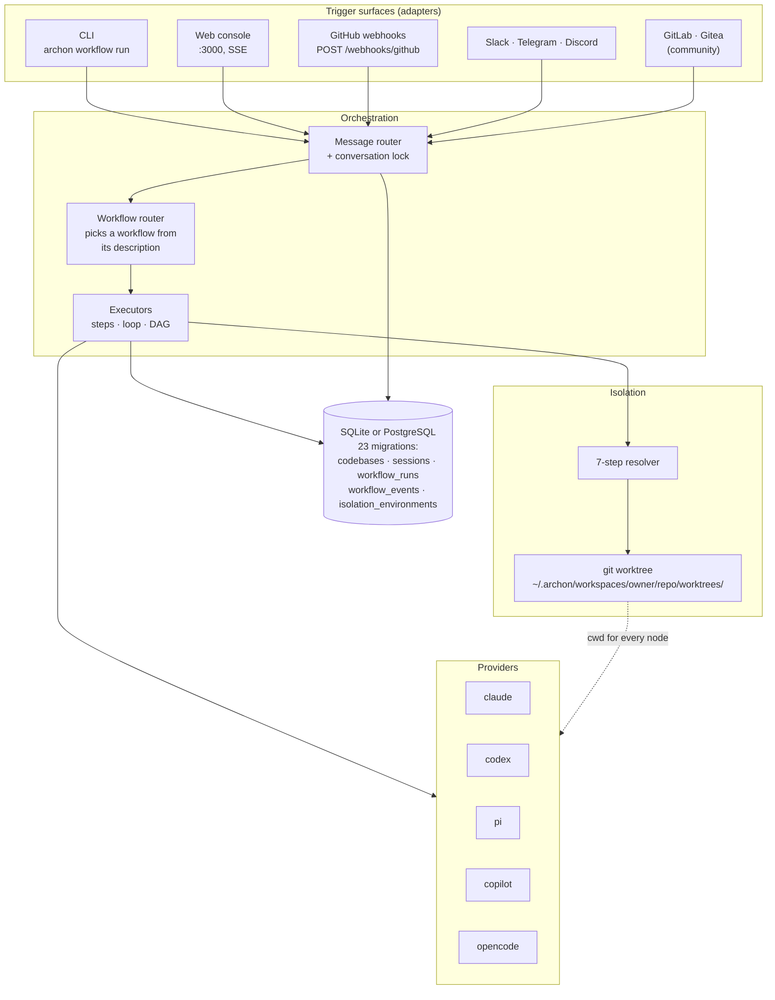
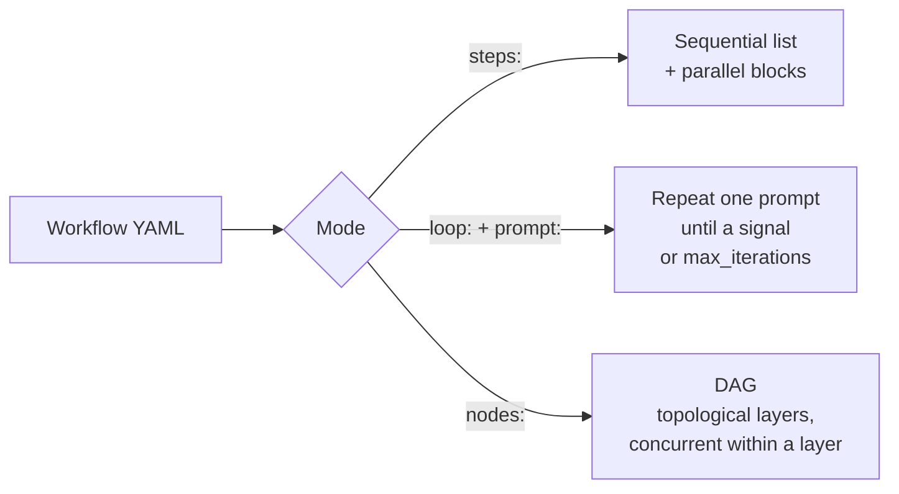
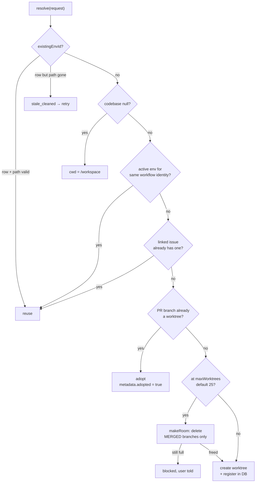
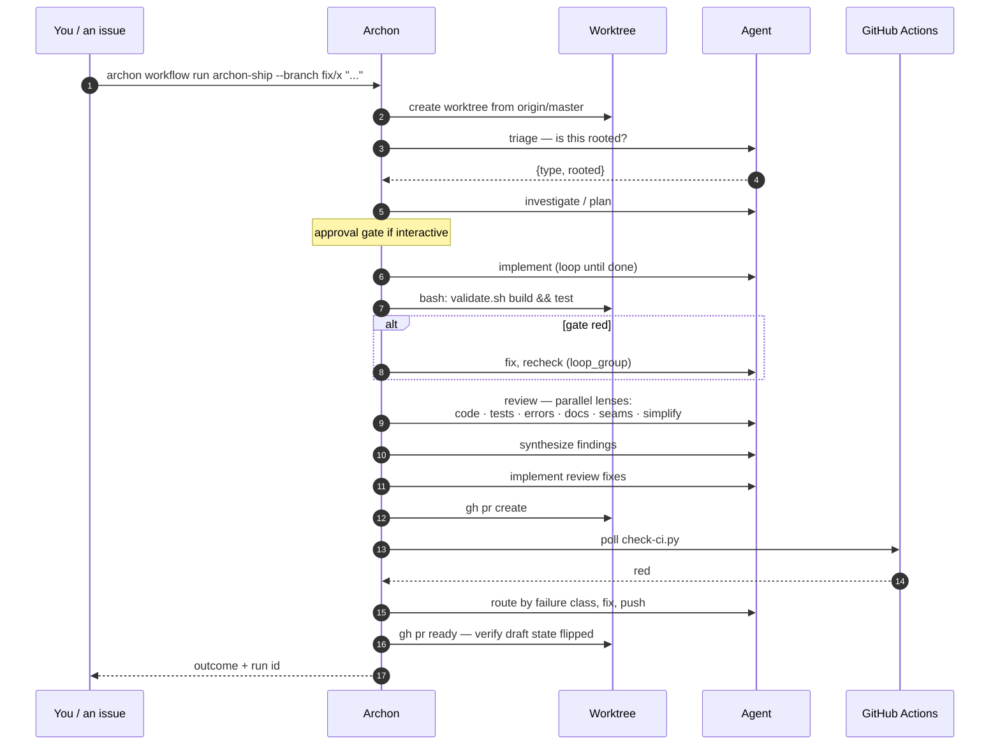
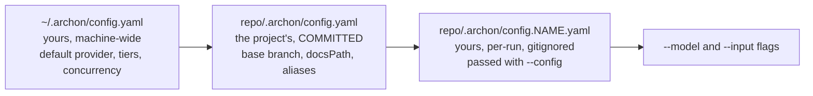

# What Archon is

> Researched 2026-09-05 against [`coleam00/Archon`](https://github.com/coleam00/Archon)
> `dev` branch, release **0.10.1** (2026-08-30), ~23.4k stars, open source,
> TypeScript on the Bun runtime. This document describes what the code does
> today, not what a blog post says it does. See
> [Version drift](#version-drift--read-this-before-trusting-any-of-this) at the
> end.

---

## First, the name collision — you may have read about a different product

The repository has shipped **two unrelated products** under the name Archon.

| | Old Archon | Current Archon |
|---|---|---|
| What | Knowledge base + task manager + MCP server | Workflow engine / "harness builder" |
| Stack | Python, FastAPI, React, Supabase + pgvector | TypeScript, Bun, SQLite or PostgreSQL |
| Sells itself as | RAG over your docs, tasks for your coding agent | Deterministic, repeatable SDLC automation |
| Where it lives now | archived on branch `archive/v1-task-management-rag` | `main` / `dev` |

The rewrite is tracked in
[issue #957](https://github.com/coleam00/Archon/issues/957) and
[issue #952](https://github.com/coleam00/Archon/issues/952). **Almost every
tutorial, YouTube video and "Archon setup guide" older than roughly mid-2026
describes the archived Python product.** If a guide tells you to create a
Supabase project and run SQL migrations for a `crawled_pages` table, it is the
old one, and none of this document applies to it.

Everything below is the current product.

---

## The one-sentence version

**Archon turns a software-delivery process into a versioned YAML DAG, runs each
node on a coding agent or a shell command, isolates every run in its own git
worktree, and gates progress on deterministic checks rather than on the model's
opinion that it is finished.**

The tagline is *"make AI coding deterministic and repeatable."* The word doing
the work is **repeatable**. A single Claude Code session is a one-off: it
succeeds or fails based on how you happened to phrase things that day. Archon's
premise is that the *process* — investigate, plan, implement, review, validate,
open a PR, watch CI, respond to review — is stable even when the task is not, so
the process should be a committed artefact that is reviewed and improved like
code, and the model should be the interchangeable part.

You already believe this, by the way. `docs/architecture-upgrade/phase-*.md` are
exactly that artefact, written by hand: explicit commands, a `## Verify`
section, a rollback. Archon is the machine that would execute them and refuse to
continue when Verify fails. That correspondence is the whole reason this is
worth your time — see [the adaptation plan](02-adaptation-plan.md).

---

## Architecture



Monorepo layout, one Bun workspace per concern:

| Package | Owns |
|---|---|
| `packages/workflows` | YAML loader, validation, `executor`, `dag-executor`, condition evaluation, variable substitution, router |
| `packages/isolation` | The 7-step resolver, `WorktreeProvider`, error classification |
| `packages/git` | Branded `RepoPath` / `BranchName` / `WorktreePath` types, worktree and branch primitives |
| `packages/providers` | Claude / Codex / Pi / Copilot / OpenCode client wrappers |
| `packages/adapters` | Slack, Telegram, GitHub, and community Discord / GitLab / Gitea |
| `packages/server` | HTTP server, web adapter, SSE transport, webhook endpoints |
| `packages/cli` | `archon` binary — `workflow`, `setup`, `doctor`, `serve`, `ai`, `auth`, `skill`, `isolation`, `validate` |
| `packages/core` | Message handling, cleanup service, port allocation, shared types |
| `packages/web` | React console |

Deployment is a single container: `ghcr.io/coleam00/archon:latest`, one port
(default 3000), two volumes (`/.archon` for state, `/home/appuser` for the agent
CLIs' own config), SQLite by default and PostgreSQL if you point it at one.
There is a `deploy/docker-compose.yml` and a `deploy/cloud-init.yml` for a VM.

---

## The workflow language

A workflow is a YAML file discovered recursively from `.archon/workflows/` in
your repo, merged over the bundled defaults — **same name in your repo wins**,
which is how you customise without forking. Three execution modes; a file picks
exactly one.



`nodes:` is the mode that matters. Everything real is written as a DAG.

### Node types

Exactly one of these keys per node:

| Node | Runs | Use for |
|---|---|---|
| `command:` | An agent, prompt loaded from `commands/<name>.md` | Anything substantial — prompts belong in files |
| `prompt:` | An agent, inline prompt | Short classification and judgment |
| `bash:` | Shell, **no AI** | One- or two-line deterministic gates |
| `script:` | Python via `uv` or TypeScript via `bun`, **no AI** | Gate logic with branching |
| `loop:` | One AI job, repeatedly | Converge on a fix |
| `loop_group:` | A whole sub-DAG, repeatedly | Fix → recheck cycles |
| `approval:` | Nothing — it pauses and waits for a human | Irreversible or expensive actions |
| `cancel:` | Terminates the run with a reason | "This workflow does not handle that" |
| `wait:` | Delay | Polling external state |
| `workflow:` | A child run, own artifacts and audit trail | Composition across cost boundaries |
| `include:` | Flattens another workflow inline at load time | Reuse without a child run |

### Wiring

```yaml
name: pjx-example
description: |
  Use when: ...
  NOT for: ...
model: large              # tier keyword — small | medium | large — or an @alias.
interactive: false        # must be true if any approval node exists
inputs:
  issue: { default: "", description: Issue number }
returns: implement        # which node's output is the run's terminal output
outcome_field: green      # persist one authored boolean beside the run status
worktree:
  enabled: true

nodes:
  - id: classify
    prompt: "Classify $ARGUMENTS as BUG or CHORE."
    allowed_tools: []               # pure judgment, no tools
    output_format:                  # declare ONLY when a machine reads a field
      type: object
      properties:
        type: { type: string, enum: [BUG, CHORE] }
      required: [type]

  - id: implement
    command: implement              # commands/implement.md
    depends_on: [classify]
    when: "$classify.output.type == 'BUG'"

  - id: build-gate
    bash: ./local/scripts/validate.sh build
    depends_on: [implement]
    timeout: 900000

  - id: decide
    script: gate-green              # scripts/gate-green.py
    runtime: uv
    depends_on: [build-gate]
    trigger_rule: all_done          # run even if build-gate failed
    with:
      built: { from: "$build-gate.output", if_skipped: "none" }
```

Four mechanics worth internalising, because they are what make this different
from a prompt chain:

1. **`depends_on` + `trigger_rule`.** Join semantics are explicit:
   `all_success` (default), `one_success`, `none_failed_min_one_success`,
   `all_done`. A gate node that must *report* on a failure uses `all_done`.
2. **`when:`** is deliberately feeble — `$node.output[.field] == 'value'` or
   `!=`, single-quoted literals only, and an unparseable expression evaluates to
   `false` and skips the node. There is no expression language to get clever in.
3. **`output_format`** is JSON Schema, and the guidance is to declare it *only*
   when a machine consumes the field. Structured output is a contract, not
   decoration.
4. **`bash:` and `script:` nodes have no AI in them at all.** This is where the
   determinism comes from. The model proposes; the exit code disposes.

### Variables

`$ARGUMENTS` / `$USER_MESSAGE` (the trigger message), `$WORKFLOW_ID`,
`$ARTIFACTS_DIR`, `$BASE_BRANCH`, `$CONTEXT` / `$ISSUE_CONTEXT` (GitHub issue or
PR body), `$INPUTS.<name>`, `$LOOP_PREV_OUTPUT`, and `$nodeId.output[.field]`
for upstream results. Values substituted into `bash:` bodies are shell-quoted.

---

## Isolation — the part that makes parallelism safe

Every run gets a git worktree. Not a clone, not a branch checkout in place — a
worktree, so `n` runs can hold `n` different branches of the same repository
simultaneously without touching your working tree.



Details that will bite you specifically:

- **Path layout** is `~/.archon/workspaces/<owner>/<repo>/worktrees/<branch>`.
- **`.archon/` is always copied** into a new worktree; anything else you need
  there must be listed in `worktree.copyFiles` in `.archon/config.yaml`
  (supports `"source -> destination"`). For pjx that means `.env`, the mkcert
  material, and `global.json` — see
  [adjustments](04-adjustments-and-optimizations.md).
- **Ports are allocated deterministically**: `PORT` env var wins, otherwise a
  worktree hashes its own cwd to a stable port in `3190–4089`. Archon assumes an
  app under test binds a *variable* port. pjx binds 80 and 443. This is the
  single biggest impedance mismatch and it is dealt with in
  [the plan](02-adaptation-plan.md#the-hard-problem-parallel-runs-versus-a-fixed-port-stack).
- **Cleanup runs at startup and every 6 hours**: filesystem gone, branch merged,
  or 14 days stale. Uncommitted changes block removal.
- **`worktree.enabled` bounds git files only** — not `~/.archon`, not env vars,
  not the database, not your Docker daemon. Two runs still share one Docker
  socket.

---

## What the process actually looks like

The bundled `sdlc` pack is the reference implementation and the best thing in
the repo to read. It is a set of composable workflows, each a DAG, each with its
own `commands/`, `scripts/` and — importantly — **`fixtures/`**, which are
stubbed runs used to test the workflow itself.



The pack's own `README.md` contains the design rule I would steal wholesale:

> A guard here must protect an action the node it lives in takes. […] **If this
> pack's fixture suite cannot exercise the guard, it is not a guard. It is a
> comment — write it as one.**

and

> Evidence never carries credentials. The engine retains what every exec node
> prints, so a node's output is the record whether it set out to keep one or
> not.

That second one matters for pjx: a node that echoes a remote URL containing a
token, or dumps `docker compose config`, has just written your secrets into the
run transcript.

---

## Configuration and cost

Three layers, resolved in order:



The per-run layer is sparse and **strict** — an unknown key is a hard error, not
a silent drop — and it is sealed at launch, so editing it mid-run does nothing.

Models are addressed by **tier** (`small` / `medium` / `large`) or by an
`@alias`, never by a literal model id in a workflow. That indirection is the
cost lever: re-point `medium` at a cheaper model and every review node in every
workflow follows. As of 0.10.1 built-in tiers ship for `claude` and `codex`
only; if you run any other provider you must set tiers yourself or workflows
refuse to load.

There is no getting around the fact that a `ship`-class run is many agent
sessions. The review stage alone fans out to six or seven lenses. Budget in
runs, not in tokens, and use tiers and `effort` to control it.

---

## CLI surface

```bash
archon setup                                   # interactive first-run wizard
archon doctor                                  # environment diagnosis
archon serve                                   # HTTP server + web console + webhooks

archon workflow list                           # what is available here
archon workflow list <name> --full             # the full routing description
archon workflow search "pr review"             # the marketplace

archon workflow run <wf> --branch fix/x "<message>" --detach
archon workflow run <wf> --branch x --from master "<message>"
archon workflow run <wf> --no-worktree "<message>"
archon workflow run <wf> --input issue=42 --config .archon/config.mine.yaml

archon workflow wait <run-id> --json           # block until terminal or paused
archon workflow runs --json                    # recent runs, this project
archon workflow status --all --json            # active everywhere
archon workflow get <run-id> --verbose --json  # per-node detail

archon ai tier set large claude claude-opus-5  # cost control
```

`--detach` is the default posture and `wait` is preferred over polling.
Interactive workflows — anything containing an `approval:` node — refuse
`--detach` on a fresh launch.

---

## What it is not

- **Not a knowledge base.** No RAG, no crawler, no vector store. That was the
  old product.
- **Not an MCP server.** Workflow nodes can *use* MCP tools (an AI node with
  `allowed_tools: []` is MCP-only), but Archon does not expose itself as one.
- **Not a CI system.** It calls `gh` and reads GitHub Actions results; it does
  not run your pipeline. GitHub Actions stays exactly where it is.
- **Not a deployer.** Nothing in it knows about Kubernetes, Helm or Azure. A
  `bash:` node running `helm upgrade` is just a shell command, with all the
  authority that implies.
- **Not multi-tenant.** The web adapter has no auth: "single-developer tool on
  the local machine." Every chat and forge adapter gates on an explicit
  allow-list env var, and an empty allow-list means **open access**.

---

## Version drift — read this before trusting any of this

3,000+ commits on `dev`, and 0.10.1 shipped a breaking change to model tiers
nine days before this was written. Two of the documents I read — the
`.claude/docs/workflow-yaml-reference.md` and the newer
`.claude/skills/archon-cli/authoring-workflows/node-reference.md` — already
disagree with each other: the older one lists three node types, the newer eleven,
and `modelReasoningEffort` is deprecated in favour of `effort`.

So: **treat this document as an orientation, not a specification.** Before
writing any YAML, read `node-reference.md` and
`.archon/workflow-language-constitution.md` at the commit you actually
installed, and pin a version. Do not track `latest` on something moving this
fast while it is load-bearing for your delivery process.

---

Next: [How to adapt it to pjx](02-adaptation-plan.md).
