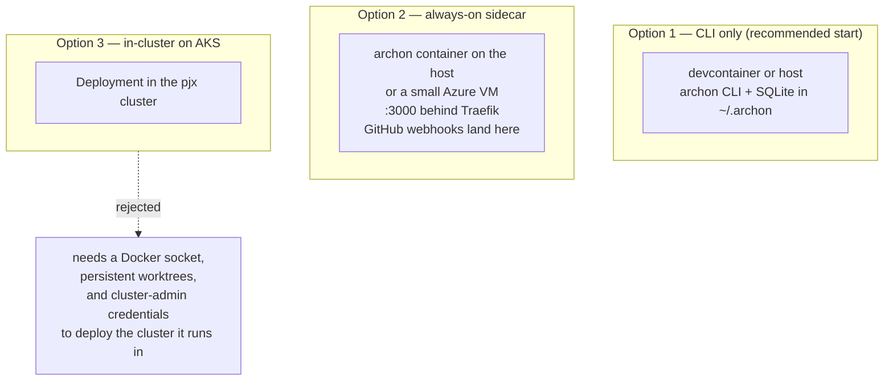
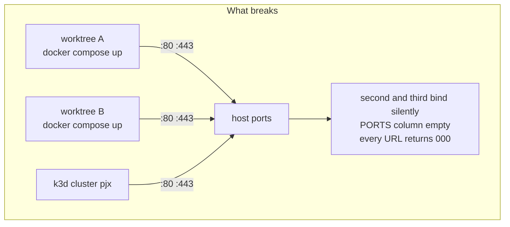
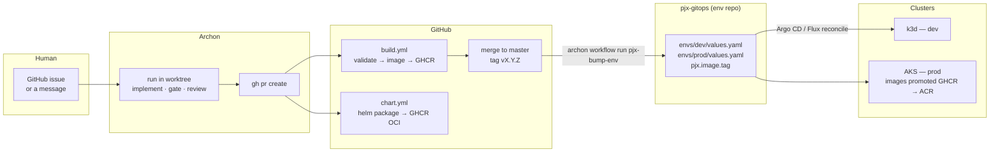

# Adapting Archon to pjx

> Assumes the target stated in
> [`docs/architecture-upgrade/README.md`](../architecture-upgrade/README.md):
> GitHub for source and CI, GitOps for cluster state, k3d locally, AKS on Azure,
> GHCR → ACR for images, Helm for packaging. Read
> [what Archon is](01-what-is-archon.md) first.

---

## The gate: do not start this before Phase 11

Archon's value is that it enforces a process against deterministic gates. It
therefore inherits every weakness in your gates and amplifies it, because it
runs them unattended, in parallel, at 3am.

Right now pjx has three gates: `validate.sh build`, `validate.sh test`, and a
human with a browser. The architecture-upgrade README says so itself —

> No automated browser test — every CORS bug this phase was invisible to `curl`

An agent that can build and test but cannot see a CORS failure will confidently
ship the exact class of bug that cost you Phase 7b. **Adopting Archon before the
gates are real converts a slow manual process into a fast wrong one.**

| Prerequisite | Where it is today | Why Archon needs it |
|---|---|---|
| Real CI on every PR | `.github/workflows/build.yml` exists ✅ | `deliver`-class workflows poll CI and route on the failure class |
| An end-to-end browser gate | listed as deferred, due by 7c ❌ | The only gate that catches the CORS/env-var class |
| Production images, not `Dockerfile.dev` | Phase 10 ❌ | 4-minute cold compiles make every agent iteration a timeout risk |
| Postgres, not SQLite | Phase 10 ❌ | Parallel worktrees cannot share one SQLite file |
| Deploy that is one command | Phase 11 ❌ | Otherwise a "deliver" workflow can only ever open a PR |

**Recommended entry point: after [Phase 11](../architecture-upgrade/phase-11-deploy.md).**
Phase 8 (Duende) is genuinely orthogonal and can happen either side.

There is, however, a set of preparation that costs nothing, that you should do
*inside* the architecture upgrade because it is good practice regardless —
see [the "do now" list](04-adjustments-and-optimizations.md#do-these-now--they-are-free).

---

## Decisions to lock before Phase A

### A1 — Where does Archon run?



**Recommendation: Option 1, then Option 2 when you want issue-triggered runs.
Never Option 3.**

Option 3 fails on its own merits, not on taste. Archon shells out to `git`,
`gh`, `docker`, `helm` and `kubectl`; giving a pod all of that means a
privileged pod holding cluster-admin, in the cluster it is modifying, with an
LLM choosing the arguments. The blast radius has no upper bound. Additionally
k3d is torn down and rebuilt constantly during pjx development, and Archon's
state — run history, worktrees, sessions — must outlive that.

If you want Option 2 in Azure later, the cheap shape is a B2s VM with
`deploy/cloud-init.yml`, or an Azure Container App with a file share for
`/.archon`. Not AKS.

**Where Option 1 runs matters too.** pjx uses docker-outside-of-docker, so the
devcontainer holds only the Docker CLI. Archon inside the devcontainer can
therefore drive the host daemon — good — but its worktrees would live in the
container's `~`, which is a `pjx-claude-config`-style volume problem. Put
`~/.archon` on a named volume from day one, or run the CLI on the host. Given
the host already has `docker`, `gh` and `git`, and the devcontainer's value is
the .NET/k8s toolchain, **run Archon on the host and let its bash nodes exec
into the devcontainer** for `dotnet`/`helm` work — see
[A4](#a4--which-toolchain-do-bash-nodes-see).

### A2 — Fork, or override?

**Do not fork.** Archon's extension mechanism is that a workflow in your
`.archon/workflows/` with the same `name:` shadows the bundled one. Everything
pjx needs — new workflows, new `commands/*.md`, new `scripts/*.py`,
config layers — lives in *your* repo. A fork means merging 3,000 commits a
quarter against a project that ships breaking changes in patch releases.

The one thing you cannot do without touching the codebase is add a **new
adapter** (Jira). That is dealt with separately in
[the Jira document](03-jira-integration.md), including how to get it without a
fork.

### A3 — Which repo, and what is a "codebase"?

pjx-root is a monorepo with the five services vendored under `projects/`
(decision D3 in the architecture upgrade — stay vendored). **This is the right
shape for Archon and you should not revisit it.** One worktree gives an agent
the whole system: React, Apollo, both APIs, SSO, the Helm chart, the Compose
files and the phase docs. A change that spans Apollo and the .NET API is one
run, one branch, one PR.

The cost is worktree weight. A fresh worktree of pjx-root needs `npm install`
across four Node projects and `dotnet restore` across eight `.csproj`. At three
concurrent runs that is real disk and real minutes. Mitigation is in
[adjustments](04-adjustments-and-optimizations.md#5-make-a-fresh-worktree-cheap).

### A4 — Which toolchain do bash nodes see?

An Archon `bash:` node runs with the CWD set to the worktree, in whatever
environment the Archon process has. pjx gates need `dotnet` 8, Node 18, `helm`,
`kubectl`, `k3d` and `az`. Three ways to supply them:

| | How | Verdict |
|---|---|---|
| a | Install the toolchain wherever Archon runs | Duplicates `.devcontainer/Dockerfile`; drifts |
| b | `bash:` nodes `docker compose exec` into the devcontainer | Cheap, but the devcontainer's CWD is not the worktree |
| c | `bash:` nodes run `docker run --rm -v <worktree>:/src <devcontainer-image> ...` | **Recommended** — the image is already built and pinned by Phase 6 |

(c) reuses the artefact Phase 6 produced, keeps the worktree as the source of
truth, and means the gate an agent runs is byte-identical to the gate CI runs
if `build.yml` uses the same image. Wrap it once:

```bash
# local/scripts/in-toolchain.sh — run a command in the pinned devcontainer image
#   against the CURRENT worktree, not against pjx-root.
exec docker run --rm \
  -v "$(git rev-parse --show-toplevel)":/src -w /src \
  -v /var/run/docker.sock:/var/run/docker.sock \
  -e HOST_PROJECT_PATH="$(git rev-parse --show-toplevel)" \
  "${PJX_TOOLCHAIN_IMAGE:?}" "$@"
```

The `HOST_PROJECT_PATH` line is not optional — rule 1 of "Where to run
commands" in the architecture upgrade README says bind-mount sources are
resolved by the *host* daemon, and a worktree's path is not pjx-root's path.
Getting this wrong silently mounts empty directories.

### A5 — Provider and tier bindings

```yaml
# .archon/config.yaml — committed, facts true for everyone
baseBranch: master
docsPath: docs
worktree:
  copyFiles:
    - ".env"
    - "local/certs -> local/certs"
    - "global.json"
```

```yaml
# ~/.archon/config.yaml — yours, and where the money is decided
tiers:
  small:  { provider: claude, model: claude-haiku-4-5-20251001 }
  medium: { provider: claude, model: claude-sonnet-5 }
  large:  { provider: claude, model: claude-opus-5, effort: high }
```

Keep model choices out of the committed file. Workflows reference tiers only.

---

## The hard problem: parallel runs versus a fixed-port stack

This is the one thing that will actually stop you, so it gets its own section.

Archon's design assumes an app under test binds a port derived from its own
worktree — `3090 + hash(cwd) % 900`. It expects `n` runs to be able to boot `n`
copies of the app at once. **pjx cannot do that today.** Every stack in it wants
fixed host ports, and the architecture upgrade README already documents that
even *three* of your own stacks collide:

> Only **one** of these can run at a time. Stop one before starting the next.
> pjx Compose Traefik · pjx k3d cluster · CloudDevEnvironment `central-router`

Add Archon and it is `1 + n`. Worse, the failure mode is the documented silent
one: Docker starts Traefik anyway and you get `Up` with an empty PORTS column.



Three ways out, in increasing order of effort and value:

### Tier 1 — Serialise the app-running gate (start here)

Most nodes do not need a running app. Build, unit test, lint, `helm lint`,
`helm template | kubeconform`, and every review lens are all static. Only the
end-to-end gate needs the stack.

So: let `n` runs proceed in parallel through everything static, and make the e2e
gate take a **host-wide lock**.

```bash
# local/scripts/with-stack-lock.sh
exec flock /tmp/pjx-stack.lock "$@"
```

Cheap, correct, and it caps e2e throughput at one — which is fine, because you
are one person and e2e is minutes, not hours.

### Tier 2 — Make the Compose stack instance-parameterised

Give every host-facing name and port an instance prefix, defaulting to today's
values so nothing changes for interactive work:

| Today | Parameterised |
|---|---|
| `pjx.test`, `ql.pjx.test`, … | `${PJX_INSTANCE:+$PJX_INSTANCE.}pjx.test` |
| Traefik `80:80`, `443:443` | `${PJX_HTTP_PORT:-80}`, `${PJX_HTTPS_PORT:-443}` |
| compose project `pjx-root` | `pjx-${PJX_INSTANCE:-root}` |
| mkcert SANs `*.pjx.test` | `*.pjx.test` **and** `*.*.pjx.test` |

An Archon node then does `export PJX_INSTANCE=$(basename $PWD)` and gets its own
stack. The wildcard-of-wildcard SAN is the fiddly bit — mkcert will issue
`*.*.pjx.test`, but browsers and .NET treat a two-label wildcard inconsistently,
so prefer `a1-pjx.test` style flat names over `a1.pjx.test` if it fights you.

This is genuinely useful outside Archon too: it is what would let you run the
Compose stack and the k3d cluster simultaneously, which the README currently
says you cannot.

### Tier 3 — A k3d cluster per run

Do not. `k3d cluster create` per run is minutes, gigabytes, and it still wants
80/443 unless you remap, and the image-import step in the README's edit-cycle
note is already the slowest thing in the project. **Agents should validate under
Compose and only humans should touch k3d**, at least until Phase 10 replaces the
dev images. Encode that as policy in `engineering.md` so agent nodes read it.

---

## The GitOps seam

Archon and GitOps meet at exactly one place: **Archon writes commits, GitOps
reads them.** Keep that boundary absolute. Archon never runs `kubectl apply` at
an environment; it opens a PR that changes the desired state, and the reconciler
does the rest.



> **A divergence worth naming.** [Phase 11](../architecture-upgrade/phase-11-deploy.md)
> currently specifies **push-based CD** — GitHub Actions authenticating to AKS via
> OIDC federation and deploying directly. That is not GitOps; it is CI with
> deploy credentials. You told me to assume GitOps, and the diagram above is the
> GitOps shape, so one of the two has to move. My recommendation is that Phase 11
> stays push-based (it is simpler, and it is the right weight for one developer
> and one demo cluster) and that **you adopt a reconciler only when you adopt
> Archon** — because that is the point at which an automated actor starts
> proposing deployments, and "the cluster only ever converges on a reviewed
> commit" stops being ceremony and starts being the control that makes agent-driven
> delivery safe.

Three consequences:

1. **You need an environment repo (or directory) that is separate from the
   source.** `helm-pjx/` is the *chart*; desired state per environment is a
   different artefact with a different review policy. Phase 11 is where this
   belongs; Archon just makes the case for it stronger, because "an agent may
   open a PR here" is a much easier thing to reason about when the repo contains
   nothing but values files.
2. **Image-tag bumps are the one automation worth having early.** A
   `pjx-bump-env` workflow — five nodes, one of them `approval:` for prod — is
   the smallest genuinely useful thing Archon can do for your delivery, and it
   needs no AI in the critical path at all.
3. **Never give a workflow standing credentials to a cluster.** If a node must
   run `kubectl` or `helm upgrade` against AKS, it sits behind an `approval:`
   gate and uses a short-lived federated token, not a stored kubeconfig. See
   [adjustments](04-adjustments-and-optimizations.md#10-do-not-let-a-workflow-hold-azure-credentials).

---

## The workflow catalogue for pjx

Bundled `sdlc` workflows (`archon-triage`, `archon-investigate`, `archon-plan`,
`archon-implement`, `archon-review`, `archon-validate`, `archon-deliver`,
`archon-pr`, `archon-ship`, `archon-upkeep`) work on any repo and are where you
start. These are the pjx-specific ones worth authoring, in the order they pay
back:

| Workflow | Shape | What it buys |
|---|---|---|
| **`pjx-gates`** | pure `bash:` DAG, no AI | The reusable gate block every other workflow `include:`s. Build, test, lint, `helm lint`, `helm template \| kubeconform`, e2e under the stack lock |
| **`pjx-e2e-repair`** | `loop_group` — run e2e, read the failure, fix, re-run | Directly closes the deferred item that blocks 7c. This is the highest-value one and it argues for building the browser test now |
| **`pjx-chart-change`** | plan → edit → `helm template` diff → review → PR | Chart edits are the change class where "it lints" and "it deploys" diverge most |
| **`pjx-bump-env`** | script-only + `approval:` for prod | The GitOps seam above. No AI in the critical path |
| **`pjx-phase-run`** | reads `docs/architecture-upgrade/phase-N.md`, executes numbered steps, runs the doc's `## Verify`, commits per step | Your phase docs already have this exact contract. See below |
| **`pjx-dep-bump`** | triage a Dependabot PR → build+test → review → auto-merge on green | `.github/dependabot.yml` exists and generates noise nobody triages |
| **`pjx-cors-audit`** | fan-out review lens across the five services | The Phase 7b failure class: `localhost:3000` hardcoded in two CORS policies, invisible to curl and Bruno |
| **`pjx-otel-check`** | assert every service emits spans after a change | Guards the Phase 5 investment from silent regression |

### On `pjx-phase-run`

Your phase documents are already written to a contract Archon can execute:

> Each phase is a separate document with explicit commands, a verification step,
> and a rollback. […] You execute the steps. This document is the instruction
> set, not a changelog.

and

> **Commit after every numbered step** […] so a single bad step can be dropped
> without unwinding the phase.

That maps onto a `loop_group` over steps, with the `## Verify` section as a
`bash:` gate and `git revert` as the failure path. It is a tempting first
project **and you should not make it your first project.** Executing an
architecture migration unattended is the highest-stakes thing in the catalogue.
Build it last, run it on a phase you have already done manually, and compare.

The reason it is on the list at all is the reverse insight: **because your phase
docs are executable-shaped, writing Archon workflows will feel familiar rather
than alien.** You already write process as artefact. This is the same discipline
with an interpreter attached.

---

## Phased adoption

Same conventions as the architecture upgrade: one branch per phase, commit per
step, every phase leaves the repo working, every phase has a Verify and a
rollback.

### Phase A — Evaluate, read-only

*Half a day. Touches nothing.*

1. Install on the **host**: `curl` installer or Homebrew, then `archon setup`.
   Pin the version — `archon --version` into a note.
2. `archon doctor`.
3. Point it at a **throwaway clone** of pjx-root, not your working tree.
4. `archon workflow list`, then `archon workflow list archon-review --full`.
5. Run exactly one thing: `archon workflow run archon-review --branch
   review/spike "Review the last commit on master for correctness."`
6. Read `archon workflow get <id> --verbose --json`. Look at what each node cost
   and what the review lenses actually found.

**Verify:** a completed run, a worktree under
`~/.archon/workspaces/mikelau13/pjx-root/worktrees/`, and a review you would not
be embarrassed to have written.
**Rollback:** `rm -rf ~/.archon`, uninstall. Nothing touched pjx-root.

**Stop here and decide.** If the review output is not better than what you get
from a single Claude Code session, the rest of this plan is not worth doing yet.

### Phase B — Own the gates

*One to two days. No Archon in it.*

No Archon-specific work at all. This is
[the "do now" list](04-adjustments-and-optimizations.md#do-these-now--they-are-free)
and it belongs in the architecture upgrade regardless: `AGENTS.md`,
`engineering.md`, `validate.sh lint|chart|e2e`, the Playwright browser test, and
`local/scripts/in-toolchain.sh`.

**Verify:** `./local/scripts/validate.sh e2e` fails on a deliberately
reintroduced `http://localhost:3000` CORS policy, and passes when reverted. That
single test is the whole justification for this phase.

### Phase C — First real workflows

*Two to three days.*

1. `.archon/config.yaml` committed with `baseBranch`, `docsPath`, `copyFiles`.
   `.archon/config.*.yaml` into `.gitignore`.
2. Author `pjx-gates` — `bash:` nodes only, no AI. Prove a worktree can build
   and test pjx from cold.
3. Author `pjx-dep-bump`. Low stakes, immediate value, exercises the whole loop.
4. Run `archon-ship` against one real, small, boring issue with `interactive:
   true` so you sit at the gates and watch.

**Verify:** a merged PR that an agent opened, that CI passed, that you would
have written approximately the same way.
**Rollback:** delete `.archon/`; the branch is a normal branch.

### Phase D — Parallelism and the stack lock

*One to two days.*

1. `with-stack-lock.sh` around the e2e gate (Tier 1 above).
2. Raise concurrency to 3. Launch three `pjx-dep-bump` runs at once.
3. Watch for the failure modes the architecture README already names: empty
   PORTS columns, `ENOTFOUND` between services, probes restarting pods mid-build.
4. Only if Tier 1 throughput actually annoys you, do Tier 2 instance
   parameterisation.

**Verify:** three concurrent runs, three worktrees, three branches, no port
collision, and `docker ps` shows exactly one app stack at a time.

### Phase E — Trigger from GitHub

*One day.*

1. Move Archon to Option 2 (always-on container) — host first, Azure later.
2. `archon serve`, route `POST /webhooks/github` through Traefik.
3. Configure a GitHub App or webhook with `GITHUB_WEBHOOK_SECRET`, and **set
   `GITHUB_ALLOWED_USERS=mikelau13`** — an empty allow-list means open access.
4. Note the adapter only handles `issue_comment.created`, `issues.closed` and
   `pull_request.closed` — **not** `issues.opened`. Triggering is by commenting
   `@archon …` on an issue, not by filing one.

**Verify:** commenting on an issue starts a run; the bot replies on the issue;
a second comment while the first run is live is serialised by the conversation
lock, not run twice.
**Rollback:** delete the webhook. Everything falls back to the CLI.

### Phase F — The GitOps seam

*Two to three days. Gated on Phase 11.*

1. Environment repo or directory with per-env values.
2. `pjx-bump-env`: read the new tag → edit values → `helm template` diff →
   `approval:` if prod → PR.
3. Argo CD or Flux reconciles. Archon still never touches a cluster.

**Verify:** tagging `v0.x.y` results, without human editing, in a PR against the
env repo that changes exactly one image tag, and a dev cluster that converges on
it after merge.

### Phase G — Jira, if you want it

See [the Jira document](03-jira-integration.md). Do not start it before Phase E,
because the cheapest good answer requires the GitHub path to be working already.

---

## Cost, honestly

A `ship`-class run is roughly: triage, investigate, plan, an implement loop of
2–5 iterations, six or seven parallel review lenses, a synthesize, a fix loop, a
PR, and CI-response rounds. Call it 15–30 agent sessions of varying size.

| Lever | Effect |
|---|---|
| Bind `small`/`medium` to Haiku/Sonnet and reserve Opus for `large` | The largest single lever; review fan-out is where spend concentrates |
| Use `bash:`/`script:` nodes wherever a check is deterministic | Free, and more reliable than asking a model |
| `allowed_tools: []` on pure-judgment nodes | Stops a classification node from reading the repo it does not need |
| `effort:` per tier rather than always `high` | 0.10.1 made this explicit per tier |
| Run `pjx-gates` before anything expensive | Fail on a red build before paying for a review |

The genuine risk is not the per-run cost. It is running a fleet of them against
gates that cannot tell you the answer is wrong. Which is Phase B, which is why
Phase B has no Archon in it.

---

Next: [Jira](03-jira-integration.md) ·
[Adjustments to Archon and to pjx](04-adjustments-and-optimizations.md)
