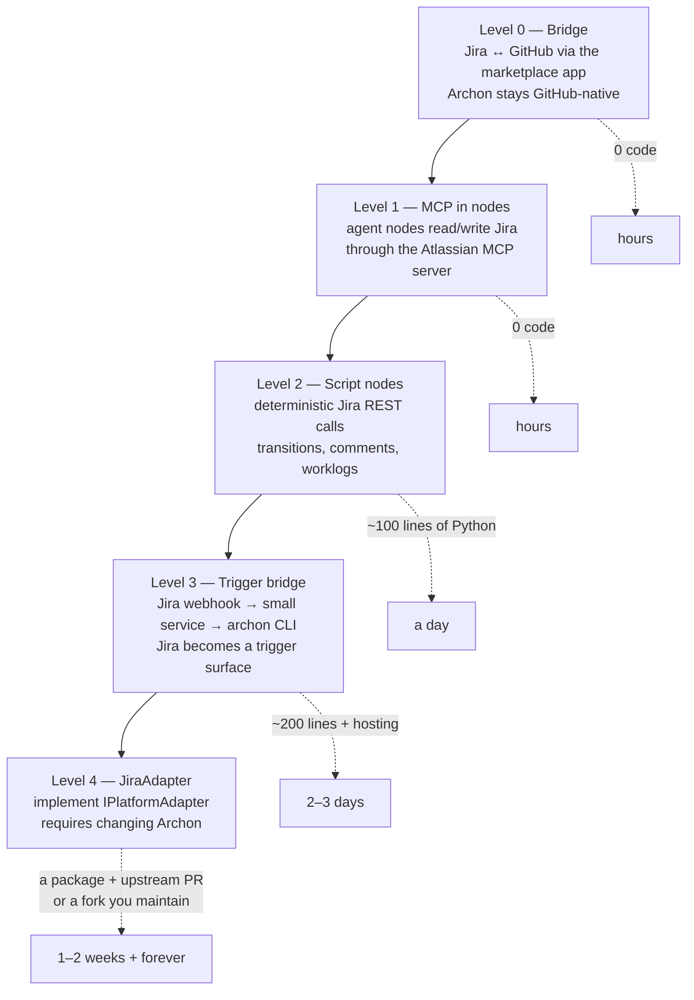
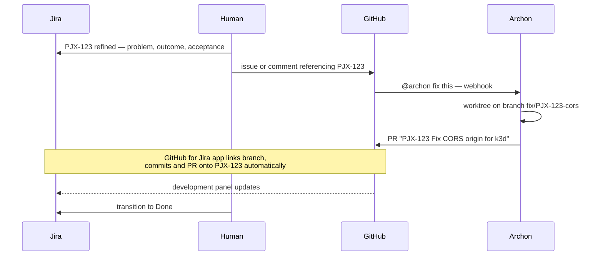
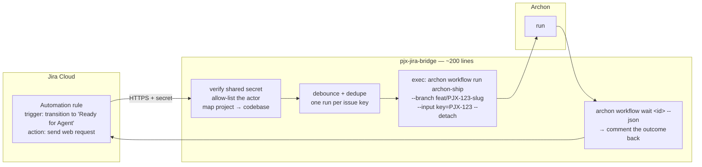
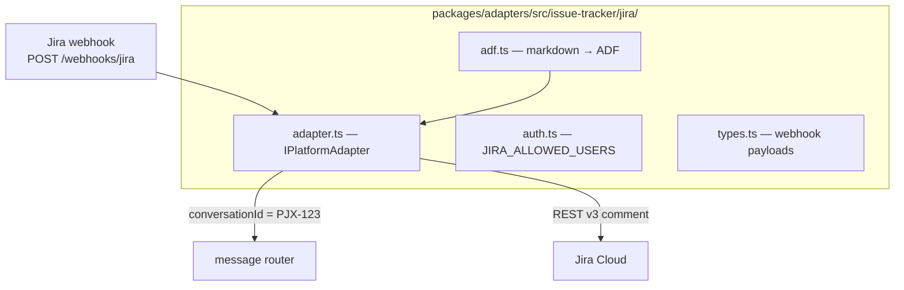
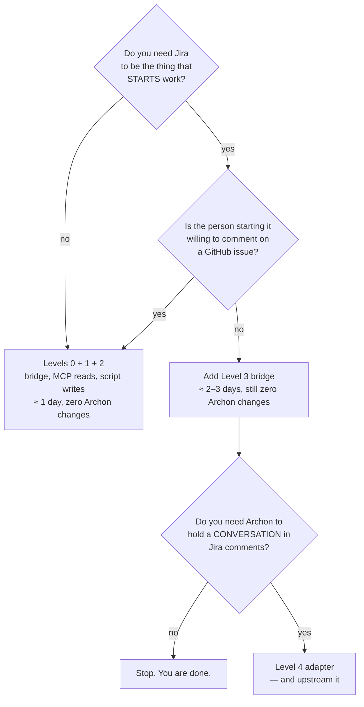

# Integrating Jira

> Short answer: **Archon has no Jira adapter, and you almost certainly should
> not write one.** There are three cheaper integrations that get you most of the
> value, and one of them requires no code at all. This document ranks them and
> tells you when the expensive one is actually justified.

---

## What exists today

Archon's adapters, verified against `packages/adapters/src/` on `dev`:

| Category | Adapters | Status |
|---|---|---|
| Chat | Slack, Telegram | First-party |
| Chat | Discord | Community |
| Forge | GitHub | First-party |
| Forge | GitLab, Gitea | Community |
| Web | the built-in console | First-party |

There is **no Jira, Linear, Azure DevOps or Atlassian anything** — not a stub,
not a partial. A repo-wide grep for `jira`, `atlassian` and `linear` returns
nothing.

That is not an oversight, it is a shape difference. Every existing adapter
implements `IPlatformAdapter`, which is a *conversation* interface —
`sendMessage`, `ensureThread`, `getStreamingMode`, `start`, `stop`. Slack
threads, Discord threads and GitHub issue comment threads all fit it. Jira
issues do too, roughly. But the thing you actually want from Jira is usually not
conversation — it is **state**: which issue is in which status, who owns it, what
the acceptance criteria say, and moving it along when work lands. State is
better served by a script node than by an adapter.

---

## The four integration levels



**Recommendation: do Levels 0, 1 and 2. Stop.** Add Level 3 only if you
genuinely need a non-developer to start work by moving a Jira card. Do Level 4
only if you intend to upstream it.

---

## Level 0 — Bridge Jira to GitHub, and leave Archon alone

Jira remains the system of record for *what* and *why*. GitHub remains the
system of record for *code*. The two are linked by the issue key, and Archon
never learns Jira exists.



What makes this work is three conventions, all free:

| Convention | Value | Enforced by |
|---|---|---|
| Branch names carry the key | `fix/PJX-123-cors` | `engineering.md`, read by every agent node |
| PR titles start with the key | `PJX-123 Fix CORS origin` | a `bash:` gate that greps the title, or a CI check |
| Commit trailers carry the key | `PJX-123 #comment gate green` | `engineering.md` + smart-commit support |

Install the **GitHub for Jira** app on the `mikelau13` org and the development
panel on every Jira issue fills itself in — branch, commits, PR, build status —
with zero integration code. Smart commits (`PJX-123 #comment …`, `#time 2h`,
`#close`) work over the same connection.

This gets you 70% of what people mean by "integrate Jira" for one afternoon of
setup. Everything after this is about closing the remaining 30%.

**Caveat:** the Archon GitHub adapter only reacts to `issue_comment.created`,
`issues.closed` and `pull_request.closed`. It does **not** react to
`issues.opened`. So "file a Jira ticket, get a PR" cannot be Level 0 alone — a
human or an automation must comment. That is what Level 3 buys.

---

## Level 1 — Give agent nodes Jira through MCP

Archon's AI nodes run on a provider, and a Claude-provider node can use MCP
tools. The workflow reference is explicit that `allowed_tools: []` means "no
built-in tools — MCP only". Atlassian ships a first-party remote MCP server for
Jira and Confluence; it is already an available connector in this Claude Code
environment, which means the auth path is a solved problem rather than a
project.

```yaml
- id: read-ticket
  prompt: |
    Read Jira issue $INPUTS.key. Extract, verbatim where possible:
      problem, why-now, desired outcome, invariants, acceptance criteria.
    If any of the five is absent, set thin=true and name which.
    Do NOT invent acceptance criteria.
  allowed_tools: []          # MCP only — this node has no shell and no file access
  output_format:
    type: object
    properties:
      problem:    { type: string }
      outcome:    { type: string }
      invariants: { type: string }
      acceptance: { type: string }
      thin:       { type: boolean }
      missing:    { type: array, items: { type: string } }
    required: [problem, outcome, acceptance, thin]

- id: refuse-thin
  cancel: "PJX ticket is missing: $read-ticket.output.missing — refine it first."
  depends_on: [read-ticket]
  when: "$read-ticket.output.thin == 'true'"
```

That second node is the point. Archon's own guidance says the input is the
contract and the six elements — problem, why worth solving, why now, outcome,
invariants, acceptance — must be present before a run is worth paying for. A
`cancel:` node that refuses a thin ticket costs nothing and saves you from
funding a run against a one-line "fix the login bug".

**Zero changes to Archon.** The MCP server is configured for the provider, not
for the workflow engine.

**The limitation:** MCP calls are made *by a model*, so they are non-deterministic
and they cost tokens. Fine for reading and summarising. Not what you want for a
status transition — that is Level 2.

---

## Level 2 — Deterministic Jira writes from script nodes

Anything that must happen exactly once, exactly right, should be a `script:`
node with no AI in it.

```yaml
- id: jira-progress
  script: jira-transition
  runtime: uv
  deps: [httpx]
  depends_on: [pr]
  with:
    key:  "$INPUTS.key"
    to:   "In Review"
    pr:   "$pr.output.url"
```

```python
# .archon/workflows/pjx/scripts/jira-transition.py
# Inputs arrive as INPUTS_KEY, INPUTS_TO, INPUTS_PR.
# Auth: JIRA_BASE_URL, JIRA_EMAIL, JIRA_API_TOKEN from the run's env.
#
# Two rules this file exists to enforce:
#   1. Never print a value that can contain a secret. Archon retains every exec
#      node's output as the run record, and stderr reaches the operator
#      unredacted. Interpolating the auth header into an error message leaks it.
#   2. Look the transition id up by name. Transition ids are per-workflow and
#      differ between Jira projects; a hardcoded id silently moves the wrong card.
```

Useful deterministic writes, in the order they earn their keep:

| When | Do |
|---|---|
| Run starts | Comment the run id and the branch. Now Jira links to the transcript |
| PR opened | Transition `In Progress → In Review`, comment the PR URL |
| Gates green | Comment the evidence — which gates, which commit |
| PR merged | Transition to whatever your DoD says, and **only** if your DoD genuinely means "merged" |
| Run failed | Comment the failure and the node it died in. Do **not** transition |

Two things not to automate:

- **Do not let a workflow move a card to Done.** Done is a human judgment about
  whether the outcome was achieved; the workflow only knows the gates went
  green. Let it reach "In Review" or "Ready for QA" and stop.
- **Do not let it estimate or log time.** It has no basis for either and the
  numbers will pollute your reporting.

### The Jira API gotchas, so you do not find them the hard way

| Gotcha | What happens | Fix |
|---|---|---|
| REST v3 comment bodies are **ADF**, not text or markdown | A plain-string body is rejected, or renders as one flat paragraph | Either use `/rest/api/2/issue/{key}/comment`, which accepts plain text, or build minimal ADF: `{"type":"doc","version":1,"content":[{"type":"paragraph","content":[{"type":"text","text":"…"}]}]}` |
| Transition **ids are per-project-workflow** | A hardcoded `31` moves the wrong card in a different project | `GET /rest/api/3/issue/{key}/transitions`, match on `name`, use the returned id |
| Comment bodies have a length cap (~32k chars) | A long agent transcript is truncated or 400s | Post a summary and a link to the run, never the transcript. This is also what Archon's own adapters do — every one of them splits on a per-platform limit |
| Cloud auth is `email:api-token` basic, not a bearer token | 401 that looks like a permissions problem | Base64 `email:token`; scope the token to one Jira user with only the projects it needs |
| Agent comments look like human comments | Automation loops, and confused humans | Prefix every automated comment with a marker. Archon's GitHub adapter appends `<!-- archon-bot-response -->` for exactly this reason — copy the pattern |

---

## Level 3 — Make Jira a trigger surface

Only worth building if someone who does not use GitHub needs to start work.



Design notes that matter more than the code:

- **The trigger is a transition, not issue creation.** "Moved to *Ready for
  Agent*" is a deliberate human act with a name; "created" is not. This also
  mirrors the deliberate choice Archon made on GitHub — it ignores
  `issues.opened` because issue bodies are documentation, not commands.
- **Dedupe on the issue key.** Jira Automation fires on edits you did not
  expect. Archon's isolation resolver will happily reuse a worktree for the same
  workflow identity, but you still do not want three runs racing.
- **Allow-list the actor**, the same way every Archon adapter does with
  `*_ALLOWED_USERS`. And remember Archon's own rule: an empty allow-list means
  open access, not closed.
- **The bridge holds credentials, so keep it dumb.** No LLM, no repo access, no
  ability to do anything but launch a named workflow with a validated key. It is
  the smallest thing that can be reviewed once and then trusted.
- **Host it beside Archon**, not in the pjx cluster — the same reasoning as
  [A1](02-adaptation-plan.md#a1--where-does-archon-run).

This is the option I would build **if** the requirement is real. It is
additive, it does not touch Archon's source, and if you later delete it nothing
else breaks.

---

## Level 4 — A real `JiraAdapter`

Archon documents how, in `.claude/docs/adapter-implementation-guide.md`, and the
checklist is genuinely short: implement six methods, a `parseAllowedJiraUsers` /
`isJiraAuthorized` pair in an `auth.ts`, use the lazy-logger pattern, use
`splitIntoParagraphChunks`, register in `packages/server/src/index.ts`.



The shape fits: `conversationId` is the issue key, `ensureThread` is a no-op
(Jira comments are inherently one thread per issue), `getStreamingMode` returns
`'batch'`, and the GitHub adapter is a close template — it is the other
webhook-driven, batch-mode, HMAC-verified one.

**The real work is not the interface, it is ADF.** Every other adapter emits
markdown or something close to it. Jira Cloud's v3 comment body is a structured
document tree, so a `JiraAdapter` needs a markdown→ADF converter that survives
code fences, tables, and links — which is where agent output actually lives.
That is the bulk of the effort and it is the part that will keep breaking.

**Why I would not do it:**

1. It is a change to Archon, which means a fork, which means merging against a
   project shipping breaking changes in patch releases. Decision
   [A2](02-adaptation-plan.md#a2--fork-or-override) says do not fork, and this is
   the case that tests it.
2. Levels 0–3 already deliver reading, writing, transitions and triggering.
   Level 4 adds only *conversation* — replying to Jira comments as a chat
   surface — and Jira is a poor chat surface.
3. If you do build it, **upstream it.** A merged `JiraAdapter` costs you a PR;
   an unmerged one costs you maintenance forever. Given the community-adapter
   precedent (`packages/adapters/src/community/`), there is an obvious place for
   it to land.

---

## Recommendation



For pjx as it stands — one developer, GitHub-native, Jira as the planning
surface — **Levels 0, 1 and 2**, sequenced after
[Phase E](02-adaptation-plan.md#phase-e--trigger-from-github). The single highest
value item in the whole document is the `cancel:` node in Level 1 that refuses a
thin ticket, because it moves quality control to before the money is spent.

---

Next: [Adjustments to Archon and to pjx](04-adjustments-and-optimizations.md)
