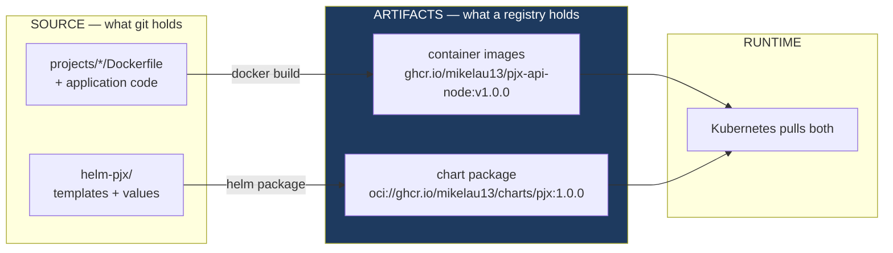
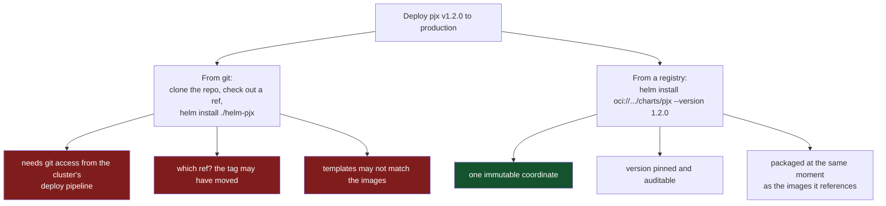
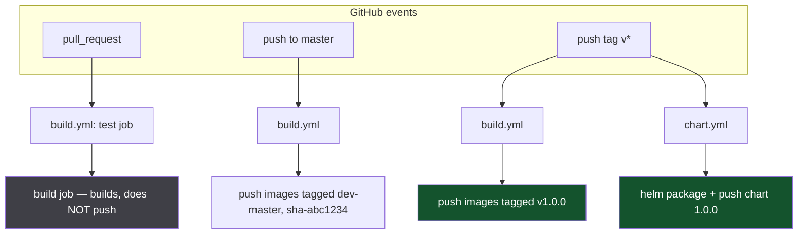
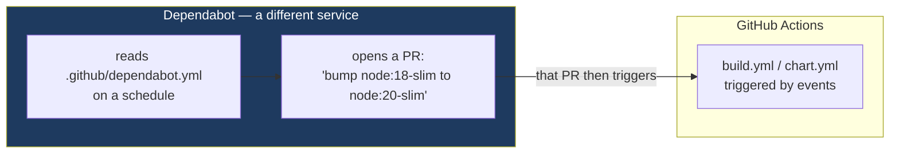
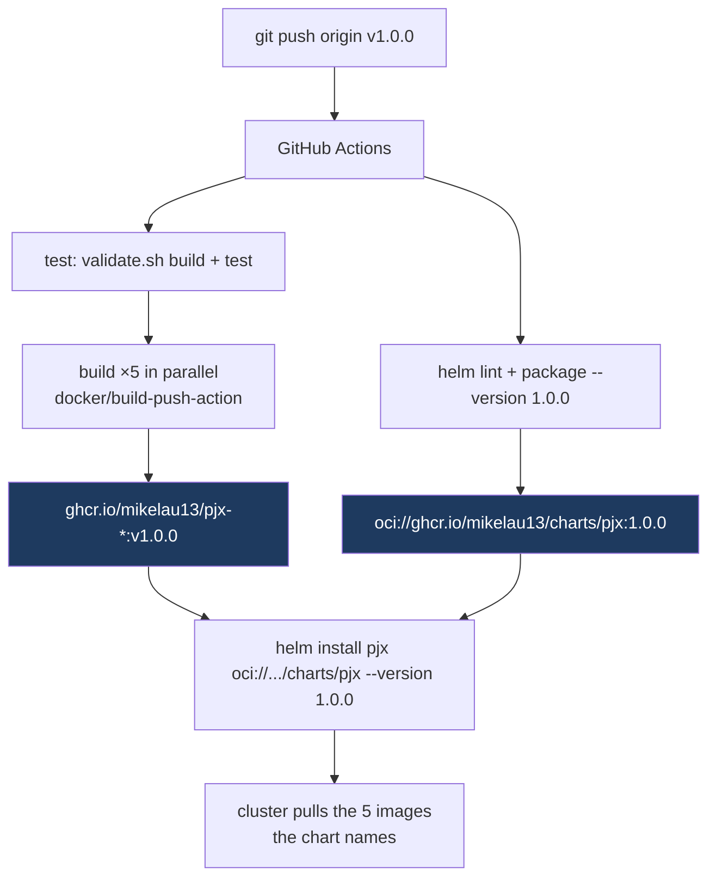
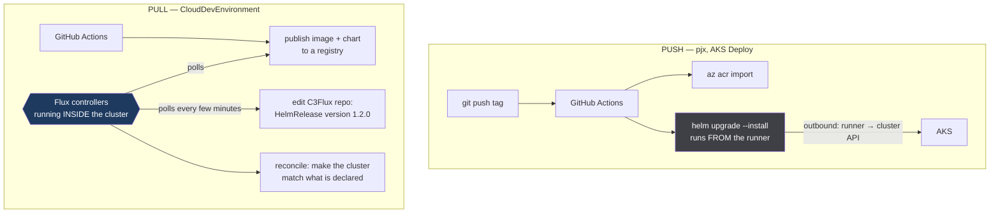

# CI/CD, registries, and why a chart gets published

What [Phase 7c](../architecture-upgrade/phase-7c-cicd.md) is actually building,
and the concepts underneath it: what a registry is, why a Helm chart you already
have needs publishing, what `on: tags` means, and where Dependabot fits — which
is **not** in the workflow.

Companion to [helm-chart.md](helm-chart.md) (what the chart contains) and
[k3d-networking.md](k3d-networking.md) (how a request reaches a pod).

---

## The one idea: source is not an artifact

Everything in this phase follows from one distinction.



Source is **mutable and unversioned** — a branch moves, a file changes, `main`
today is not `main` yesterday. An artifact is **immutable and versioned**: once
`pjx-api-node:v1.0.0` is pushed, that exact filesystem is frozen under that name
forever.

A deployment must reference artifacts, not source. Otherwise "what is running in
production?" has no answer you can trust.

CI is the machine that turns the first into the second, reproducibly, without a
laptop involved.

---

## What a registry is

A server that stores and serves artifacts, addressed by `name:tag`.

You have already used three without thinking about it:

| Registry | You pulled |
|---|---|
| Docker Hub (`docker.io`) | `node:18-alpine`, `nginx:1.19.0` |
| Microsoft (`mcr.microsoft.com`) | `dotnet/aspnet:8.0` |
| GitHub (`ghcr.io`) | — this phase makes you a *publisher* |

`docker pull node:18-alpine` is shorthand for
`docker pull docker.io/library/node:18-alpine`. The registry is the default; the
name was always fully qualified.

**GHCR is GitHub's registry.** It authenticates with the same token your Actions
workflow already has, which is why nothing extra needs configuring:

```yaml
password: ${{ secrets.GITHUB_TOKEN }}   # provided automatically per run
```

### OCI: why charts can live there too

**OCI** — Open Container Initiative — standardised what a registry stores. The
spec describes generic *artifacts*: a manifest, a set of layers, a media type.
Nothing in it is container-specific.

So registries can hold anything that fits that shape. Helm 3.8+ uses this: a
packaged chart is a `.tgz` with its own media type, pushed to the same server as
your images.

```
oci://ghcr.io/mikelau13/charts/pjx:1.0.0
^^^                                     the OCI protocol, not HTTPS+index.yaml
```

The older way was a **chart repository** — a static web server hosting an
`index.yaml` plus tarballs, usually GitHub Pages. OCI replaces it: one registry,
one auth mechanism, one access-control model for both artifact kinds.

---

## Why publish a chart you already have

Because the chart in `helm-pjx/` is **source**, and it has the same problem as
application source.



The decisive one is the third. `helm package --version "$VERSION" --app-version
"$VERSION"` stamps the chart with the same version as the images built from that
same commit, so `pjx.image`'s fallback to `.Chart.AppVersion` resolves to images
that provably exist. Deploying from git gives you a chart whose default tag may
point at nothing.

For local work `helm install ./helm-pjx` stays correct and is what
[Phase 7b](../architecture-upgrade/phase-7b-local-k8s.md) uses. Publishing is for
deployments you did not run by hand.

---

## Two workflows, two triggers

`build.yml` and `chart.yml` are separate files because they answer to different
events.



### What `on:` means

The `on:` block is the workflow's trigger. Nothing runs unless a matching event
occurs.

```yaml
on:
  push:
    branches: [master]      # every commit landing on master
    tags: ['v*']            # every tag starting with v
  pull_request:
    branches: [master]      # every PR targeting master
```

`chart.yml` has only the tag trigger — charts are published at releases, not on
every commit.

### What `on: tags` means in practice

A git tag is a name for one commit. `v*` is a glob, so `v1.0.0`, `v2.3.1` and
`v0.1.0-rc1` all match.

```bash
git tag v1.0.0
git push origin v1.0.0     # ← this is what fires the workflow
```

**Tags must be pushed explicitly.** `git push` alone does not send them, which is
the usual reason a release workflow "does not run".

**You currently have zero tags**, so the tag half of both workflows has never
fired. Only the PR and branch paths will do anything until you cut one.

### Why PRs build without pushing

```yaml
push: ${{ github.event_name != 'pull_request' }}
```

A PR proves the image *builds*. Publishing it would put untrusted code in your
registry under a name others might pull — and a fork's PR should never be able to
write to your packages. Build for the signal, push only from trusted refs.

---

## Where Dependabot fits: nowhere in the workflow

This is the question worth answering directly. **Dependabot is not a step, a job,
or an action.** It is a separate GitHub service that reads one config file and
opens pull requests on a schedule.



They only meet at the end: a Dependabot PR is a PR, so it triggers `build.yml`
like any other — which is the point. The bot proposes an upgrade, your pipeline
proves it compiles.

### Why Phase 7c configures it at all

Not to enable it — to **suppress it, visibly**, for one service:

```yaml
- package-ecosystem: docker
  directory: /projects/pjx-sso-identityserver
  # netcoreapp3.1 base is a known deferral tracked in phase-duende.md.
  open-pull-requests-limit: 0
```

`pjx-sso-identityserver` builds on `dotnet/core/aspnet:3.1-buster-slim` — an
unpatched runtime on Debian 10. The moment that image is in GHCR, GitHub's
scanner flags it, and it will keep flagging it until
[Duende](../architecture-upgrade/phase-duende.md) replaces IdentityServer4.

Two ways to live with that:

- ignore the alert, and gradually stop reading alerts at all
- suppress it **with a dated comment naming the phase that resolves it**

The second is the point. A suppression with a reason is a decision; a suppression
without one is a lie you tell yourself later. This is the same reasoning as the
[deferred-work table](../architecture-upgrade/README.md#deferred-work).

---

## What the tags on an image mean

`docker/metadata-action` generates several names for the same build:

```yaml
tags: |
  type=semver,pattern=v{{version}}      # v1.0.0     — only on a tag push
  type=ref,event=branch,prefix=dev-     # dev-master — on a branch push
  type=sha,format=short                 # sha-abc1234 — always
```

| Tag | Points at | Moves? |
|---|---|---|
| `v1.0.0` | one release | never |
| `dev-master` | latest master build | **yes, every push** |
| `sha-abc1234` | one commit | never |

A moving tag is why `imagePullPolicy` matters. `IfNotPresent` with `dev-master`
gives you whatever the node already cached — possibly weeks old. Immutable tags
make the policy irrelevant, which is the real argument for using them in anything
you care about.

`latest` is absent deliberately. It is the most-moving tag of all, and
[Phase 7b](../architecture-upgrade/phase-7b-local-k8s.md) only uses it because
`k3d image import` puts local builds in under that name.

---

## The full path, source to cluster



The `test` job gates the rest: `needs: test` on the build job means no images are
published from a commit that does not compile. That is the whole value of a
pipeline over a shell script — a failure stops the line rather than shipping.

### Where this goes next

[AKS Deploy](../architecture-upgrade/phase-aks-deploy.md) adds one hop. AKS pulls
from **ACR**, not GHCR, so images are copied registry-to-registry:

```bash
az acr import --source ghcr.io/mikelau13/pjx-api-node:v1.0.0 ...
```

`az acr import` copies the artifact without rebuilding, so the bytes that reach
production are the bytes CI tested. Rebuilding for a second registry would throw
that guarantee away — different base-image contents, different timestamps, a
different image wearing the same version.

That is also why `global.imageRegistry` is a chart value rather than a constant:
the same chart deploys from GHCR locally and ACR in Azure, with one `--set`.

---

## Push-based CD versus Flux (pull-based GitOps)

`on:` and Flux both "trigger deployments" and both pin versions, so they look
like alternatives doing the same job. They are opposite architectures, and pjx
and CloudDevEnvironment sit on opposite sides.



### The difference that matters

| | GitHub Actions `on:` | Flux |
|---|---|---|
| Model | **event** — something happened, run once | **reconciliation loop** — does actual match desired? |
| Runs | on a GitHub runner, outside the cluster | as controllers **inside** the cluster |
| Direction | runner reaches **in** to the cluster | cluster reaches **out** to git and the registry |
| Credentials | the cluster's API must be reachable, and CI holds credentials for it | none inbound; the cluster holds read-only tokens |
| Drift | invisible — a hand-edited Deployment stays edited until the next deploy | **corrected** — the next reconcile reverts it |
| "Deploy" means | a pipeline ran | a commit changed the desired state |

The reconciliation loop is the real distinction. Actions fires once and stops; if
someone runs `kubectl edit deploy` afterwards, nothing notices. Flux compares
continuously, so an out-of-band change is reverted within minutes. Git stops
being a record of what you *intended* and becomes a description of what *is*.

### Where each one pins

Both pin, in different places:

```yaml
# Actions — the pipeline names the version at deploy time
helm upgrade --install pjx oci://ghcr.io/.../charts/pjx --version 1.2.0
```

```yaml
# Flux — a HelmRelease in the config repo declares it; a commit changes it
spec:
  chart:
    spec:
      chart: c3
      version: "1.2.0"
      sourceRef: { kind: HelmRepository, name: c3-charts }
```

With Flux, **deploying is a pull request** against the config repo. That is why
CloudDevEnvironment has `C3Flux` and `AwareMDFlux` as separate submodules holding
"only declarative configuration" — the environments live there, not in the
pipeline, with `apps/base/` plus a `dev`/`stg`/`prod` overlay each.

### Why pjx uses push

Not because push is better — because pull costs more than a single demo cluster
justifies:

- a second repository to hold cluster state
- Flux controllers installed and upgraded in the cluster
- a sealed-secrets or External Secrets mechanism, since a public config repo
  cannot hold credentials
- one more moving part between "I pushed" and "it deployed"

CloudDevEnvironment carries that because it runs many environments across
multiple clusters, where hand-run deploys stop being auditable. pjx has one
cluster and one person.

The two are **not exclusive**, and the split is worth noting: CDE still uses
GitHub Actions to *build and publish*. Flux replaces only the last hop — how
artifacts get from the registry into a cluster. Phase 7c is the half both
architectures share.

### When pjx would want Flux

If a second environment appears, or a second person deploys. The migration is
smaller than it looks, because Phase 7c already produces what Flux consumes: a
versioned chart and versioned images in an OCI registry. What is missing is a
config repo and the controllers — not a change to how anything is built.

---

## Glossary

| Term | Meaning |
|---|---|
| **Registry** | server storing artifacts by `name:tag` — Docker Hub, GHCR, ACR |
| **OCI** | the standard that lets a registry hold non-container artifacts too |
| **Artifact** | an immutable, versioned, published thing — an image or a chart package |
| **Workflow** | a YAML file in `.github/workflows/` that Actions runs on an event |
| **Job** | a set of steps on one runner; jobs run in parallel unless `needs:` |
| **Runner** | the VM executing a job — `ubuntu-latest` here |
| **Matrix** | one job definition expanded per value, so five images build concurrently |
| **`GITHUB_TOKEN`** | per-run credential injected by Actions; needs `packages: write` to push |
| **Dependabot** | a separate service that opens dependency-bump PRs on a schedule |
| **Push-based CD** | a pipeline outside the cluster runs `helm upgrade` against it — pjx, AKS Deploy |
| **Pull-based CD / GitOps** | controllers inside the cluster reconcile it against a declared state — Flux, as CloudDevEnvironment uses |
| **Reconciliation** | the loop that compares actual cluster state to desired and corrects drift |
| **HelmRelease** | a Flux resource naming a chart, a version, and values — the pinned coordinate |
