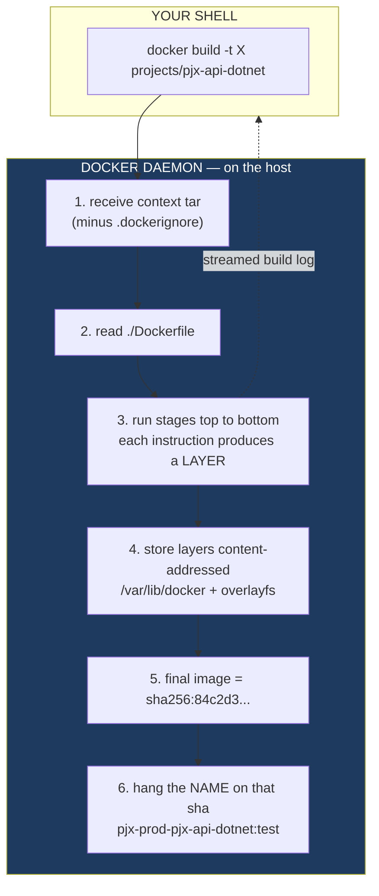
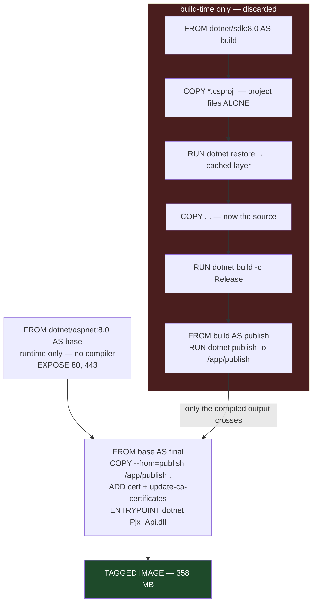
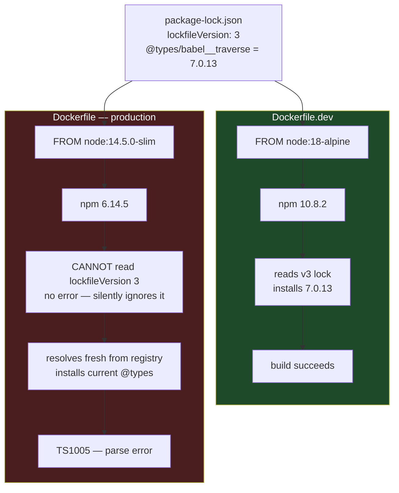
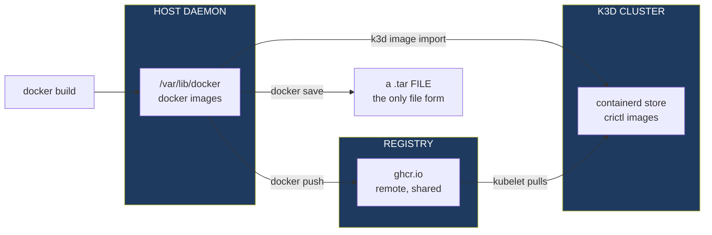
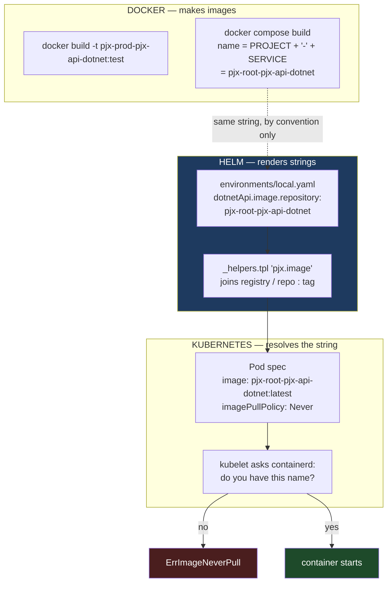

# docker build, and where images actually live

What happens between typing `docker build` and having something Kubernetes can
run — and the answer to the question that trips everyone up: **which file is the
image?**

Written while doing [Phase 7c](../architecture-upgrade/phase-7c-cicd.md) Step 0,
where we build all five production images by hand before letting a CI workflow
do it.

Companion to [ci-cd-and-registries.md](ci-cd-and-registries.md) (where images go
afterwards), [helm-chart.md](helm-chart.md) (who names them), and
[k3d-networking.md](k3d-networking.md) (how a request reaches the running one).

---

## The one idea: an image is not a file

This is the sentence to keep.

> `docker build` does not write a file into your repository. It sends your
> directory to a **daemon**, which produces a stack of layers in its own private
> store and hangs a name on it.

Nothing appears in `projects/`. Nothing appears in `git status`. The only way to
observe the result is to *ask the daemon*:

```bash
docker images | grep pjx-prod
```

If you want a file — an actual, copyable, e-mailable file — you have to ask for
one explicitly with `docker save`. Nothing else produces one. Hold on to that;
it explains a lot later.

---

## Anatomy of the command

```
docker build  -t "pjx-prod-pjx-api-dotnet:test"   "projects/pjx-api-dotnet"
     │             │                                    │
     │             │                                    └─ BUILD CONTEXT
     │             │                                       (a directory, not a file)
     │             └─ TAG — the name you are assigning
     └─ subcommand
```

Two arguments, and the second one is the one people misread.

| Part | What it is | Common misreading |
|---|---|---|
| `projects/pjx-api-dotnet` | the **build context** — the directory tarred up and shipped to the daemon | "the Dockerfile" |
| `-t name:tag` | a label hung on the finished image | "the output filename" |

There is no `-f` in our loop. When you omit it, Docker looks for a file named
exactly `Dockerfile` at the **root of the context**. So:

```
context:    projects/pjx-api-dotnet/
Dockerfile: projects/pjx-api-dotnet/Dockerfile     ← chosen by default
result:     pjx-prod-pjx-api-dotnet:test           ← a name, not a path
```

The `pjx-prod-` prefix is arbitrary. It was chosen so these test builds do not
overwrite the `pjx-root-pjx-*` images that Docker Compose built for development.
No tool reads that prefix or attaches meaning to it.

---

## The flow, end to end



Step 6 is the whole answer to "which file is it?". `-t` writes a
**name → sha256 pointer** into the daemon's image index. The image itself is a
set of compressed layer blobs under `/var/lib/docker`, owned by root, not
meaningfully browsable and not intended to be.

Confirm the store location on your own machine:

```bash
docker info --format 'Root: {{.DockerRootDir}}  Driver: {{.Driver}}  Host: {{.Name}}'
# Root: /var/lib/docker  Driver: overlayfs  Host: mike-ThinkPad-P51
```

> **Note for the devcontainer.** pjx uses docker-outside-of-docker: the
> devcontainer talks to the **host's** daemon through a mounted socket. So the
> context tar crosses the container boundary on the way in, and images you build
> from inside the devcontainer land in the host's store and survive a container
> rebuild. This is also why relative context paths must resolve inside the
> container, while the *daemon* — and therefore bind mounts — see host paths.

---

## Layers, stages, and why the cache is ordered that way

Every instruction that changes the filesystem produces one layer. Layers are
stacked, immutable, and shared between images that have identical prefixes.

`projects/pjx-api-dotnet/Dockerfile` is **multi-stage** — each `FROM` starts a
fresh stage:



Two things to take from this shape.

**Only the last stage becomes the tagged image.** Everything in the red box —
the ~800 MB SDK, the NuGet cache, the intermediate `bin/obj` — is thrown away.
That is why the production image is 358 MB.

**`COPY *.csproj` before `COPY . .` is deliberate.** Docker caches a layer and
reuses it as long as its inputs are unchanged. Project files change rarely,
source changes constantly. Splitting the copy means editing a `.cs` file
invalidates the cache at `COPY . .` — *after* the slow `dotnet restore` — instead
of before it. Merge those two COPYs and every build re-downloads every package.

---

## Dev image vs production image

This is the actual point of Phase 7c, and the sizes make it concrete:

| Service | Dev image | Prod image | Why the gap |
|---|---:|---:|---|
| `pjx-api-dotnet` | 2.22 GB | **358 MB** | dev ships the whole SDK to run `dotnet watch` |
| `pjx-sso-identityserver` | 1.62 GB | **357 MB** | same |
| `pjx-api-node` | 717 MB | 1.38 GB | prod not yet slimmed — see below |
| `pjx-graphql-apollo` | 795 MB | 779 MB | same |
| `pjx-web-react` | 915 MB | **206 MB** | prod drops Node entirely; nginx serves static files |

Each project carries **two** Dockerfiles, and they have opposite goals:

| | `Dockerfile.dev` | `Dockerfile` |
|---|---|---|
| Built by | `docker compose` / `make up` | `docker build` / CI |
| Base | SDK (`dotnet/sdk:8.0`) | runtime (`dotnet/aspnet:8.0`) |
| Source | **bind-mounted** from the host at runtime | **baked in** at build time |
| Command | `dotnet watch run` | `dotnet Pjx_Api.dll` |
| Edit a file | recompiles in place, seconds | requires a rebuild |
| Stages | one | four |

The dev image is a *development environment that happens to contain your code*.
The production image is *your code, compiled, and nothing else*. They are not
different builds of the same thing — they are different things.

> **Where this bites.** In Kubernetes there is no bind mount. A source edit does
> not reach a pod; you must rebuild the image, `k3d image import` it, and
> `kubectl rollout restart`. Phase 7b ran the *dev* images inside k3d, which is
> why the chart currently targets port 3000 for React (CRA dev server) rather
> than 80 (nginx, production). That mismatch is recorded in the
> [deferred-work table](../architecture-upgrade/README.md).

React is the clearest case — its production Dockerfile builds static files and
serves them from nginx, with no Node in the final image at all:

```dockerfile
FROM node:18-slim AS builder         # ← builds
RUN npm ci && npm run build
FROM nginx:1.19.0                    # ← serves; Node is gone
COPY --from=builder /app/build .
```

915 MB → 206 MB, the largest ratio of the five. Nothing that compiled the app
is present in the shipped image.

---

## Case study: when the two Dockerfiles drift

Phase 7c Step 0 turned up a failure worth keeping, because every step of it
looked innocent and none of the usual checks would have caught it.

`docker build` on `pjx-web-react` failed inside `npm run build`:

```
TypeScript error in /app/node_modules/@types/babel__traverse/index.d.ts(302,20)
']' expected.  TS1005

  > 302 |  [N in Node as N["type"]]?: VisitNode<S, N extends { type: N["type"] } ? N : never>;
        |             ^
```

`[K in T as ...]` is **mapped-type key remapping**, added in TypeScript 4.1.
This project pins `typescript ^3.7.5`. So a dependency arrived that the
project's own compiler cannot parse.

The question is *why it arrived*, since `package-lock.json` pins that package to
a version predating the syntax:



**npm 6 only understands lockfileVersion 1.** Handed a v3 file it does not fail,
warn, or refuse — it ignores the lock and resolves every range fresh against the
registry. A transitive, unpinned `@types/*` therefore floats forward to whatever
was published this morning.

Four conditions had to line up, and each is ordinary on its own:

| Condition | Why it looked fine |
|---|---|
| `Dockerfile.dev` moved to `node:18-alpine`; `Dockerfile` stayed on `node:14.5.0-slim` | the dev path is the one you exercise daily |
| `package-lock.json` was rewritten as v3 by a modern npm | that is just what npm 7+ does on install |
| `RUN npm install`, not `npm ci` | reads as the more forgiving choice |
| `@types/babel__traverse` is transitive and unpinned | nobody chose its version |

Three lessons generalise past this bug.

**A lock file is only as good as the npm that reads it.** Pinning versions
achieves nothing if the tool consuming the pin cannot parse the file. Pin the
*base image* too — it is what determines the npm version.

**`npm install` and `npm ci` are not interchangeable in a build.** `npm ci`
installs the lock verbatim and fails loudly when the lock and `package.json`
disagree. `npm install` is allowed to resolve something new. In an image build,
"resolve something new" means the image is not reproducible — build it twice a
week apart and get two different filesystems from identical source.

**Dev and production Dockerfiles drift silently.** They are two files that are
supposed to describe the same application, and only one of them runs every day.
The other is discovered to be broken at the worst possible moment — in CI, on a
release tag. This is the strongest argument for Step 0: build the production
images by hand *now*, before a workflow depends on them.

The fix was three lines in Stage 1 — `node:18-slim`, `npm ci`, and
`NODE_OPTIONS=--openssl-legacy-provider` (react-scripts 3.4.3 uses a hash
algorithm OpenSSL 3 rejects; the `start` script already carried the flag, but
`build` did not).

> **Still deferred.** The image builds; the underlying pins do not move.
> `react-scripts ^3.4.3` (2020, end-of-life) and `typescript ^3.7.5` now compile
> on Node 18 via a compatibility flag rather than because they support it, and
> Stage 2's `nginx:1.19.0` is equally old. Tracked in the
> [deferred-work table](../architecture-upgrade/README.md), owed before Phase 10.

---

## Three stores, three different places an image can live

The single most useful mental model, and the source of most "but I built it!"
confusion:



These stores are **completely separate**. An image in the host daemon is
invisible to the cluster until you import or push it. `k3d image import` is
internally a `docker save` piped into the cluster's containerd — which is why
it is slow and why the tar file is the hidden common currency.

Checking each one:

```bash
docker images | grep pjx                       # host daemon
docker exec k3d-pjx-server-0 crictl images     # cluster (Phase 7b)
docker manifest inspect ghcr.io/OWNER/img:tag  # registry, without pulling
```

---

## Who names images — the string handoff

Neither Helm nor Kubernetes ever builds anything. They only ever hold a
**string**, and never verify it means anything until the kubelet tries to
resolve it.



Note the dotted line. Nothing enforces that `values.yaml` names an image that
exists. The connection between "Compose built `pjx-root-pjx-api-dotnet`" and
"the chart asks for `pjx-root-pjx-api-dotnet`" is **convention held by hand**.
Get one character wrong and Helm renders valid YAML, the API server accepts it,
and the failure only surfaces as a pod event.

Compose's naming rule is worth memorising, since it produced those dev names:

```
<compose project name> - <service name>
      pjx-root         -  pjx-api-dotnet   →  pjx-root-pjx-api-dotnet:latest
```

---

## Reading the loop itself

```bash
for s in pjx-web-react pjx-graphql-apollo pjx-api-node pjx-api-dotnet pjx-sso-identityserver; do
  echo "==> $s"
  docker build -t "pjx-prod-$s:test" "projects/$s" || echo "FAILED: $s"
done
```

| Piece | Why it is there |
|---|---|
| `for s in ...` | the five service directory names, which are also the image-name stems |
| `echo "==> $s"` | marks the boundary in a very long combined log |
| `"projects/$s"` | quoted so a path with a space would still work |
| `\|\| echo "FAILED: $s"` | `\|\|` fires only on a **non-zero exit** — build failed |

That last one is the important bit: it lets the loop **continue past a failure**
instead of stopping at the first one. You get all five verdicts in one run.
Without it, a React failure would hide whether .NET builds.

A quieter variant that reports only pass/fail:

```bash
for s in pjx-web-react pjx-graphql-apollo pjx-api-node pjx-api-dotnet pjx-sso-identityserver; do
  docker build -t "pjx-prod-$s:test" "projects/$s" >/dev/null 2>&1 \
    && echo "OK      $s" || echo "FAILED  $s"
done
```

Run the loud version when something fails and you need the error.

---

## Inspecting what you built

| Question | Command |
|---|---|
| What images exist? | `docker images \| grep pjx` |
| What is in this one, layer by layer? | `docker history pjx-prod-pjx-api-dotnet:test` |
| What is its entrypoint / sha / size? | `docker image inspect  --format '{{.Id}} {{.Config.Entrypoint}}'` |
| Does this base image even exist? | `docker manifest inspect mcr.microsoft.com/dotnet/aspnet:8.0` |
| Poke around inside it | `docker run --rm -it --entrypoint sh ` |
| Turn it into a real file | `docker save  -o /tmp/img.tar` |
| Reclaim the disk | `docker image prune` / `docker rmi ` |

`docker manifest inspect` is the cheap one worth remembering — it queries the
registry over the network and returns **without downloading gigabytes**. It is
how we proved `mcr.microsoft.com/dotnet/core/aspnet:8.0` does not exist: the
`dotnet/core/` path was retired after 3.1, so 8.0 lives at `dotnet/aspnet:8.0`.
The 3.1-era SSO Dockerfile still legitimately uses `dotnet/core/`.

---

## Gotchas found in this repo

**Only `pjx-web-react` has a `.dockerignore`.** The other four projects have
none, so `COPY . .` ships the entire working tree into the build stage —
`bin/`, `obj/`, `node_modules/`, `PjxCalendar.db`, `.git/`. Harmless for the
final image (only `/app/publish` crosses into `final`), but it inflates the
context transfer and busts the layer cache on any file touch. React's file is
the model to copy:

```
node_modules
.git
.gitignore
docker-compose.yml
Dockerfile
README.md
```

**`imagePullPolicy: Never` means the string must already resolve locally.** It
is correct for local k3d — it stops the kubelet reaching out to Docker Hub for
an image that only exists on your laptop — but it converts "wrong name" and
"forgot to import" into the same opaque `ErrImageNeverPull`.

**`:latest` is a mutable pointer, not a version.** Rebuilding moves it. Two
machines holding `pjx-root-pjx-api-dotnet:latest` can hold different bytes. This
is exactly why Phase 7c pushes immutable, tagged artifacts to a registry — see
[ci-cd-and-registries.md](ci-cd-and-registries.md).

**A build that succeeds proves nothing about runtime.** `docker build` verifies
that the image *assembles*. It does not start the process, hit a health check,
or contact a database. All five images can build and the app still be broken.

---

## Glossary

| Term | Meaning |
|---|---|
| **build context** | the directory sent to the daemon; `COPY` can only read from inside it |
| **layer** | one filesystem diff, produced by one instruction, immutable and shareable |
| **stage** | one `FROM` block; intermediate stages are discarded unless copied from |
| **image** | an ordered stack of layers plus config (entrypoint, env, ports) |
| **tag** | a mutable `name:version` pointer to an image sha |
| **digest** | `sha256:...` — the immutable identity; a tag can move, a digest cannot |
| **daemon** | the `dockerd` process that owns the image store and does the building |
| **registry** | a server that stores images by `name:tag`, e.g. Docker Hub, `ghcr.io`, `mcr.microsoft.com` |
| **containerd** | the runtime Kubernetes uses; keeps its **own** image store, separate from Docker's |
| **lockfileVersion** | `package-lock.json` format number — v1 is npm 6, v2/v3 are npm 7+; **npm 6 silently ignores a v3 lock** |
| **`npm ci`** | installs the lock verbatim and fails if it disagrees with `package.json`; `npm install` may resolve something new |
