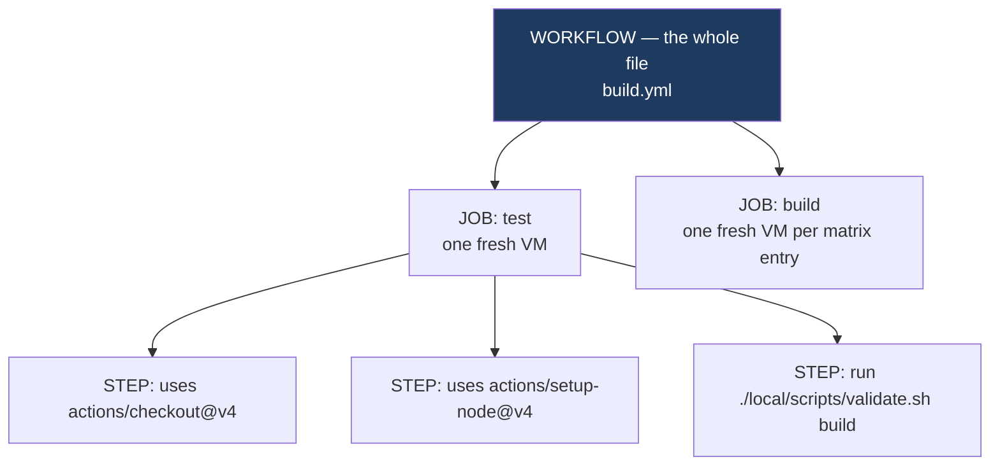
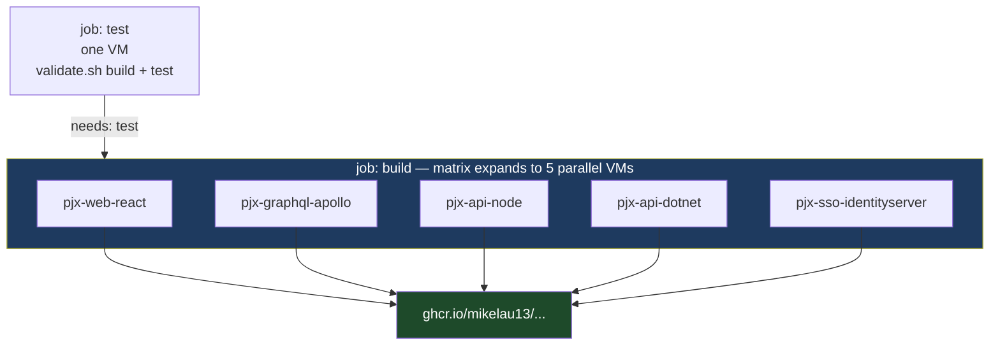
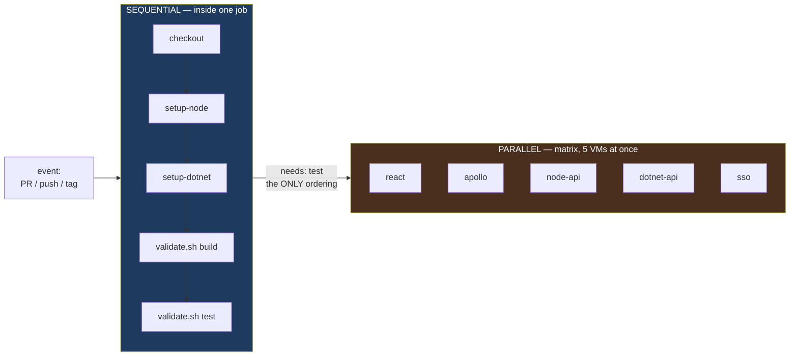
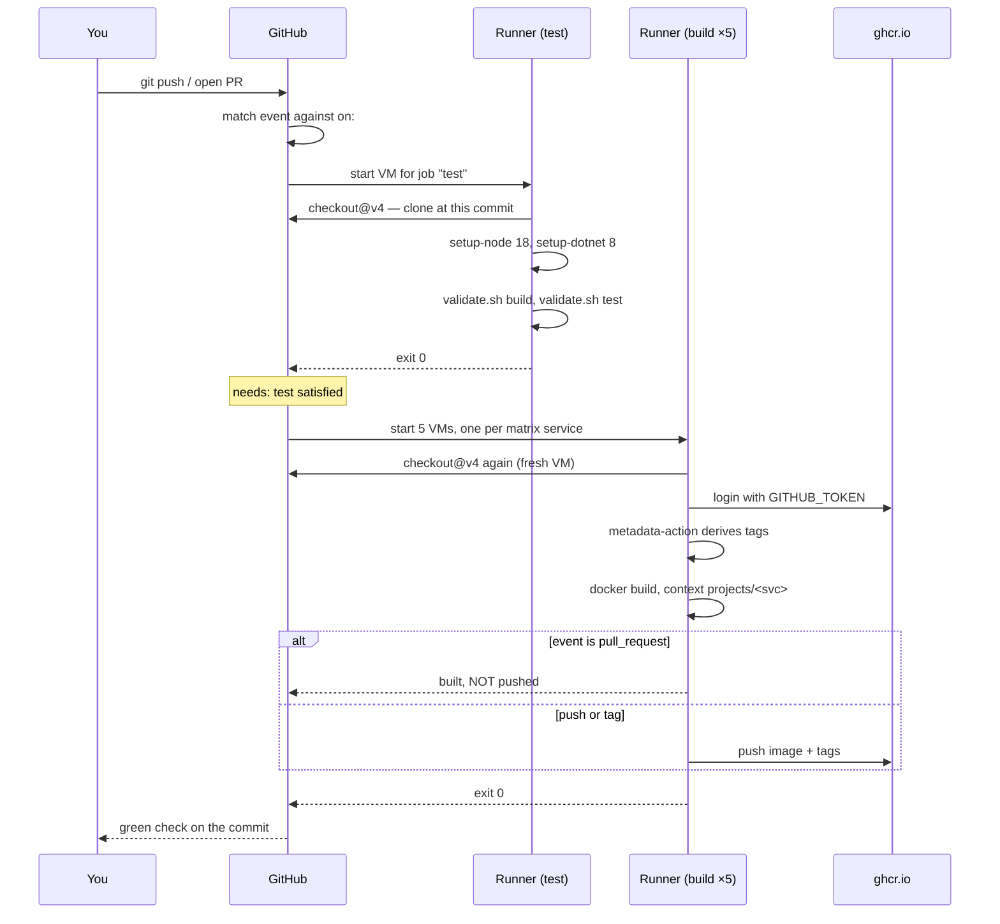

# What `.github/workflows/build.yml` actually is

A line-by-line reading of the workflow file created in
[Phase 7c Step 1](../architecture-upgrade/phase-7c-cicd.md#step-1--github-actions):
what it declares, who reads it, when it runs, and why it is a **dependency graph**
rather than a script.

Companion to [ci-cd-and-registries.md](ci-cd-and-registries.md) (why publish
artifacts at all, and what the `on:` triggers mean) and
[docker-build-and-images.md](docker-build-and-images.md) (what `docker build`
does, which is the work this file delegates).

---

## The one idea: you are not running this file

`build.yml` is not a script you execute. It is a **declaration you hand to
GitHub**, describing work you want done *on someone else's computer* when
something happens to your repository.

| | A shell script | A workflow file |
|---|---|---|
| Who runs it | you, on demand | GitHub, on an **event** |
| Where | your machine | a fresh cloud VM, destroyed afterwards |
| When | when you type it | when a push, tag, or PR matches `on:` |
| Order | top to bottom, always | a **graph** — parallel unless you say otherwise |
| Result if you delete it | nothing runs | nothing runs — same |

You never type `build.yml`. You commit it, and from then on GitHub watches for
the events it names.

## Who needs it, and when

The honest answer for a project this size: **you don't, until more than one
thing depends on the images being correct.**

Right now you build images by hand, on one laptop, and you know which ones are
current because you built them. CI earns its keep the moment any of these is
true — and Phase 7c exists because pjx is about to hit all four:

| Condition | Why a laptop stops being enough |
|---|---|
| A cluster pulls images | AKS cannot reach `pjx-prod-...:test` on your ThinkPad |
| A second person contributes | "works on my machine" becomes unfalsifiable |
| You need to know what is deployed | a laptop build has no immutable name |
| A release must be repeatable | rebuilding 3 months later must give the same bytes |

The `test` job answers *"does this branch still compile?"* on every PR. The
`build` job answers *"is there a durable, named artifact for this commit?"*
Neither question can be answered by a machine you might reboot.

---

## The vocabulary, smallest to largest



- A **workflow** is one YAML file under `.github/workflows/`. A repo can have many; they are independent.
- A **job** is a unit that gets its **own machine**. Jobs run *in parallel* by default.
- A **step** is one command or one reusable action. Steps within a job run *in order*, on the *same* machine.

The consequence people trip on: **jobs share nothing.** The `test` job compiles
your code, then its VM is destroyed. The `build` job starts on a *different*
clean VM and checks the repo out again from scratch. Nothing built in `test`
exists in `build`.

---

## Reading pjx's file, block by block

### `on:` — the trigger

```yaml
on:
  push:
    branches: [master]
    tags: ['v*']
  pull_request:
    branches: [master]
```

Covered in detail in
[ci-cd-and-registries.md](ci-cd-and-registries.md#what-on-means). The point to
carry here: **you are on `feature/arch-phase-7c-cicd`, and none of these match a
push to a feature branch.** A PR *targeting* master does match. Until you open
one or merge, this file has never executed.

### `env:` — workflow-wide variables

```yaml
env:
  REGISTRY: ghcr.io
```

Available to every job and step as `${{ env.REGISTRY }}`. One place to change if
you ever move to Azure Container Registry — which Deployable will.

### `jobs.test` — does it still compile?

```yaml
jobs:
  test:
    runs-on: ubuntu-latest
    steps:
      - uses: actions/checkout@v4
      - uses: actions/setup-node@v4
        with: { node-version: '18' }
      - uses: actions/setup-dotnet@v4
        with: { dotnet-version: '8.0.x' }
      - run: ./local/scripts/validate.sh build
      - run: ./local/scripts/validate.sh test
```

`runs-on: ubuntu-latest` requests a **GitHub-hosted runner** — an ephemeral VM,
pre-loaded with common tooling (Docker, git, several language runtimes), wiped
when the job ends.

The four steps in order: get the source; install Node 18; install .NET 8; run
your own script twice.

That last part is deliberate. The workflow does **not** restate how to build pjx.
It calls `validate.sh`, the same script you run locally, so there is exactly one
definition of "does this build" — not one in bash and a second, drifting copy in
YAML.

> **`react-scripts test` needs `CI=true`.** Without it, it runs in *watch mode*
> and never exits. GitHub sets `CI=true` on every runner automatically, so the
> job is fine — but running `./local/scripts/validate.sh test` on your laptop
> will hang. Use `CI=true ./local/scripts/validate.sh test` locally.

### `uses` versus `run` — the distinction that matters most

Every step is one or the other, never both:

```yaml
- uses: actions/checkout@v4              # someone else's packaged code
- run: ./local/scripts/validate.sh build # a shell command, on the runner
```

`uses` pulls a versioned **action** — a small program published on GitHub,
pinned by tag. `@v4` is a moving major-version pointer: you get 4.x bug fixes
without opting into breaking 5.0 changes.

The five actions pjx uses, and what each replaces:

| Action | Does | Without it you would |
|---|---|---|
| `actions/checkout@v4` | clones the repo at the triggering commit | hand-write `git clone` + auth |
| `actions/setup-node@v4` | installs a specific Node, with caching | `apt-get` a Node the runner didn't ship |
| `actions/setup-dotnet@v4` | same for the .NET SDK | download and unpack the SDK tarball |
| `docker/login-action@v3` | `docker login` to a registry | pipe a token into `docker login` by hand |
| `docker/metadata-action@v5` | derives image **tags** from the event | write branching shell to parse refs |
| `docker/build-push-action@v6` | BuildKit build + push, with cache | `docker build && docker push` |

**Steps are not free-standing.** The `checkout` step is required before any
`run` that touches your files — the runner starts with an *empty* working
directory. Forgetting it is the single most common first-workflow failure.

### `jobs.build` — produce and publish the artifact

```yaml
  build:
    needs: test
    runs-on: ubuntu-latest
    permissions:
      contents: read
      packages: write
    strategy:
      matrix:
        service:
          - pjx-web-react
          - pjx-graphql-apollo
          - pjx-api-node
          - pjx-api-dotnet
          - pjx-sso-identityserver
```

Three declarations, each doing real work.

**`needs: test`** is the only reason anything here is sequential. Remove it and
`build` starts immediately, in parallel with `test`, and can publish images from
code that does not compile.

**`permissions:`** scopes the automatic token. `contents: read` to clone,
`packages: write` to push to GHCR — and nothing else. Default permissions are
broader; narrowing them means a compromised action in this job cannot open
issues, push commits, or alter releases.

**`strategy.matrix`** expands one job definition into **five independent jobs**,
each on its own VM, each with `matrix.service` bound to a different value.



This is the wall-clock argument for CI. Your local loop builds five images
**one after another**. The matrix builds five **at once**, on five machines. It
is also why one service failing does not tell you about the other four — by
default a failed matrix entry cancels its siblings (`fail-fast: true`), the
opposite of the `|| echo "FAILED"` behaviour in your local loop.

### The registry login

```yaml
      - uses: docker/login-action@v3
        with:
          registry: ${{ env.REGISTRY }}
          username: ${{ github.actor }}
          password: ${{ secrets.GITHUB_TOKEN }}
```

**`secrets.GITHUB_TOKEN` is not something you create.** GitHub mints a fresh
token for each run, scoped by the `permissions:` block above, and revokes it
when the run ends. No secret to store, rotate, or leak. `github.actor` is
whoever triggered the run.

This is why GHCR is the path of least resistance for Phase 7c: pushing to Docker
Hub or ACR needs a real credential in repository secrets. Pushing to GHCR needs
nothing.

### Deriving the tags

```yaml
      - id: meta
        uses: docker/metadata-action@v5
        with:
          images: ${{ env.REGISTRY }}/${{ github.repository_owner }}/${{ matrix.service }}
          tags: |
            type=semver,pattern=v{{version}}
            type=ref,event=branch,prefix=dev-
            type=sha,format=short
```

`id: meta` names the step so a later one can read its outputs as
`steps.meta.outputs.tags`.

Each `type=` line is a **rule that may or may not produce a tag**, depending on
the event. For `pjx-api-dotnet`, the image name is always
`ghcr.io/mikelau13/pjx-api-dotnet`, and the tags come out like this:

| Event | `type=semver` | `type=ref,event=branch` | `type=sha` | Pushed? |
|---|---|---|---|---|
| PR → master | — | — | `sha-1a2b3c4` | **no** |
| push to master | — | `dev-master` | `sha-1a2b3c4` | yes |
| push tag `v1.0.0` | `v1.0.0` | — | `sha-1a2b3c4` | yes |

The `sha-` tag appears on every event and is the only one that is *never
reused*. `dev-master` moves with every commit to master; `v1.0.0` should never
move. That distinction is the whole point of
[tags versus digests](docker-build-and-images.md).

> **`latest` may appear too.** `metadata-action`'s default `flavor` is
> `latest=auto`, which adds a `latest` tag whenever a semver tag is generated.
> Confirm what actually lands on your first `v*` release rather than assuming.

### The build itself

```yaml
      - uses: docker/build-push-action@v6
        with:
          context: ./projects/${{ matrix.service }}
          push: ${{ github.event_name != 'pull_request' }}
          tags: ${{ steps.meta.outputs.tags }}
          labels: ${{ steps.meta.outputs.labels }}
          cache-from: type=gha
          cache-to: type=gha,mode=max
```

`context:` is **the same build context as your local loop** —
`projects/<service>`, with the Dockerfile found at its root. Everything in
[docker-build-and-images.md](docker-build-and-images.md) applies unchanged; this
step is `docker build` with the arguments filled in from the matrix.

`push:` evaluates to a boolean. On a PR it is `false`, so the image is built and
thrown away — the build is the signal, publishing untrusted code is not.

`cache-from`/`cache-to: type=gha` stores BuildKit's layer cache in GitHub's
cache service, so the next run reuses unchanged layers the way your laptop
reuses them. Each runner is a clean VM with no local layer store; without this,
every run rebuilds every layer from scratch. `mode=max` caches intermediate
stages too — which matters here, since four of five Dockerfiles are multi-stage.

> **No `.dockerignore` means a slow upload.** Only `pjx-web-react` has one. For
> the rest, the whole project directory is packed and sent to BuildKit — the
> Apollo build transferred **133 MB** of context locally. That cost is paid on
> every matrix job, every run.

---

## Is it a sequence of actions?

Partly — and the exact answer is worth holding.

**Within a job, yes.** Steps run top to bottom on one machine, and a failing step
aborts the rest by default.

**Between jobs, no.** Jobs form a **directed graph**, and GitHub runs everything
it can in parallel. `needs:` is the only thing that imposes order.



So `build.yml` declares: *one gate, then five parallel builds.* Written as a
script it would be five sequential `docker build` calls — which is exactly your
Step 0 loop, and roughly five times slower.

---

## The full run, end to end



Note `checkout` happening **twice**. That is not redundancy — it is the
consequence of jobs being separate machines.

---

## What this file does not do

Worth stating, because the name "CI/CD" suggests otherwise:

| Not here | Where it lives |
|---|---|
| Deploying to a cluster | Deployable — nothing in `build.yml` touches Kubernetes |
| Packaging the Helm chart | `chart.yml`, a separate file on the tag trigger |
| Updating dependencies | Dependabot — a **service**, not a workflow |
| Running the app | nothing; images are built and stored, never started |

`build.yml` is the **CI** half. It ends at "a named artifact exists in a
registry". Everything after that is CD.

---

## Reading a failed run

| Symptom | Usual cause |
|---|---|
| Nothing ran at all | the event did not match `on:` — feature-branch push, or an unpushed tag |
| `no such file or directory` in a `run` | missing `actions/checkout` step |
| Only one matrix service reported | `fail-fast: true` cancelled the siblings; add `fail-fast: false` to see all five |
| `denied: permission_denied` on push | `permissions.packages: write` missing |
| `build` never started | `test` failed — the `needs:` gate held |
| Builds are slow every time | cache not hit; check `cache-from`/`cache-to` and context size |

Logs live under the repo's **Actions** tab, one collapsible section per step. If
`gh` is installed, `gh run list` and `gh run view --log-failed` are faster.

---

## Glossary

| Term | Meaning |
|---|---|
| **workflow** | one YAML file in `.github/workflows/`, triggered by events |
| **event** | something that happened to the repo — push, tag, PR, schedule |
| **job** | a unit of work with its **own fresh VM**; parallel unless gated by `needs` |
| **step** | one `uses` (an action) or one `run` (a shell command), in order within a job |
| **runner** | the ephemeral VM executing a job; `ubuntu-latest` is GitHub-hosted |
| **action** | reusable packaged code, referenced as `owner/name@version` |
| **matrix** | expands one job definition into N parallel jobs over a list of values |
| **`needs:`** | declares a job dependency — the only source of ordering between jobs |
| **`GITHUB_TOKEN`** | a per-run token minted automatically, scoped by `permissions:` |
| **`fail-fast`** | matrix default `true` — one failure cancels the remaining entries |
