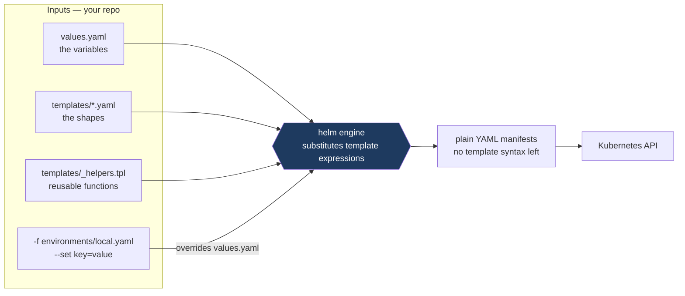
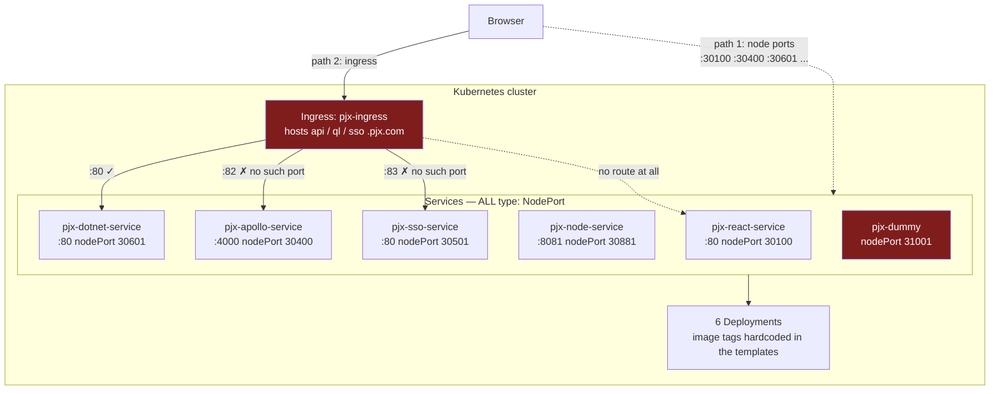
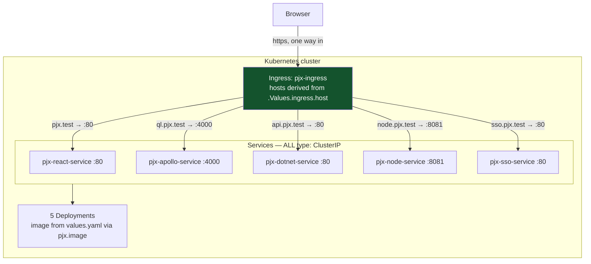
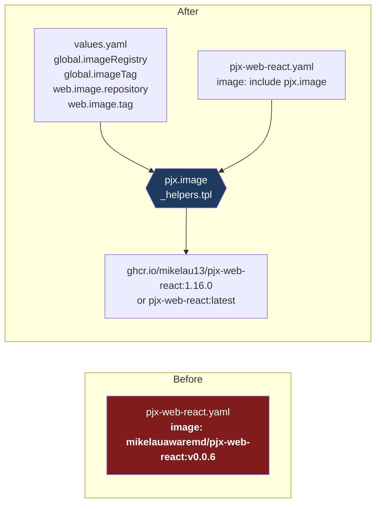

# The Helm chart, before and after Phase 7

What `helm-pjx/` looked like before [Phase 7](../architecture-upgrade/phase-7-cicd.md),
what it looks like after, and why each change was needed. Companion to
[request-flow.md](request-flow.md), which covers the Docker Compose path — this
one covers the Kubernetes path.

---

## First: what Helm actually does

Kubernetes accepts plain YAML only. Helm is a **text templating layer that runs
before** Kubernetes ever sees anything.



Three consequences worth internalising:

- **Kubernetes never sees `.Values` or `{{ }}`.** By the time anything reaches
  the cluster it is ordinary YAML.
- **A template bug is a build-time bug.** `helm template` reproduces it fully,
  with no cluster involved. That is why Phase 7 verifies by grepping rendered
  output rather than deploying.
- **The same chart serves every environment.** Only the inputs differ:
  `helm template ... -f environments/local.yaml` for k3d,
  `--set global.imageRegistry=<acr>.azurecr.io` for AKS.

Precedence: `values.yaml` < `-f file` < `--set`.

---

## Before — two routing mechanisms, and neither worked



Everything was reachable **two** ways, and the ingress half was broken three
ways: it pointed `ql` and `sso` at ports 82 and 83 that no Service declares, had
no route to the React app at all — the actual entry point — and used `*.pjx.com`
hostnames that were never the ones in use.

The `*.pjx.com` detail matters more than it looks: React bakes its API URLs into
the JavaScript bundle at **build** time, so the deployed app calls
`https://api.pjx.test` regardless of what the Ingress says.

---

## After — one mechanism, host-based



> ### The backend ports are not all 80
>
> `pjx-apollo-service` listens on **4000** and `pjx-node-service` on **8081**.
> An Ingress backend must name the port the *Service* declares, so writing
> `port: { number: 80 }` for every route reproduces exactly the defect Phase 7
> set out to fix — a rule that renders as valid YAML and 404s at request time.
>
> The chart avoids the problem by giving every Service port the name `http` and
> having the Ingress reference it **by name**:
>
> ```yaml
> # each Service                    # the Ingress
>   ports:                          backend:
>     - protocol: TCP                 service:
>       port: 4000                      name: pjx-apollo-service
>       targetPort: 4000                port:
>       name: http                        name: http
> ```
>
> All five backend rules then read identically, and changing a Service's port
> cannot desynchronise the Ingress.
>
> The hostnames mirror the Compose Traefik setup from
> [Phase 2](../architecture-upgrade/phase-2-traefik.md), so the existing mkcert
> wildcard certificate and `/etc/hosts` entries work unchanged, and k3d can be
> compared like-for-like against Compose.

---

## Where an image reference comes from



Shipping a new version used to mean editing a template — so the artifact you
deployed was never the artifact you tested.

`pjx.image` exists rather than plain string concatenation because of two cases:

| Input | `pjx.image` | naive `printf "%s/%s:%s"` |
|---|---|---|
| registry set, no tags | `ghcr.io/mikelau13/pjx-web-react:1.16.0` | same ✅ |
| **registry `""`, `imageTag: latest`** | `pjx-web-react:latest` | `/pjx-web-react:1.16.0` ❌ |
| per-service tag set | `ghcr.io/…:v2.0.0` | same ✅ |

The middle row is [Phase 7b](../architecture-upgrade/phase-7b-local-k8s.md):
`k3d image import` puts images into the cluster under bare names with no
registry. A leading slash is not a valid image reference, and the naive form
also ignores `global.imageTag`. Neither is a syntax error — both render valid
YAML and fail later as `ImagePullBackOff`, which reads as "image missing" rather
than "template bug".

---

## What changed on disk

| | Before | After |
|---|---|---|
| `helm-pjx/templates/` | 10 files + `NOTES.txt` | 7 files + `NOTES.txt` + `_helpers.tpl` |
| `kubernetes/` | 11 files duplicating the templates | **deleted** |
| Templates containing `{{ }}` | 4 of 10 | all |
| `values.yaml` keys | `dotnet_api`, `node_api`, `react`, `ssoUrl` | `global`, `web`, `apollo`, `nodeApi`, `dotnetApi`, `sso`, `ingress`, `ssoUrl` |
| Service type | `NodePort` ×6 | `ClusterIP` ×5 |
| Image tags | hardcoded ×6 | `values.yaml` via `pjx.image` |

Three templates were deleted outright:

- **`pjx-secret.yaml`** — shipped `sso-password` and `certificate-password` as
  base64 `password` in a public repository. Base64 is encoding, not encryption.
  Deleting does not remove it from git history, so treat both as compromised;
  [Phase 10](../architecture-upgrade/phase-10-deployable.md) sources these from
  Key Vault.
- **`pjx-namespace.yaml`** — the chart created namespace `pjx` while Phase 7b
  installs with `--create-namespace`. Helm rejects a release containing a
  namespace it was also told to create.
- **`pjx-dummy.yaml`** — a placeholder Deployment and `NodePort` 31001.

`kubernetes/` went too. It duplicated `helm-pjx/templates/` **by filename**, and
had already drifted in the four files that were templated — so it was not a
backup of anything, and having two files with the same name invites editing the
wrong one.

---

## Known inconsistency

`pjx-sso-identityserver.yaml` declares `containerPort: 5002` while its Service
targets port **80**:

```bash
grep -A6 'kind: Service' helm-pjx/templates/pjx-sso-identityserver.yaml
grep containerPort helm-pjx/templates/pjx-sso-identityserver.yaml
```

`containerPort` is informational in Kubernetes — routing is decided by the
Service's `targetPort` — so this does not break anything by itself, provided the
container really does listen on 80. Under Compose it does:
`ASPNETCORE_URLS=https://+:443;http://+:80`. The `5002` is stale from before that
was set.

Worth correcting to `80` when convenient, since a reader checking whether the
Service is wired correctly will compare the two numbers and conclude it is not.

---

## What this does not cover

Phase 7 makes the chart **render** correctly. It does not deploy anything —
there is no `helm install` in it. Probes, TLS secrets, image import and the
browser test all belong to
[Phase 7b](../architecture-upgrade/phase-7b-local-k8s.md), and the chart still
has real gaps until then:

- no readiness or liveness probes
- no resource requests or limits
- SQLite, so one replica per service and no persistence
- no TLS block until `ingress.tls.enabled` is set by an environment file
