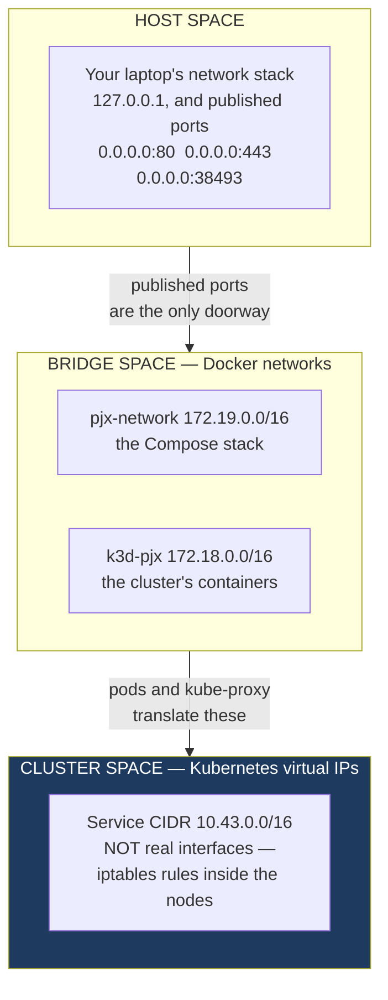
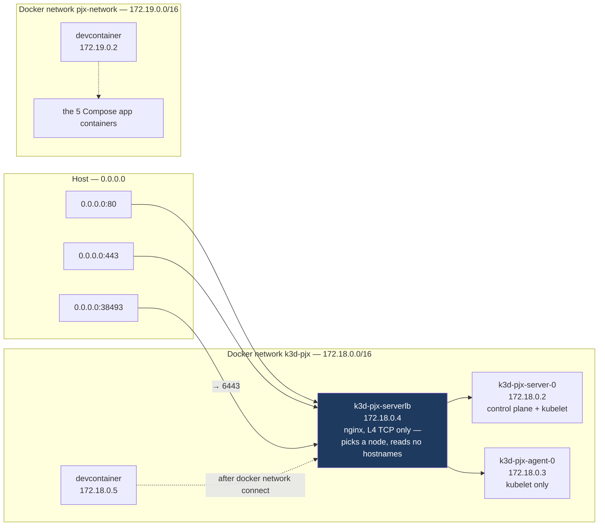
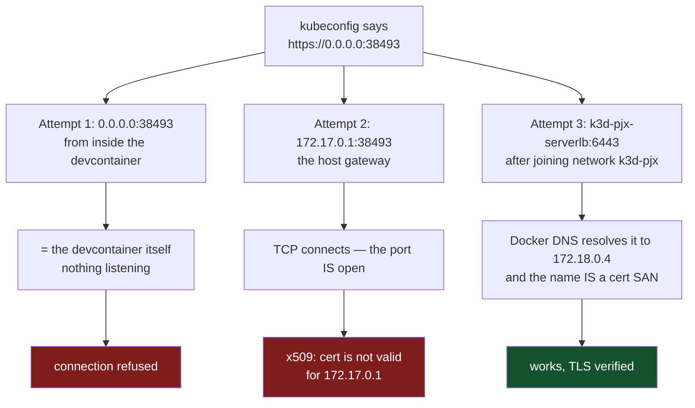
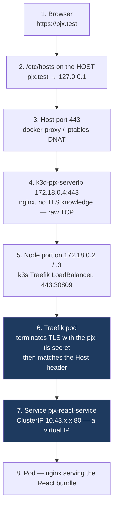
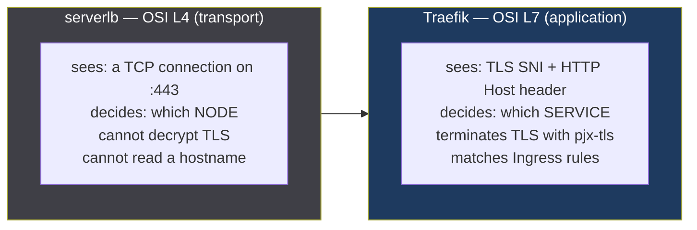
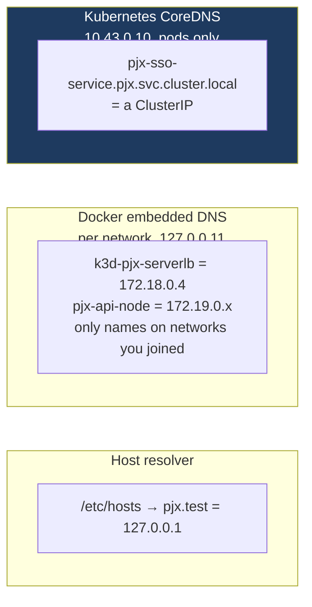
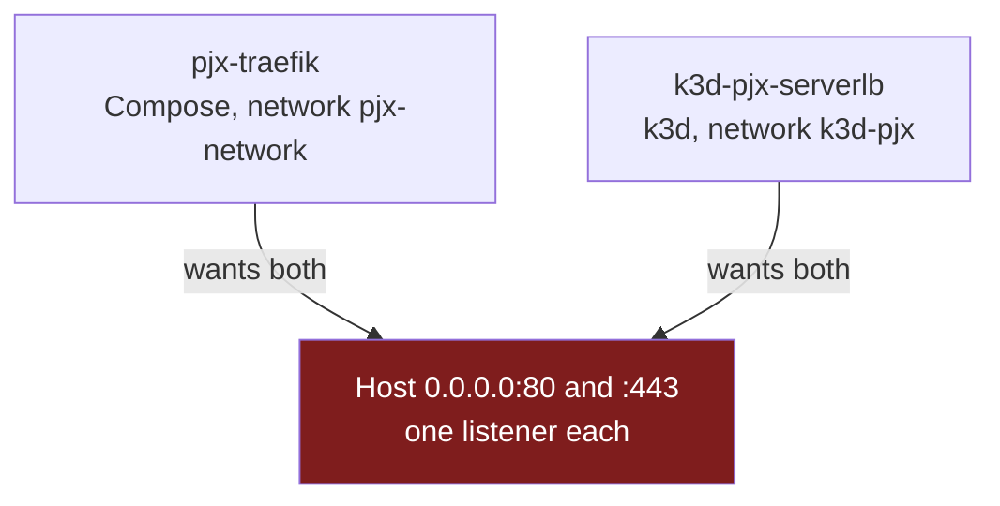

# k3d networking, from the browser to the pod

Why `kubectl` could not reach the cluster, why pointing it at the host gateway
would have failed even though the port was open, and what actually happens when
you load <https://pjx.test> against k3d.

Companion to [request-flow.md](request-flow.md) (the Docker Compose path) and
[helm-chart.md](helm-chart.md) (the chart itself). All addresses below are the
real ones from this machine — yours will differ in the last octet, not in shape.

---

## The one idea that explains everything else

"IP address" and "DNS name" each mean **three different things** here, in three
**address spaces** that never see each other's addresses.

> These are *not* OSI layers. Later sections talk about **L4** (TCP) and **L7**
> (HTTP) when describing what a proxy inspects — a separate idea entirely. An
> address space is *where a number is meaningful*; an OSI layer is *how deep into
> the packet something looks*. `serverlb` is an L4 proxy living in bridge space;
> a ClusterIP is an address in cluster space that no proxy layer can reach from
> outside.



Cluster space is the one that surprises people: `10.43.66.164` is not assigned to any
network interface anywhere. It exists only as iptables rules inside the k3s
nodes. Nothing outside the cluster can route to it, ever — which is why an
Ingress exists at all.

---

## What k3d actually created

Three containers on a new Docker network, plus a virtual cluster inside them.



`k3d-pjx-serverlb` is the only container with published ports. Everything from
outside enters through it.

The devcontainer appears **twice** because it is genuinely on both networks —
one container, two IPs, two sets of names it can resolve. That is what
`docker network connect k3d-pjx pjx-root-workspace-1` did.

---

## Why `kubectl` failed, and why the obvious fix also fails

k3d wrote this into the kubeconfig:

```yaml
server: https://0.0.0.0:38493
```

That address is correct **on the host** — `0.0.0.0` there resolves to the local
machine, where Docker published port 38493. But k3d runs in the devcontainer,
and inside a container `0.0.0.0` means *this container*. Nothing listens on
38493 there, hence `connection refused`.

This is [docker-outside-of-docker](request-flow.md) again: k3d talks to the
**host's** Docker daemon through the mounted socket, so it creates host-level
containers and writes host-level addresses — but it is itself running somewhere
those addresses do not apply.



Attempt 2 is the instructive one. The port is reachable — `TCP` succeeds — and it
still fails, because **TLS validates the name you asked for against the
certificate's Subject Alternative Names**:

```bash
echo | openssl s_client -connect 127.0.0.1:38493 2>/dev/null \
  | openssl x509 -noout -text | grep -A2 'Subject Alternative Name'
```

```
DNS: k3d-pjx-server-0, k3d-pjx-serverlb, kubernetes, kubernetes.default,
     kubernetes.default.svc, kubernetes.default.svc.cluster.local, localhost
IP:  0.0.0.0, 10.43.0.1, 127.0.0.1, 172.18.0.2, ::1
```

`172.17.0.1` is absent, so no amount of routing makes it work. `k3d-pjx-serverlb`
is present, which is why attempt 3 needs no `--insecure-skip-tls-verify`.

> **Why `10.43.0.1` is in that list.** Pods reach the API server through the
> in-cluster `kubernetes` Service at `10.43.0.1:443`. The certificate has to
> cover both the outside names and the inside virtual IP, because the same server
> answers on both.

### The fix, and when it needs redoing

```bash
docker network connect k3d-pjx pjx-root-workspace-1
kubectl config set-cluster k3d-pjx --server=https://k3d-pjx-serverlb:6443
```

| Event | Redo needed |
|---|---|
| `k3d cluster stop` / `start` | none — names and network survive |
| Devcontainer rebuild | `docker network connect` again |
| `k3d cluster delete` + recreate | **both** — new network and a new random API port |

The random port is avoidable — pin it at creation so the kubeconfig stops
changing every time the cluster is recreated:

```bash
k3d cluster create pjx \
  --port "80:80@loadbalancer" --port "443:443@loadbalancer" \
  --api-port 6443 --agents 1
```

> `--api-port` takes `[HOST:]PORT`, and a HOST given there must **already
> resolve**. Naming the load balancer container fails, because it does not exist
> until the cluster is created:
>
> ```
> FATA Failed to lookup host 'k3d-pjx-serverlb' specified for Port Exposure
> ```
>
> A bare port is the right form. It fixes the port but not the address — the
> kubeconfig still says `0.0.0.0`, so the `set-cluster` step above is still
> required.

---

## A browser request, end to end

Loading <https://pjx.test> crosses all three address spaces. Seven hops, each of which
can fail differently.



### Two reverse proxies is not a mistake

Hops 4 and 6 are both "a reverse proxy", which looks redundant. They are not the
same kind of thing and neither can do the other's job.



The proof is in `serverlb`'s own config:

```bash
docker exec k3d-pjx-serverlb cat /etc/nginx/nginx.conf
```

```nginx
stream {                                   # L4 — NOT an http { } block
  upstream 443_tcp {
    server k3d-pjx-agent-0:443;
    server k3d-pjx-server-0:443;
  }
  server { listen 443; proxy_pass 443_tcp; }
}
```

No `server_name`, no certificates, no paths. It forwards bytes and round-robins
between the two nodes. It also carries `6443` for the API server — nothing to do
with ingress, which is why the same container publishes both `443` and `38493`.

**Why the L4 hop must exist:** Traefik runs *inside* the cluster on node IPs
`172.18.0.2` and `172.18.0.3`, which are unpublished. Docker publishes a port to
**one** container, but a cluster is N containers — so something at the Docker
layer has to bridge `host:443` in, and pick a node.

**You can collapse it**, with a real cost:

```bash
k3d cluster create pjx --port "443:443@server:0"
```

That publishes straight to one node and drops `serverlb` from the path. Fine with
a single node; it pins all traffic to a named node with no failover once you add
more, and does not carry the API server.

**The reason to keep both** is that the layering is what a cloud looks like:

| | L4 | L7 |
|---|---|---|
| local k3d | `serverlb` (nginx) | Traefik |
| [AKS](../architecture-upgrade/phase-aks-deploy.md) | Azure Load Balancer | Traefik |

`serverlb` is k3d simulating a cloud load balancer. On AKS it is replaced by a
real one and Traefik stays — so the topology you debug locally is the topology you
deploy. That is the argument for doing Phase 7b before spending anything on Azure.

By contrast the **Compose** stack has only one proxy: there are no nodes, so
Docker publishes `443` directly to the `pjx-traefik` container. The second layer
appears only once a cluster exists.

---

Two more hops deserve attention.

**Hop 6 — Traefik decides everything from the `Host` header.** The TCP connection
carries no hostname; TLS SNI and the HTTP `Host` header do. That is why the
Ingress is host-based and why a stale `sso.pjx.com` rule silently never matches:
the request arrives with `Host: sso.pjx.test`, finds no rule, and gets a 404 from
Traefik itself — the pod is never contacted, so pod logs show nothing.

**Hop 7 — the ClusterIP is fictional.** `10.43.x.x` is not on any interface.
kube-proxy programmed iptables rules on every node that rewrite the destination
to a real pod IP. This is also why `kubectl` from your laptop cannot curl a
ClusterIP: there is nothing to route to.

---

## Three DNS resolvers, and which one answers

The single most common source of confusion. The same lookup gives different
answers — or fails — depending on where you run it.



| Name | Host | devcontainer | inside a pod |
|---|---|---|---|
| `pjx.test` | ✅ `/etc/hosts` | ✅ via `extra_hosts` → host-gateway | ❌ nothing configures it |
| `k3d-pjx-serverlb` | ❌ | ✅ only after joining `k3d-pjx` | ❌ different network |
| `pjx-api-node` (Compose) | ❌ | ✅ on `pjx-network` | ❌ |
| `pjx-sso-service` | ❌ | ❌ | ✅ CoreDNS |

The last row is why [Phase 7's Step 2a](../architecture-upgrade/phase-7-cicd.md#step-2a--fix-the-sso-authority)
sets `ssoUrl: http://pjx-sso-service:80`. That name resolves **only** from inside
a pod — which is exactly where the .NET API runs, and exactly why you cannot test
it with `curl` from the devcontainer.

---

## Why Compose and k3d cannot run together

Both want host ports **80** and **443**, and a port can have one listener.



Whichever starts second fails. It presents in two different ways — an explicit
`address already in use` on create, or a container that reports `Up` with
`PORTS=[]` and silently routes nothing.

```bash
stop.sh
docker compose -f local/docker-compose.yml stop
ss -tln | grep -E ':(80|443) ' || echo "80/443 free"
```

Mapping k3d to 8080/8443 to run both looks tempting and breaks the React app:
`react-scripts` bakes `REACT_APP_*` into the bundle at **build** time, so the SPA
loads but every API call targets port 443. That is
[Deployable's runtime-configuration problem](../architecture-upgrade/phase-deployable.md#step-3--react-runtime-configuration),
and not worth meeting early.

---

## Diagnosing: find the address space first

When something is unreachable, work out **which address space the number belongs
to** before reaching for a command — they differ completely.

| Symptom | Where the problem is | Check |
|---|---|---|
| `connection refused` from `kubectl` | host → bridge | `docker port k3d-pjx-serverlb` |
| `x509: certificate is not valid for …` | TLS, not addressing | compare the name you used against the SAN list |
| `Please enter Username` | auth, not addressing | TLS worked; credentials were not sent — usually a `--server` flag detaching them from the context |
| Browser `ERR_CONNECTION_REFUSED` | host | `ss -tln \| grep ':443 '` on the host |
| 404 from Traefik, pod logs empty | none — L7 routing | `kubectl get ingress -A`; check the `Host` rule |
| `ImagePullBackOff` | none — image naming | image not imported, or the name does not match |
| ClusterIP unreachable from the devcontainer | **cluster space** | expected — use `kubectl port-forward` |

> `docker exec` without `-u vscode` runs as **root**, with a different `HOME` and
> therefore a different, usually empty, `~/.kube/config`. A `kubectl` that
> suddenly reports `localhost:8080` is that, not a broken cluster — 8080 is the
> hardcoded default when no kubeconfig exists.
