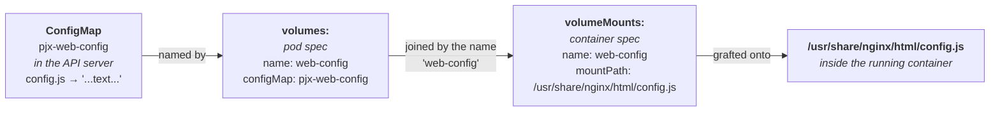
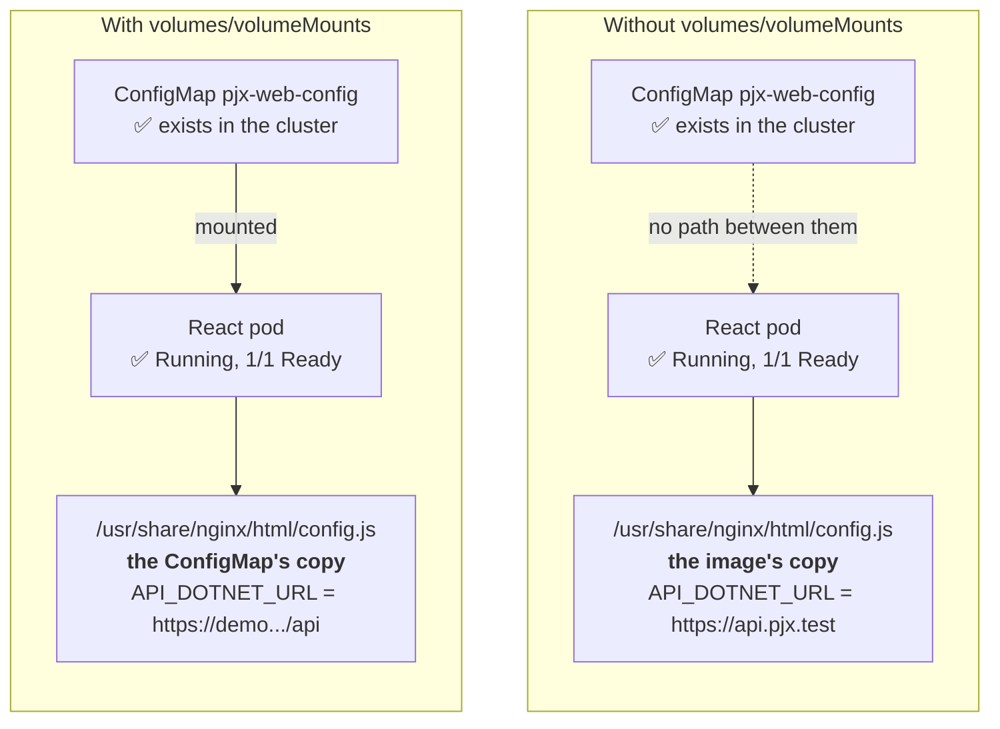
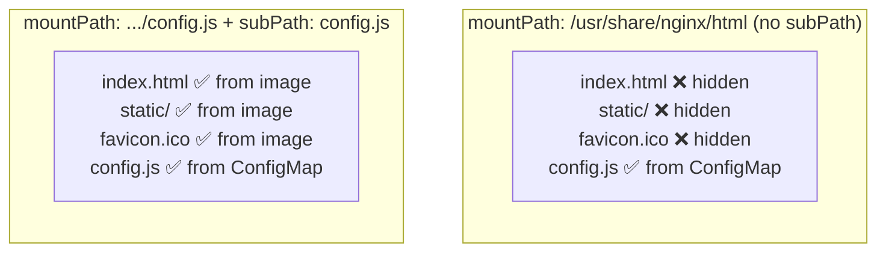

# ConfigMaps, volumes and volumeMounts

Background for [Deployable Step 3b](../architecture-upgrade/phase-deployable.md#step-3b--mount-it-and-make-the-port-a-value),
where `helm-pjx/templates/pjx-web-config.yaml` has to reach nginx's webroot
inside the React pod.

## The one idea: a container's filesystem comes from its image

When a container starts, its filesystem is whatever the image baked in — nothing
more. `projects/pjx-web-react/Dockerfile` runs `npm run build` and copies the
output into nginx's webroot, so the image contains a `config.js` frozen at build
time.

A **volume** is how you graft something that is *not* in the image onto a path in
that filesystem, at startup. Without one, the image's copy is what the container
sees, permanently.

That is the whole mechanism. Everything below is detail about how the graft is
described.

## Three objects, not one

A ConfigMap reaching a file inside a container involves three separate things,
declared in three different places:



- **The ConfigMap** is a key→string map stored in the API server. It is *data*,
  not a file. Creating one changes nothing about any pod.
- **`volumes:`** is on the **pod**. It says "make this source available to this
  pod, and call it `web-config`." Still no file anywhere.
- **`volumeMounts:`** is on the **container**. It says "take the thing called
  `web-config` and graft it onto this path in my filesystem."

The `name:` field is the only thing joining the two halves. They are separate
because one pod can run several containers, and a single volume can be mounted
into some of them, at different paths, or none.

## Where each one goes in the YAML

This is the part that is easy to get wrong, because the two blocks sit at
different indent levels in the same file:

```yaml
spec:                          # ← pod spec
  containers:
  - name: pjx-react
    image: ...
    livenessProbe: ...
    volumeMounts:              # ← 8 spaces: belongs to THE CONTAINER
      - name: web-config
        mountPath: /usr/share/nginx/html/config.js
        subPath: config.js
  volumes:                     # ← 6 spaces: belongs to THE POD
    - name: web-config
      configMap:
        name: pjx-web-config
```

`volumes:` is a sibling of `containers:`, not of `image:`. Putting it inside the
container is the usual mistake; Kubernetes rejects it, which at least fails
loudly.

## What happens without them

Nothing fails. That is the problem.



Every check you might run still passes:

| Check | Result without the mount |
|---|---|
| `helm lint` | ✅ passes |
| `helm template` | ✅ renders the ConfigMap |
| `kubectl get configmap pjx-web-config` | ✅ exists, with the right data |
| `kubectl get pods` | ✅ `1/1 Running` |
| `curl https://demo.../` | ✅ 200, the app loads |

The app then boots, reads `window.__PJX_CONFIG__` from the **image's** baked-in
`config.js`, and calls `https://api.pjx.test` — a hostname that only resolves on
your laptop. In a browser pointed at the AKS demo, every API call fails.

This is the same class as the two defects this project already hit: **a
ConfigMap in the chart root instead of `templates/`** (Helm renders only
`templates/`, silently) and **a health check that reports `Healthy` with nothing
meaningful in the pipeline.** Valid YAML and a 200 response are not evidence that
the thing you intended is happening.

Worse, `runtimeConfig.ts` falls back with `?? process.env.REACT_APP_*`, so a
missing `window.__PJX_CONFIG__` produces no error either —
[Step 3c](../architecture-upgrade/phase-deployable.md#step-3c--warn-when-configjs-fails-to-load)
adds the `console.warn` that makes this visible.

## `subPath` — replace one file, or mask the whole directory

A volume mount replaces **whatever is at `mountPath`**. Mount a ConfigMap at a
directory path and the directory is replaced wholesale — the image's contents at
that path become unreachable for as long as the container runs:



Without `subPath`, nginx serves nothing — `index.html` is gone and the site is a
404. `subPath: config.js` says "take just this one key out of the volume and put
it at exactly this one path", leaving the rest of the webroot alone.

## Two gotchas worth knowing

**A `subPath` mount never receives updates.** Edit the ConfigMap and a *normal*
mount updates the file in place within a minute or so. A `subPath` mount does
not — it is resolved once, at container start. Changing config therefore requires
a pod restart:

```bash
kubectl -n pjx rollout restart deploy/pjx-react-deployment
```

This is the trade for not masking the directory, and it is usually the right
trade for config that changes per environment rather than per minute.

**The mount is read-only in practice.** ConfigMap volumes are projected
read-only; the container cannot write back. Fine here, since `config.js` is only
ever read.

## Why this pairs with the port change

Step 3b makes both changes together because each is useless alone. The `subPath`
mount over `/usr/share/nginx/html/config.js` only makes sense for the
**production** image, which is nginx on port 80. The dev image is
`react-scripts start` on port 3000 and has no such directory, so:

- mount without the port change → the pod is configured but unreachable (the
  Service still points at 3000, the container listens on 80 → 502)
- port change without the mount → the pod is reachable and misconfigured

## Glossary

| Term | Meaning |
|---|---|
| **ConfigMap** | A named key→string map in the API server. Data only. Inert until mounted or referenced by `env`. |
| **volume** | A source of files declared on the **pod**, given a name. |
| **volumeMount** | An instruction on a **container** to graft a named volume onto a path. |
| **`subPath`** | Mount a single key from the volume rather than the whole thing, so the target directory is not masked. |
| **projected read-only** | The kubelet writes the files; the container cannot modify them. |
| **masking** | A directory mount hiding the image's contents at that path for the container's lifetime. |

## What this does not cover

Secrets (same mounting mechanics, different object and at-rest handling),
`emptyDir`, `hostPath`, PersistentVolumeClaims, and the Secrets Store CSI driver
that [Deployable Step 1b](../architecture-upgrade/phase-deployable.md) uses for
the SSO signing certificate — that one mounts from Key Vault, but the
`volumes:` / `volumeMounts:` pairing is identical.
