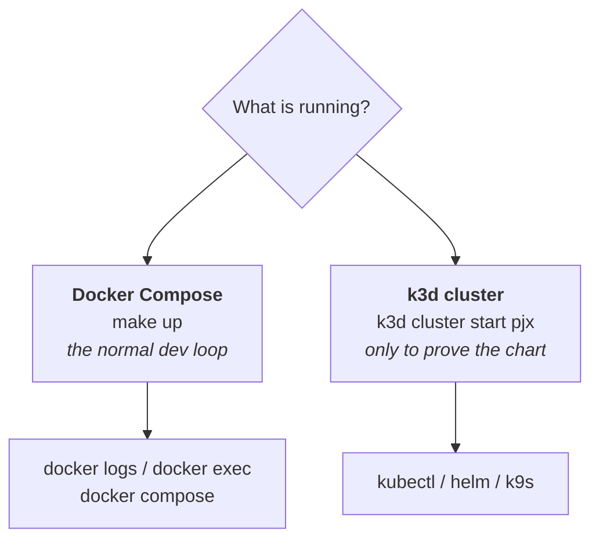

# Operating the stack: logs, shells and databases

Day-to-day commands for the Compose environment. Kubernetes equivalents are in
[k3d networking](k3d-networking.md).

## Which runtime am I on?

pjx has two, and they need different tools. This is the most common source of
confusing errors:



Running `kubectl` with no cluster gives a misleading error — it falls back to a
default address rather than saying "no cluster":

```
The connection to the server localhost:8080 was refused —
did you specify the right host or port?
```

That means **no cluster is running**, not that something is broken. `make status`
shows what is actually up.

## Logs

```bash
make logs                                    # all app services, follow
docker logs pjx-sso-identityserver-dev --tail 50
docker logs pjx-sso-identityserver-dev -f    # follow one service
docker logs pjx-api-dotnet-dev 2>&1 | grep -i error
```

Container names are stable and printed by `docker ps --format '{{.Names}}'`:

| Service | Container |
|---|---|
| React | `pjx-web-react-dev` |
| .NET API | `pjx-api-dotnet-dev` |
| Node API | `pjx-api-node-dev` |
| Apollo | `pjx-graphql-apollo-dev` |
| SSO | `pjx-sso-identityserver-dev` |
| PostgreSQL | `pjx-root-postgres-1` |
| Traefik | `pjx-traefik` |
| Grafana | `pjx-grafana-otel` |
| Devcontainer | `pjx-root-workspace-1` |

Note the naming is inconsistent — services with an explicit `container_name:` get
`-dev`, and those without get the compose default
`<project>-<service>-<index>`. That is why PostgreSQL is `pjx-root-postgres-1`.

### Things that only appear in the logs

**SMTP is disabled in development**, so registration and password-reset emails are
never sent — they are written to the SSO log instead. To retrieve an activation
link:

```bash
docker logs pjx-sso-identityserver-dev 2>&1 | grep -A3 'Smtp disabled'
```

Check the host in that link before using it. It is built from
`appsettings.json`'s `LocalDomain`, which has been stale before.

## A shell inside a container

```bash
docker exec -it pjx-sso-identityserver-dev bash
docker exec -it pjx-root-postgres-1 sh        # alpine, no bash
docker exec -w /app pjx-sso-identityserver-dev ls    # run one command in a directory
```

The .NET dev containers run as **root**, so anything they write into the bind
mount is root-owned and the devcontainer (uid 1000, `vscode`) cannot delete it.
After running a build or a tool inside one, from a **host** terminal:

```bash
sudo chown -R mike:mike /home/mike/projects/pjx-root/projects/<project>
```

`chown`, never `rm -rf` — see the Phase 1 incident in
[phase-1-script-layer.md](../architecture-upgrade/phase-1-script-layer.md).

## PostgreSQL

Two databases, one per service:

```bash
docker exec -it pjx-root-postgres-1 psql -U pjx -d pjx_calendar   # .NET API
docker exec -it pjx-root-postgres-1 psql -U pjx -d pjx_identity   # SSO
```

### psql commands

| Command | Does |
|---|---|
| `\l` | list databases |
| `\dt` | list tables in the current database |
| `\d "AspNetUsers"` | describe one table |
| `\c pjx_identity` | switch database |
| `\x` | toggle expanded output — useful for wide rows |
| `\q` | quit |

### Identifiers are case-sensitive here

EF Core quotes its table and column names, so Postgres preserves the PascalCase.
Unquoted identifiers are folded to lowercase, so this matters:

```sql
select * from "AspNetUsers";     -- works
select * from AspNetUsers;       -- ERROR: relation "aspnetusers" does not exist
```

This is the first item in Step 2's "expect these differences" table, and it is
the one most likely to confuse when querying by hand.

### Without the interactive shell

```bash
docker exec pjx-root-postgres-1 psql -U pjx -d pjx_identity \
  -c 'select "Email", "EmailConfirmed" from "AspNetUsers";'

docker exec pjx-root-postgres-1 psql -U pjx -d pjx_calendar -c '\dt'
```

### Creating a database

`POSTGRES_DB` in the compose service creates **one** database, on first
initialisation of the volume only. The second comes from
`local/postgres/10-create-identity.sql`, mounted at
`/docker-entrypoint-initdb.d` — the same file the chart carries as a ConfigMap,
so the two runtimes cannot drift. It also runs only on first init, so a volume
created before 2026-09-26 had `pjx_identity` created by hand:

```bash
docker exec pjx-root-postgres-1 psql -U pjx -d pjx_calendar \
  -c 'CREATE DATABASE pjx_identity OWNER pjx;'
```

Either way, editing `POSTGRES_DB` or the init script later does nothing until
the volume is destroyed.

> **`pjx-pgdata` now holds real data.** `docker compose down -v` and
> `local/scripts/clean.sh` destroy it, taking the registered users and every
> calendar event with them. This is the point where `clean.sh`'s confirmation
> prompt starts earning its keep.

## What actually differs between Compose and k3d

The browser experience is meant to be identical — same hostnames, same ports.
What differs is the loop around it, and how much of the stack exists at all.

| | `make up` (Compose) | k3d cluster |
|---|---|---|
| Source changes | bind-mounted; `dotnet watch` / CRA reload in seconds | no bind mount — build, `k3d image import`, `rollout restart`, ~4 min |
| Startup | fast | dev images compile *at pod start*; React needs a `startupProbe` and 2Gi to survive it — [7b](../architecture-upgrade/phase-7b-local-k8s.md#how-it-actually-went-2026-09-26) |
| Database | `pjx-root-postgres-1` on `pjx-network` | `pjx-postgres-deployment`, 2Gi PVC, created by the chart (Step 5b) |
| Configuration | 34 env lines in `docker-compose.devcontainer.yml` | `pjx-config` ConfigMap — `sso-authority` plus the two connection strings |
| Observability | `pjx-grafana-otel` | not deployed |
| Routing | standalone Traefik, Docker labels | k3s's built-in Traefik, Ingress rules |
| URLs and ports | identical | identical, by design |

> **Superseded 2026-09-13 — the chart has a database now.** Step 5b added
> `helm-pjx/templates/pjx-postgres.yaml`: a Deployment, a Service named
> `postgres` so `Host=postgres` resolves in the cluster as well as on the
> Compose network, a 2Gi PVC, and an init ConfigMap that creates `pjx_calendar`
> and `pjx_identity`.
>
> The chart still points at the **dev** images (`pjx-root-*` in
> `environments/local.yaml:18-22`), which is what makes pod startup so slow —
> and those images carry a *frozen copy* of the source, because there is no bind
> mount in Kubernetes. Develop on Compose; k3d is for proving the chart. See
> [the cluster runs the image, and only the
> image](../architecture-upgrade/phase-deployable.md#the-cluster-runs-the-image-and-only-the-image-2026-09-13).

## The k3d cluster, when you want it

> 🛑 **Compose and k3d cannot run at the same time.** Both want host ports 80 and
> 443 — deliberately, so `https://pjx.test` resolves identically in each. Start
> the cluster while Traefik is up and only the load balancer fails:
>
> ```
> FATA Failed to add one or more helper nodes: ... k3d-pjx-serverlb:
> Bind for 0.0.0.0:80 failed: port is already allocated
> ```
>
> The server and agent nodes **do** start, leaving the cluster half-up with no
> ingress. Stop it (`k3d cluster stop pjx`), then pick one:
>
> ```bash
> make down && k3d cluster start pjx     # Compose  → cluster
> k3d cluster stop pjx && make up        # cluster  → Compose
> ```
>
> The reasoning for not remapping k3d to 8080/8443 is in
> [phase-7b-local-k8s.md](../architecture-upgrade/phase-7b-local-k8s.md#why-not-just-map-k3d-to-80808443-and-run-both).

```bash
k3d cluster list                    # in the devcontainer; k3d is not on the host
k3d cluster start pjx
kubectl config use-context k3d-pjx
kubectl get nodes                   # gate — nothing below works until this does
kubectl -n pjx get pods
kubectl -n pjx logs deploy/pjx-sso-deployment
k9s -n pjx                          # terminal UI
```

`make down` stops the cluster along with everything else.

### When `kubectl` cannot reach a cluster that is running

Two of the four things a working `kubectl` needs live in the **devcontainer**,
not in the cluster, so they survive `k3d cluster stop/start` but not a
devcontainer rebuild — and VS Code rebuilds it on its own schedule.

| Symptom | What is missing |
|---|---|
| `error: current-context is not set` | the kubeconfig — `~/.kube` is not mounted, so a rebuild takes it |
| `dial tcp: lookup k3d-pjx-serverlb` | the devcontainer's attachment to the `k3d-pjx` network |
| `dial tcp 0.0.0.0:<port>: connection refused` | the kubeconfig still holds the host-side address k3d wrote |
| `ErrImageNeverPull` on every pod | the images — only after a `k3d cluster delete`, not a rebuild |

Cold start from a freshly rebuilt devcontainer, in this order:

```bash
k3d cluster start pjx
docker network connect k3d-pjx pjx-root-workspace-1
k3d kubeconfig merge pjx --kubeconfig-merge-default
kubectl config set-cluster k3d-pjx --server=https://k3d-pjx-serverlb:6443
kubectl get nodes
```

`merge` writes the file and switches context; `set-cluster` then repoints it
from `0.0.0.0` at the load balancer's container name, which is a SAN on the API
server certificate, so TLS verification still passes. Full reasoning in
[k3d-networking.md](k3d-networking.md#the-fix-and-when-it-needs-redoing).

Exited nodes are not a deleted cluster — `docker ps -a` showing
`k3d-pjx-server-0  Exited` means the images, the `pjx-pgdata` PVC and the helm
release are all still there, and `k3d cluster start` gets them back.
