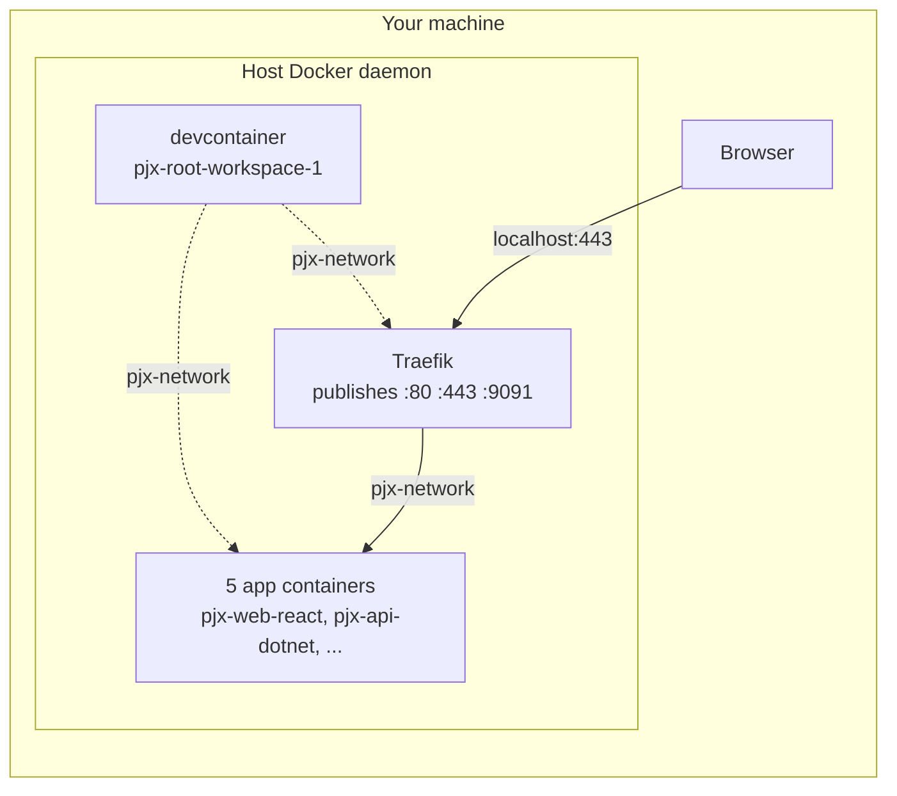
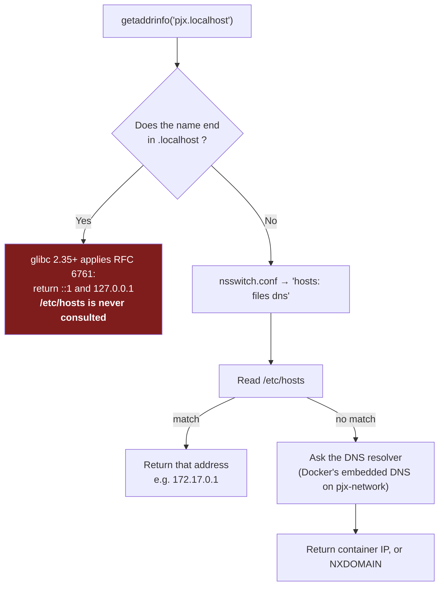
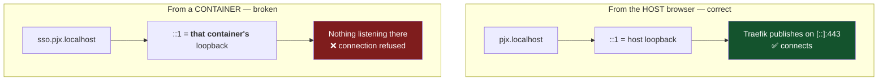
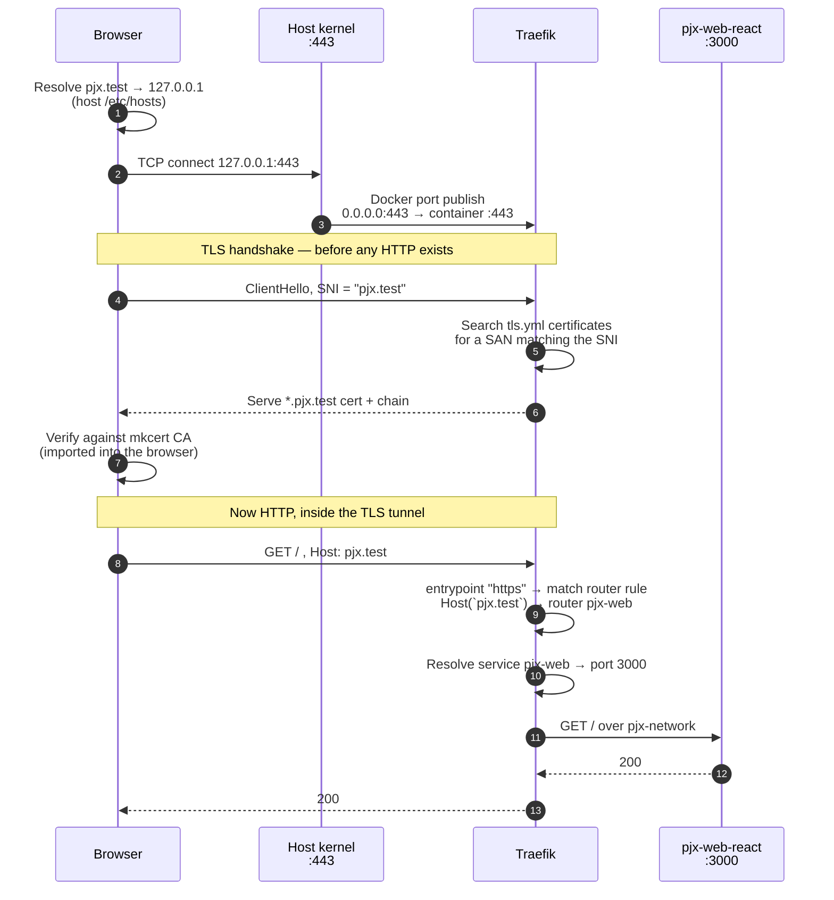
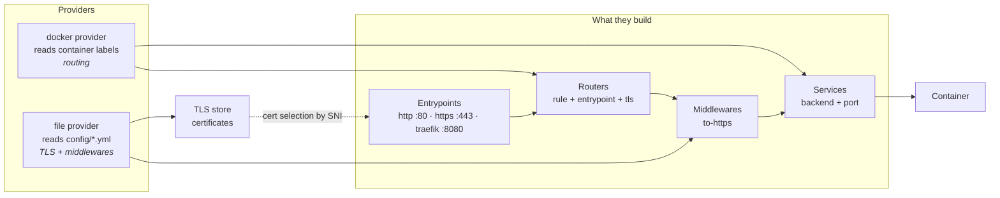
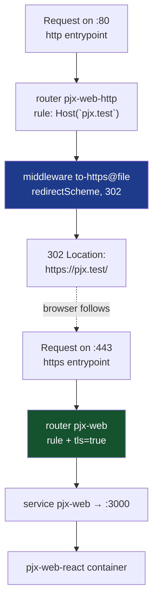

# How a request reaches a pjx container

A walkthrough of everything between typing `https://pjx.test` and a response
coming back from the React container — name resolution, TLS, Traefik routing, and
the container network.

Written while debugging Phase 2, because the same request behaves **differently
depending on where you start it**: your host browser, a shell in the devcontainer,
or one app container calling another. Understanding why is the difference between
fixing a problem in a minute and losing an afternoon to it.

---

## 1. The three vantage points

pjx runs **docker-outside-of-docker**: the devcontainer holds only the Docker
CLI, and every container — apps, Traefik, the devcontainer itself — is a sibling
on your host's Docker daemon.



Three starting points, three different answers to "where does this hostname
point?":

| Starting from | `localhost` means | Reaches Traefik via |
|---|---|---|
| Host browser / host shell | the host's loopback | published ports on `127.0.0.1` / `::1` |
| Devcontainer shell | **the devcontainer's own loopback** | `host-gateway` or the `pjx-network` address |
| An app container | **that container's own loopback** | `pjx-network` |

Almost every confusing failure in Phase 1 and Phase 2 came from assuming these
were the same.

---

## 2. Name resolution — and the `.localhost` trap

Before any traffic moves, the name must become an IP. This is where `.localhost`
behaves unlike every other name.



Observed directly in the devcontainer, with **both** names present in
`/etc/hosts` pointing at `172.17.0.1`:

```
pjx.localhost  ->  ::1              ← /etc/hosts entry ignored
pjx.test       ->  172.17.0.1       ← same file, same mechanism, honoured
```

That is not a misconfiguration. glibc implements RFC 6761, which reserves
`.localhost` and mandates it resolve to loopback. `extra_hosts`, `/etc/hosts`,
and Docker's DNS are all bypassed for those names.

### Why this is fine from the browser and fatal from a container



On the host, "loopback" *is* where Traefik listens, so the special-casing
accidentally does the right thing. Inside a container, loopback is that
container's own network namespace — empty.

This is why `pjx-api-dotnet` could not reach `https://sso.pjx.localhost` to fetch
the OIDC discovery document — a failure that presents as broken authentication,
not broken DNS.

### The resolution: pjx uses `.test`

`.test` is reserved by the same RFC for testing and carries **no special resolver
behaviour**, so `/etc/hosts` and `extra_hosts` work normally and the name resolves
identically from the host, the devcontainer, and every app container.

The trade is one line in the host's `/etc/hosts`:

```
127.0.0.1 pjx.test ql.pjx.test api.pjx.test node.pjx.test sso.pjx.test grafana.pjx.test
```

and `extra_hosts: ["<name>:host-gateway"]` on any container that must reach
Traefik by hostname — currently `workspace` and `pjx-api-dotnet`.

Everything from here on uses `.test`. The `.localhost` material above is kept
because the trap is easy to fall back into: it looks like it should work, and it
does work from the browser.

---

## 3. The full path, host browser → container

Assuming the name resolves, here is everything that happens:



Two details worth internalising:

- **SNI and the `Host` header are different things.** SNI is sent in the TLS
  ClientHello and selects the *certificate*; the `Host` header is sent inside the
  encrypted tunnel and selects the *router*. They normally carry the same value,
  which hides the distinction until something breaks — a certificate error is an
  SNI/`tls.yml` problem, a 404 is a `Host`/router-rule problem.
- **Traefik reaches the container over `pjx-network`, by service name and
  container port** — `pjx-web-react:3000`, not `localhost:3000`. The published
  host port `3000` is a separate, parallel path used only by your browser.

---

## 4. Inside Traefik

Traefik is assembled from four kinds of object, wired by two providers:



The **constraint label** filters what the docker provider will look at:

```
--providers.docker.constraints=Label(`traefik.constraint-label`, `pjx-public`)
```

Because Traefik talks to the *host* daemon, it can see every container on the
machine — the devcontainer, and other projects' containers too. Only those
carrying `traefik.constraint-label=pjx-public` are considered.

> This cuts both ways: Traefik ignores **its own** labels unless it carries that
> label, which is why the `to-https` middleware belongs in the file provider and
> is referenced as `to-https@file`. A middleware defined on the Traefik container
> is silently dropped, and the redirect routers end up `"status": "disabled"`.

### Two routers per service

Each service has an HTTPS router and an HTTP router that exists only to redirect:



Pinning `entrypoints` on each router matters. A router with no `entrypoints`
attaches to **all** of them, so without it the HTTPS router would also claim `:80`
and collide with the redirect router on the same hostname.

---

## 5. Reading a failure

The symptom usually tells you which layer to look at:

| Symptom | Layer | Check |
|---|---|---|
| `Could not resolve host` / resolves to `::1` unexpectedly | Name resolution | `getent hosts <name>`, `cat /etc/hosts`, is it a `.localhost` name? |
| `Connection refused` / curl `000` | Transport | Is anything listening? `ss -tlnp \| grep ':443 '` — on the **right machine** |
| Certificate error | TLS / SNI | `openssl s_client -connect host:443 -servername host -CAfile <ca>` |
| **404 from Traefik** | Router rule | `curl -s localhost:9091/api/http/routers/<name>@docker` |
| 502 / 503 | Service → backend | `curl -s localhost:9091/api/http/services` and check `serverStatus` |
| App-level error (400, 500) | The app itself | `docker logs <container>` |

Traefik's API is the fastest tool for the middle layers, because it reports
`status` and `error` per object:

```bash
curl -s http://localhost:9091/api/overview | python3 -m json.tool

curl -s http://localhost:9091/api/http/routers > /tmp/r.json
python3 - <<'PY'
import json
for r in json.load(open('/tmp/r.json')):
    if r.get("status") != "enabled" or r.get("error"):
        print(f"  {r['name']:<30} status={r.get('status')}")
        for e in r.get("error", []): print(f"      -> {e}")
PY
```

A **404** in particular is Traefik saying "no router matched" — which is a
labels/rule problem, not an application problem. Compare against an app-generated
400 (Apollo's "GET query missing"), which proves routing *worked*.

---

## 6. Quick reference

| From | To reach a service, use |
|---|---|
| Host browser / host shell | `https://pjx.test` (published ports) |
| Devcontainer shell, via Traefik | the hostname — needs a resolvable TLD, `extra_hosts` → `host-gateway` |
| Devcontainer shell, direct to a service | `http://pjx-web-react:3000` (service name + **container** port) |
| App container → app container | `http://pjx-api-node:8081` (service name + container port) |
| Traefik → app container | service name + container port, over `pjx-network` |

Container ports are not the published ones: the .NET API listens on `:80` inside
and is published as `:6001`; the SSO server listens on `:80` and is published as
`:5001`.

---

## See also

- [Phase 2 — Traefik, TLS and hostnames](../architecture-upgrade/phase-2-traefik.md)
- [Phase 1 — Step 6a, host paths for bind mounts](../architecture-upgrade/phase-1-script-layer.md#step-6a--emit-host-paths-for-bind-mounts)
- [Phase 0 — Step 3b, the docker-in-docker vs outside-of-docker decision](../architecture-upgrade/phase-0-foundation.md#step-3b--nine-defects-found-during-execution)
